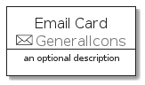
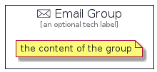

# Email


```text
aws-q3-2021/Resource/GeneralIcons/Email
```

```text
include('aws-q3-2021/Resource/GeneralIcons/Email')
```


| Illustration | Email | EmailCard | EmailGroup |
| :---: | :---: | :---: | :---: |
|  |  |  |  |


## Email

### Load remotely
```plantuml
@startuml
' configures the library
!global $LIB_BASE_LOCATION="https://github.com/tmorin/plantuml-libs/distribution"

' loads the library's bootstrap
!include $LIB_BASE_LOCATION/bootstrap.puml

' loads the package bootstrap
include('aws-q3-2021/bootstrap')

' loads the Item which embeds the element Email
include('aws-q3-2021/Resource/GeneralIcons/Email')

' renders the element
Email('Email', 'Email', 'an optional tech label')
@enduml
```

### Load locally
```plantuml
@startuml
' configures the library
!global $INCLUSION_MODE="local"
!global $LIB_BASE_LOCATION="../../.."

' loads the library's bootstrap
!include $LIB_BASE_LOCATION/bootstrap.puml

' loads the package bootstrap
include('aws-q3-2021/bootstrap')

' loads the Item which embeds the element Email
include('aws-q3-2021/Resource/GeneralIcons/Email')

' renders the element
Email('Email', 'Email', 'an optional tech label')
@enduml
```

## EmailCard

### Load remotely
```plantuml
@startuml
' configures the library
!global $LIB_BASE_LOCATION="https://github.com/tmorin/plantuml-libs/distribution"

' loads the library's bootstrap
!include $LIB_BASE_LOCATION/bootstrap.puml

' loads the package bootstrap
include('aws-q3-2021/bootstrap')

' loads the Item which embeds the element EmailCard
include('aws-q3-2021/Resource/GeneralIcons/Email')

' renders the element
EmailCard('EmailCard', 'Email Card', 'an optional description')
@enduml
```

### Load locally
```plantuml
@startuml
' configures the library
!global $INCLUSION_MODE="local"
!global $LIB_BASE_LOCATION="../../.."

' loads the library's bootstrap
!include $LIB_BASE_LOCATION/bootstrap.puml

' loads the package bootstrap
include('aws-q3-2021/bootstrap')

' loads the Item which embeds the element EmailCard
include('aws-q3-2021/Resource/GeneralIcons/Email')

' renders the element
EmailCard('EmailCard', 'Email Card', 'an optional description')
@enduml
```

## EmailGroup

### Load remotely
```plantuml
@startuml
' configures the library
!global $LIB_BASE_LOCATION="https://github.com/tmorin/plantuml-libs/distribution"

' loads the library's bootstrap
!include $LIB_BASE_LOCATION/bootstrap.puml

' loads the package bootstrap
include('aws-q3-2021/bootstrap')

' loads the Item which embeds the element EmailGroup
include('aws-q3-2021/Resource/GeneralIcons/Email')

' renders the element
EmailGroup('EmailGroup', 'Email Group', 'an optional tech label') {
    note as note
        the content of the group
    end note
}
@enduml
```

### Load locally
```plantuml
@startuml
' configures the library
!global $INCLUSION_MODE="local"
!global $LIB_BASE_LOCATION="../../.."

' loads the library's bootstrap
!include $LIB_BASE_LOCATION/bootstrap.puml

' loads the package bootstrap
include('aws-q3-2021/bootstrap')

' loads the Item which embeds the element EmailGroup
include('aws-q3-2021/Resource/GeneralIcons/Email')

' renders the element
EmailGroup('EmailGroup', 'Email Group', 'an optional tech label') {
    note as note
        the content of the group
    end note
}
@enduml
```

