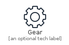
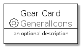
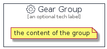

# Gear


```text
aws-q3-2021/Resource/GeneralIcons/Gear
```

```text
include('aws-q3-2021/Resource/GeneralIcons/Gear')
```


| Illustration | Gear | GearCard | GearGroup |
| :---: | :---: | :---: | :---: |
|  |  |  |  |


## Gear

### Load remotely
```plantuml
@startuml
' configures the library
!global $LIB_BASE_LOCATION="https://raw.githubusercontent.com/tmorin/plantuml-libs/master/distribution"

' loads the library's bootstrap
!include $LIB_BASE_LOCATION/bootstrap.puml

' loads the package bootstrap
include('aws-q3-2021/bootstrap')

' loads the Item which embeds the element Gear
include('aws-q3-2021/Resource/GeneralIcons/Gear')

' renders the element
Gear('Gear', 'Gear', 'an optional tech label')
@enduml
```

### Load locally
```plantuml
@startuml
' configures the library
!global $INCLUSION_MODE="local"
!global $LIB_BASE_LOCATION="../../.."

' loads the library's bootstrap
!include $LIB_BASE_LOCATION/bootstrap.puml

' loads the package bootstrap
include('aws-q3-2021/bootstrap')

' loads the Item which embeds the element Gear
include('aws-q3-2021/Resource/GeneralIcons/Gear')

' renders the element
Gear('Gear', 'Gear', 'an optional tech label')
@enduml
```

## GearCard

### Load remotely
```plantuml
@startuml
' configures the library
!global $LIB_BASE_LOCATION="https://raw.githubusercontent.com/tmorin/plantuml-libs/master/distribution"

' loads the library's bootstrap
!include $LIB_BASE_LOCATION/bootstrap.puml

' loads the package bootstrap
include('aws-q3-2021/bootstrap')

' loads the Item which embeds the element GearCard
include('aws-q3-2021/Resource/GeneralIcons/Gear')

' renders the element
GearCard('GearCard', 'Gear Card', 'an optional description')
@enduml
```

### Load locally
```plantuml
@startuml
' configures the library
!global $INCLUSION_MODE="local"
!global $LIB_BASE_LOCATION="../../.."

' loads the library's bootstrap
!include $LIB_BASE_LOCATION/bootstrap.puml

' loads the package bootstrap
include('aws-q3-2021/bootstrap')

' loads the Item which embeds the element GearCard
include('aws-q3-2021/Resource/GeneralIcons/Gear')

' renders the element
GearCard('GearCard', 'Gear Card', 'an optional description')
@enduml
```

## GearGroup

### Load remotely
```plantuml
@startuml
' configures the library
!global $LIB_BASE_LOCATION="https://raw.githubusercontent.com/tmorin/plantuml-libs/master/distribution"

' loads the library's bootstrap
!include $LIB_BASE_LOCATION/bootstrap.puml

' loads the package bootstrap
include('aws-q3-2021/bootstrap')

' loads the Item which embeds the element GearGroup
include('aws-q3-2021/Resource/GeneralIcons/Gear')

' renders the element
GearGroup('GearGroup', 'Gear Group', 'an optional tech label') {
    note as note
        the content of the group
    end note
}
@enduml
```

### Load locally
```plantuml
@startuml
' configures the library
!global $INCLUSION_MODE="local"
!global $LIB_BASE_LOCATION="../../.."

' loads the library's bootstrap
!include $LIB_BASE_LOCATION/bootstrap.puml

' loads the package bootstrap
include('aws-q3-2021/bootstrap')

' loads the Item which embeds the element GearGroup
include('aws-q3-2021/Resource/GeneralIcons/Gear')

' renders the element
GearGroup('GearGroup', 'Gear Group', 'an optional tech label') {
    note as note
        the content of the group
    end note
}
@enduml
```

