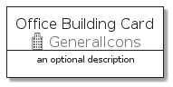
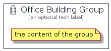

# OfficeBuilding


```text
aws-q3-2021/Resource/GeneralIcons/OfficeBuilding
```

```text
include('aws-q3-2021/Resource/GeneralIcons/OfficeBuilding')
```


| Illustration | OfficeBuilding | OfficeBuildingCard | OfficeBuildingGroup |
| :---: | :---: | :---: | :---: |
|  |  |  |  |


## OfficeBuilding

### Load remotely
```plantuml
@startuml
' configures the library
!global $LIB_BASE_LOCATION="https://raw.githubusercontent.com/tmorin/plantuml-libs/master/distribution"

' loads the library's bootstrap
!include $LIB_BASE_LOCATION/bootstrap.puml

' loads the package bootstrap
include('aws-q3-2021/bootstrap')

' loads the Item which embeds the element OfficeBuilding
include('aws-q3-2021/Resource/GeneralIcons/OfficeBuilding')

' renders the element
OfficeBuilding('OfficeBuilding', 'Office Building', 'an optional tech label')
@enduml
```

### Load locally
```plantuml
@startuml
' configures the library
!global $INCLUSION_MODE="local"
!global $LIB_BASE_LOCATION="../../.."

' loads the library's bootstrap
!include $LIB_BASE_LOCATION/bootstrap.puml

' loads the package bootstrap
include('aws-q3-2021/bootstrap')

' loads the Item which embeds the element OfficeBuilding
include('aws-q3-2021/Resource/GeneralIcons/OfficeBuilding')

' renders the element
OfficeBuilding('OfficeBuilding', 'Office Building', 'an optional tech label')
@enduml
```

## OfficeBuildingCard

### Load remotely
```plantuml
@startuml
' configures the library
!global $LIB_BASE_LOCATION="https://raw.githubusercontent.com/tmorin/plantuml-libs/master/distribution"

' loads the library's bootstrap
!include $LIB_BASE_LOCATION/bootstrap.puml

' loads the package bootstrap
include('aws-q3-2021/bootstrap')

' loads the Item which embeds the element OfficeBuildingCard
include('aws-q3-2021/Resource/GeneralIcons/OfficeBuilding')

' renders the element
OfficeBuildingCard('OfficeBuildingCard', 'Office Building Card', 'an optional description')
@enduml
```

### Load locally
```plantuml
@startuml
' configures the library
!global $INCLUSION_MODE="local"
!global $LIB_BASE_LOCATION="../../.."

' loads the library's bootstrap
!include $LIB_BASE_LOCATION/bootstrap.puml

' loads the package bootstrap
include('aws-q3-2021/bootstrap')

' loads the Item which embeds the element OfficeBuildingCard
include('aws-q3-2021/Resource/GeneralIcons/OfficeBuilding')

' renders the element
OfficeBuildingCard('OfficeBuildingCard', 'Office Building Card', 'an optional description')
@enduml
```

## OfficeBuildingGroup

### Load remotely
```plantuml
@startuml
' configures the library
!global $LIB_BASE_LOCATION="https://raw.githubusercontent.com/tmorin/plantuml-libs/master/distribution"

' loads the library's bootstrap
!include $LIB_BASE_LOCATION/bootstrap.puml

' loads the package bootstrap
include('aws-q3-2021/bootstrap')

' loads the Item which embeds the element OfficeBuildingGroup
include('aws-q3-2021/Resource/GeneralIcons/OfficeBuilding')

' renders the element
OfficeBuildingGroup('OfficeBuildingGroup', 'Office Building Group', 'an optional tech label') {
    note as note
        the content of the group
    end note
}
@enduml
```

### Load locally
```plantuml
@startuml
' configures the library
!global $INCLUSION_MODE="local"
!global $LIB_BASE_LOCATION="../../.."

' loads the library's bootstrap
!include $LIB_BASE_LOCATION/bootstrap.puml

' loads the package bootstrap
include('aws-q3-2021/bootstrap')

' loads the Item which embeds the element OfficeBuildingGroup
include('aws-q3-2021/Resource/GeneralIcons/OfficeBuilding')

' renders the element
OfficeBuildingGroup('OfficeBuildingGroup', 'Office Building Group', 'an optional tech label') {
    note as note
        the content of the group
    end note
}
@enduml
```

