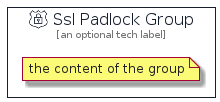

# SslPadlock


```text
aws-q3-2021/Resource/GeneralIcons/SslPadlock
```

```text
include('aws-q3-2021/Resource/GeneralIcons/SslPadlock')
```


| Illustration | SslPadlock | SslPadlockCard | SslPadlockGroup |
| :---: | :---: | :---: | :---: |
|  |  |  |  |


## SslPadlock

### Load remotely
```plantuml
@startuml
' configures the library
!global $LIB_BASE_LOCATION="https://github.com/tmorin/plantuml-libs/distribution"

' loads the library's bootstrap
!include $LIB_BASE_LOCATION/bootstrap.puml

' loads the package bootstrap
include('aws-q3-2021/bootstrap')

' loads the Item which embeds the element SslPadlock
include('aws-q3-2021/Resource/GeneralIcons/SslPadlock')

' renders the element
SslPadlock('SslPadlock', 'Ssl Padlock', 'an optional tech label')
@enduml
```

### Load locally
```plantuml
@startuml
' configures the library
!global $INCLUSION_MODE="local"
!global $LIB_BASE_LOCATION="../../.."

' loads the library's bootstrap
!include $LIB_BASE_LOCATION/bootstrap.puml

' loads the package bootstrap
include('aws-q3-2021/bootstrap')

' loads the Item which embeds the element SslPadlock
include('aws-q3-2021/Resource/GeneralIcons/SslPadlock')

' renders the element
SslPadlock('SslPadlock', 'Ssl Padlock', 'an optional tech label')
@enduml
```

## SslPadlockCard

### Load remotely
```plantuml
@startuml
' configures the library
!global $LIB_BASE_LOCATION="https://github.com/tmorin/plantuml-libs/distribution"

' loads the library's bootstrap
!include $LIB_BASE_LOCATION/bootstrap.puml

' loads the package bootstrap
include('aws-q3-2021/bootstrap')

' loads the Item which embeds the element SslPadlockCard
include('aws-q3-2021/Resource/GeneralIcons/SslPadlock')

' renders the element
SslPadlockCard('SslPadlockCard', 'Ssl Padlock Card', 'an optional description')
@enduml
```

### Load locally
```plantuml
@startuml
' configures the library
!global $INCLUSION_MODE="local"
!global $LIB_BASE_LOCATION="../../.."

' loads the library's bootstrap
!include $LIB_BASE_LOCATION/bootstrap.puml

' loads the package bootstrap
include('aws-q3-2021/bootstrap')

' loads the Item which embeds the element SslPadlockCard
include('aws-q3-2021/Resource/GeneralIcons/SslPadlock')

' renders the element
SslPadlockCard('SslPadlockCard', 'Ssl Padlock Card', 'an optional description')
@enduml
```

## SslPadlockGroup

### Load remotely
```plantuml
@startuml
' configures the library
!global $LIB_BASE_LOCATION="https://github.com/tmorin/plantuml-libs/distribution"

' loads the library's bootstrap
!include $LIB_BASE_LOCATION/bootstrap.puml

' loads the package bootstrap
include('aws-q3-2021/bootstrap')

' loads the Item which embeds the element SslPadlockGroup
include('aws-q3-2021/Resource/GeneralIcons/SslPadlock')

' renders the element
SslPadlockGroup('SslPadlockGroup', 'Ssl Padlock Group', 'an optional tech label') {
    note as note
        the content of the group
    end note
}
@enduml
```

### Load locally
```plantuml
@startuml
' configures the library
!global $INCLUSION_MODE="local"
!global $LIB_BASE_LOCATION="../../.."

' loads the library's bootstrap
!include $LIB_BASE_LOCATION/bootstrap.puml

' loads the package bootstrap
include('aws-q3-2021/bootstrap')

' loads the Item which embeds the element SslPadlockGroup
include('aws-q3-2021/Resource/GeneralIcons/SslPadlock')

' renders the element
SslPadlockGroup('SslPadlockGroup', 'Ssl Padlock Group', 'an optional tech label') {
    note as note
        the content of the group
    end note
}
@enduml
```

