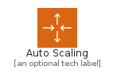
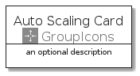
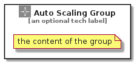

# AutoScaling


```text
aws-q3-2021/Resource/GroupIcons/AutoScaling
```

```text
include('aws-q3-2021/Resource/GroupIcons/AutoScaling')
```


| Illustration | AutoScaling | AutoScalingCard | AutoScalingGroup |
| :---: | :---: | :---: | :---: |
|  |  |  |  |


## AutoScaling

### Load remotely
```plantuml
@startuml
' configures the library
!global $LIB_BASE_LOCATION="https://github.com/tmorin/plantuml-libs/distribution"

' loads the library's bootstrap
!include $LIB_BASE_LOCATION/bootstrap.puml

' loads the package bootstrap
include('aws-q3-2021/bootstrap')

' loads the Item which embeds the element AutoScaling
include('aws-q3-2021/Resource/GroupIcons/AutoScaling')

' renders the element
AutoScaling('AutoScaling', 'Auto Scaling', 'an optional tech label')
@enduml
```

### Load locally
```plantuml
@startuml
' configures the library
!global $INCLUSION_MODE="local"
!global $LIB_BASE_LOCATION="../../.."

' loads the library's bootstrap
!include $LIB_BASE_LOCATION/bootstrap.puml

' loads the package bootstrap
include('aws-q3-2021/bootstrap')

' loads the Item which embeds the element AutoScaling
include('aws-q3-2021/Resource/GroupIcons/AutoScaling')

' renders the element
AutoScaling('AutoScaling', 'Auto Scaling', 'an optional tech label')
@enduml
```

## AutoScalingCard

### Load remotely
```plantuml
@startuml
' configures the library
!global $LIB_BASE_LOCATION="https://github.com/tmorin/plantuml-libs/distribution"

' loads the library's bootstrap
!include $LIB_BASE_LOCATION/bootstrap.puml

' loads the package bootstrap
include('aws-q3-2021/bootstrap')

' loads the Item which embeds the element AutoScalingCard
include('aws-q3-2021/Resource/GroupIcons/AutoScaling')

' renders the element
AutoScalingCard('AutoScalingCard', 'Auto Scaling Card', 'an optional description')
@enduml
```

### Load locally
```plantuml
@startuml
' configures the library
!global $INCLUSION_MODE="local"
!global $LIB_BASE_LOCATION="../../.."

' loads the library's bootstrap
!include $LIB_BASE_LOCATION/bootstrap.puml

' loads the package bootstrap
include('aws-q3-2021/bootstrap')

' loads the Item which embeds the element AutoScalingCard
include('aws-q3-2021/Resource/GroupIcons/AutoScaling')

' renders the element
AutoScalingCard('AutoScalingCard', 'Auto Scaling Card', 'an optional description')
@enduml
```

## AutoScalingGroup

### Load remotely
```plantuml
@startuml
' configures the library
!global $LIB_BASE_LOCATION="https://github.com/tmorin/plantuml-libs/distribution"

' loads the library's bootstrap
!include $LIB_BASE_LOCATION/bootstrap.puml

' loads the package bootstrap
include('aws-q3-2021/bootstrap')

' loads the Item which embeds the element AutoScalingGroup
include('aws-q3-2021/Resource/GroupIcons/AutoScaling')

' renders the element
AutoScalingGroup('AutoScalingGroup', 'Auto Scaling Group', 'an optional tech label') {
    note as note
        the content of the group
    end note
}
@enduml
```

### Load locally
```plantuml
@startuml
' configures the library
!global $INCLUSION_MODE="local"
!global $LIB_BASE_LOCATION="../../.."

' loads the library's bootstrap
!include $LIB_BASE_LOCATION/bootstrap.puml

' loads the package bootstrap
include('aws-q3-2021/bootstrap')

' loads the Item which embeds the element AutoScalingGroup
include('aws-q3-2021/Resource/GroupIcons/AutoScaling')

' renders the element
AutoScalingGroup('AutoScalingGroup', 'Auto Scaling Group', 'an optional tech label') {
    note as note
        the content of the group
    end note
}
@enduml
```

