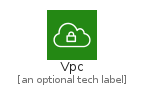
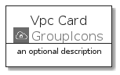
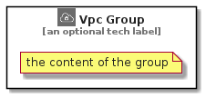

# Vpc


```text
aws-q3-2021/Resource/GroupIcons/Vpc
```

```text
include('aws-q3-2021/Resource/GroupIcons/Vpc')
```


| Illustration | Vpc | VpcCard | VpcGroup |
| :---: | :---: | :---: | :---: |
|  |  |  |  |


## Vpc

### Load remotely
```plantuml
@startuml
' configures the library
!global $LIB_BASE_LOCATION="https://raw.githubusercontent.com/tmorin/plantuml-libs/master/distribution"

' loads the library's bootstrap
!include $LIB_BASE_LOCATION/bootstrap.puml

' loads the package bootstrap
include('aws-q3-2021/bootstrap')

' loads the Item which embeds the element Vpc
include('aws-q3-2021/Resource/GroupIcons/Vpc')

' renders the element
Vpc('Vpc', 'Vpc', 'an optional tech label')
@enduml
```

### Load locally
```plantuml
@startuml
' configures the library
!global $INCLUSION_MODE="local"
!global $LIB_BASE_LOCATION="../../.."

' loads the library's bootstrap
!include $LIB_BASE_LOCATION/bootstrap.puml

' loads the package bootstrap
include('aws-q3-2021/bootstrap')

' loads the Item which embeds the element Vpc
include('aws-q3-2021/Resource/GroupIcons/Vpc')

' renders the element
Vpc('Vpc', 'Vpc', 'an optional tech label')
@enduml
```

## VpcCard

### Load remotely
```plantuml
@startuml
' configures the library
!global $LIB_BASE_LOCATION="https://raw.githubusercontent.com/tmorin/plantuml-libs/master/distribution"

' loads the library's bootstrap
!include $LIB_BASE_LOCATION/bootstrap.puml

' loads the package bootstrap
include('aws-q3-2021/bootstrap')

' loads the Item which embeds the element VpcCard
include('aws-q3-2021/Resource/GroupIcons/Vpc')

' renders the element
VpcCard('VpcCard', 'Vpc Card', 'an optional description')
@enduml
```

### Load locally
```plantuml
@startuml
' configures the library
!global $INCLUSION_MODE="local"
!global $LIB_BASE_LOCATION="../../.."

' loads the library's bootstrap
!include $LIB_BASE_LOCATION/bootstrap.puml

' loads the package bootstrap
include('aws-q3-2021/bootstrap')

' loads the Item which embeds the element VpcCard
include('aws-q3-2021/Resource/GroupIcons/Vpc')

' renders the element
VpcCard('VpcCard', 'Vpc Card', 'an optional description')
@enduml
```

## VpcGroup

### Load remotely
```plantuml
@startuml
' configures the library
!global $LIB_BASE_LOCATION="https://raw.githubusercontent.com/tmorin/plantuml-libs/master/distribution"

' loads the library's bootstrap
!include $LIB_BASE_LOCATION/bootstrap.puml

' loads the package bootstrap
include('aws-q3-2021/bootstrap')

' loads the Item which embeds the element VpcGroup
include('aws-q3-2021/Resource/GroupIcons/Vpc')

' renders the element
VpcGroup('VpcGroup', 'Vpc Group', 'an optional tech label') {
    note as note
        the content of the group
    end note
}
@enduml
```

### Load locally
```plantuml
@startuml
' configures the library
!global $INCLUSION_MODE="local"
!global $LIB_BASE_LOCATION="../../.."

' loads the library's bootstrap
!include $LIB_BASE_LOCATION/bootstrap.puml

' loads the package bootstrap
include('aws-q3-2021/bootstrap')

' loads the Item which embeds the element VpcGroup
include('aws-q3-2021/Resource/GroupIcons/Vpc')

' renders the element
VpcGroup('VpcGroup', 'Vpc Group', 'an optional tech label') {
    note as note
        the content of the group
    end note
}
@enduml
```

