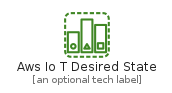
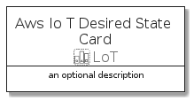
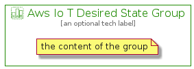

# AwsIoTDesiredState


```text
aws-q3-2021/Resource/LoT/AwsIoTDesiredState
```

```text
include('aws-q3-2021/Resource/LoT/AwsIoTDesiredState')
```


| Illustration | AwsIoTDesiredState | AwsIoTDesiredStateCard | AwsIoTDesiredStateGroup |
| :---: | :---: | :---: | :---: |
|  |  |  |  |


## AwsIoTDesiredState

### Load remotely
```plantuml
@startuml
' configures the library
!global $LIB_BASE_LOCATION="https://github.com/tmorin/plantuml-libs/distribution"

' loads the library's bootstrap
!include $LIB_BASE_LOCATION/bootstrap.puml

' loads the package bootstrap
include('aws-q3-2021/bootstrap')

' loads the Item which embeds the element AwsIoTDesiredState
include('aws-q3-2021/Resource/LoT/AwsIoTDesiredState')

' renders the element
AwsIoTDesiredState('AwsIoTDesiredState', 'Aws Io T Desired State', 'an optional tech label')
@enduml
```

### Load locally
```plantuml
@startuml
' configures the library
!global $INCLUSION_MODE="local"
!global $LIB_BASE_LOCATION="../../.."

' loads the library's bootstrap
!include $LIB_BASE_LOCATION/bootstrap.puml

' loads the package bootstrap
include('aws-q3-2021/bootstrap')

' loads the Item which embeds the element AwsIoTDesiredState
include('aws-q3-2021/Resource/LoT/AwsIoTDesiredState')

' renders the element
AwsIoTDesiredState('AwsIoTDesiredState', 'Aws Io T Desired State', 'an optional tech label')
@enduml
```

## AwsIoTDesiredStateCard

### Load remotely
```plantuml
@startuml
' configures the library
!global $LIB_BASE_LOCATION="https://github.com/tmorin/plantuml-libs/distribution"

' loads the library's bootstrap
!include $LIB_BASE_LOCATION/bootstrap.puml

' loads the package bootstrap
include('aws-q3-2021/bootstrap')

' loads the Item which embeds the element AwsIoTDesiredStateCard
include('aws-q3-2021/Resource/LoT/AwsIoTDesiredState')

' renders the element
AwsIoTDesiredStateCard('AwsIoTDesiredStateCard', 'Aws Io T Desired State Card', 'an optional description')
@enduml
```

### Load locally
```plantuml
@startuml
' configures the library
!global $INCLUSION_MODE="local"
!global $LIB_BASE_LOCATION="../../.."

' loads the library's bootstrap
!include $LIB_BASE_LOCATION/bootstrap.puml

' loads the package bootstrap
include('aws-q3-2021/bootstrap')

' loads the Item which embeds the element AwsIoTDesiredStateCard
include('aws-q3-2021/Resource/LoT/AwsIoTDesiredState')

' renders the element
AwsIoTDesiredStateCard('AwsIoTDesiredStateCard', 'Aws Io T Desired State Card', 'an optional description')
@enduml
```

## AwsIoTDesiredStateGroup

### Load remotely
```plantuml
@startuml
' configures the library
!global $LIB_BASE_LOCATION="https://github.com/tmorin/plantuml-libs/distribution"

' loads the library's bootstrap
!include $LIB_BASE_LOCATION/bootstrap.puml

' loads the package bootstrap
include('aws-q3-2021/bootstrap')

' loads the Item which embeds the element AwsIoTDesiredStateGroup
include('aws-q3-2021/Resource/LoT/AwsIoTDesiredState')

' renders the element
AwsIoTDesiredStateGroup('AwsIoTDesiredStateGroup', 'Aws Io T Desired State Group', 'an optional tech label') {
    note as note
        the content of the group
    end note
}
@enduml
```

### Load locally
```plantuml
@startuml
' configures the library
!global $INCLUSION_MODE="local"
!global $LIB_BASE_LOCATION="../../.."

' loads the library's bootstrap
!include $LIB_BASE_LOCATION/bootstrap.puml

' loads the package bootstrap
include('aws-q3-2021/bootstrap')

' loads the Item which embeds the element AwsIoTDesiredStateGroup
include('aws-q3-2021/Resource/LoT/AwsIoTDesiredState')

' renders the element
AwsIoTDesiredStateGroup('AwsIoTDesiredStateGroup', 'Aws Io T Desired State Group', 'an optional tech label') {
    note as note
        the content of the group
    end note
}
@enduml
```

