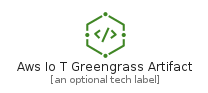
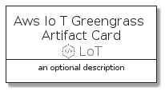
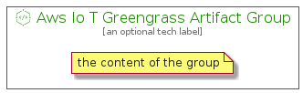

# AwsIoTGreengrassArtifact


```text
aws-q3-2021/Resource/LoT/AwsIoTGreengrassArtifact
```

```text
include('aws-q3-2021/Resource/LoT/AwsIoTGreengrassArtifact')
```


| Illustration | AwsIoTGreengrassArtifact | AwsIoTGreengrassArtifactCard | AwsIoTGreengrassArtifactGroup |
| :---: | :---: | :---: | :---: |
|  |  |  |  |


## AwsIoTGreengrassArtifact

### Load remotely
```plantuml
@startuml
' configures the library
!global $LIB_BASE_LOCATION="https://github.com/tmorin/plantuml-libs/distribution"

' loads the library's bootstrap
!include $LIB_BASE_LOCATION/bootstrap.puml

' loads the package bootstrap
include('aws-q3-2021/bootstrap')

' loads the Item which embeds the element AwsIoTGreengrassArtifact
include('aws-q3-2021/Resource/LoT/AwsIoTGreengrassArtifact')

' renders the element
AwsIoTGreengrassArtifact('AwsIoTGreengrassArtifact', 'Aws Io T Greengrass Artifact', 'an optional tech label')
@enduml
```

### Load locally
```plantuml
@startuml
' configures the library
!global $INCLUSION_MODE="local"
!global $LIB_BASE_LOCATION="../../.."

' loads the library's bootstrap
!include $LIB_BASE_LOCATION/bootstrap.puml

' loads the package bootstrap
include('aws-q3-2021/bootstrap')

' loads the Item which embeds the element AwsIoTGreengrassArtifact
include('aws-q3-2021/Resource/LoT/AwsIoTGreengrassArtifact')

' renders the element
AwsIoTGreengrassArtifact('AwsIoTGreengrassArtifact', 'Aws Io T Greengrass Artifact', 'an optional tech label')
@enduml
```

## AwsIoTGreengrassArtifactCard

### Load remotely
```plantuml
@startuml
' configures the library
!global $LIB_BASE_LOCATION="https://github.com/tmorin/plantuml-libs/distribution"

' loads the library's bootstrap
!include $LIB_BASE_LOCATION/bootstrap.puml

' loads the package bootstrap
include('aws-q3-2021/bootstrap')

' loads the Item which embeds the element AwsIoTGreengrassArtifactCard
include('aws-q3-2021/Resource/LoT/AwsIoTGreengrassArtifact')

' renders the element
AwsIoTGreengrassArtifactCard('AwsIoTGreengrassArtifactCard', 'Aws Io T Greengrass Artifact Card', 'an optional description')
@enduml
```

### Load locally
```plantuml
@startuml
' configures the library
!global $INCLUSION_MODE="local"
!global $LIB_BASE_LOCATION="../../.."

' loads the library's bootstrap
!include $LIB_BASE_LOCATION/bootstrap.puml

' loads the package bootstrap
include('aws-q3-2021/bootstrap')

' loads the Item which embeds the element AwsIoTGreengrassArtifactCard
include('aws-q3-2021/Resource/LoT/AwsIoTGreengrassArtifact')

' renders the element
AwsIoTGreengrassArtifactCard('AwsIoTGreengrassArtifactCard', 'Aws Io T Greengrass Artifact Card', 'an optional description')
@enduml
```

## AwsIoTGreengrassArtifactGroup

### Load remotely
```plantuml
@startuml
' configures the library
!global $LIB_BASE_LOCATION="https://github.com/tmorin/plantuml-libs/distribution"

' loads the library's bootstrap
!include $LIB_BASE_LOCATION/bootstrap.puml

' loads the package bootstrap
include('aws-q3-2021/bootstrap')

' loads the Item which embeds the element AwsIoTGreengrassArtifactGroup
include('aws-q3-2021/Resource/LoT/AwsIoTGreengrassArtifact')

' renders the element
AwsIoTGreengrassArtifactGroup('AwsIoTGreengrassArtifactGroup', 'Aws Io T Greengrass Artifact Group', 'an optional tech label') {
    note as note
        the content of the group
    end note
}
@enduml
```

### Load locally
```plantuml
@startuml
' configures the library
!global $INCLUSION_MODE="local"
!global $LIB_BASE_LOCATION="../../.."

' loads the library's bootstrap
!include $LIB_BASE_LOCATION/bootstrap.puml

' loads the package bootstrap
include('aws-q3-2021/bootstrap')

' loads the Item which embeds the element AwsIoTGreengrassArtifactGroup
include('aws-q3-2021/Resource/LoT/AwsIoTGreengrassArtifact')

' renders the element
AwsIoTGreengrassArtifactGroup('AwsIoTGreengrassArtifactGroup', 'Aws Io T Greengrass Artifact Group', 'an optional tech label') {
    note as note
        the content of the group
    end note
}
@enduml
```

