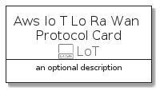
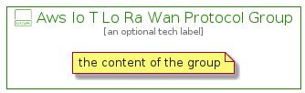

# AwsIoTLoRaWanProtocol


```text
aws-q3-2021/Resource/LoT/AwsIoTLoRaWanProtocol
```

```text
include('aws-q3-2021/Resource/LoT/AwsIoTLoRaWanProtocol')
```


| Illustration | AwsIoTLoRaWanProtocol | AwsIoTLoRaWanProtocolCard | AwsIoTLoRaWanProtocolGroup |
| :---: | :---: | :---: | :---: |
|  |  |  |  |


## AwsIoTLoRaWanProtocol

### Load remotely
```plantuml
@startuml
' configures the library
!global $LIB_BASE_LOCATION="https://github.com/tmorin/plantuml-libs/distribution"

' loads the library's bootstrap
!include $LIB_BASE_LOCATION/bootstrap.puml

' loads the package bootstrap
include('aws-q3-2021/bootstrap')

' loads the Item which embeds the element AwsIoTLoRaWanProtocol
include('aws-q3-2021/Resource/LoT/AwsIoTLoRaWanProtocol')

' renders the element
AwsIoTLoRaWanProtocol('AwsIoTLoRaWanProtocol', 'Aws Io T Lo Ra Wan Protocol', 'an optional tech label')
@enduml
```

### Load locally
```plantuml
@startuml
' configures the library
!global $INCLUSION_MODE="local"
!global $LIB_BASE_LOCATION="../../.."

' loads the library's bootstrap
!include $LIB_BASE_LOCATION/bootstrap.puml

' loads the package bootstrap
include('aws-q3-2021/bootstrap')

' loads the Item which embeds the element AwsIoTLoRaWanProtocol
include('aws-q3-2021/Resource/LoT/AwsIoTLoRaWanProtocol')

' renders the element
AwsIoTLoRaWanProtocol('AwsIoTLoRaWanProtocol', 'Aws Io T Lo Ra Wan Protocol', 'an optional tech label')
@enduml
```

## AwsIoTLoRaWanProtocolCard

### Load remotely
```plantuml
@startuml
' configures the library
!global $LIB_BASE_LOCATION="https://github.com/tmorin/plantuml-libs/distribution"

' loads the library's bootstrap
!include $LIB_BASE_LOCATION/bootstrap.puml

' loads the package bootstrap
include('aws-q3-2021/bootstrap')

' loads the Item which embeds the element AwsIoTLoRaWanProtocolCard
include('aws-q3-2021/Resource/LoT/AwsIoTLoRaWanProtocol')

' renders the element
AwsIoTLoRaWanProtocolCard('AwsIoTLoRaWanProtocolCard', 'Aws Io T Lo Ra Wan Protocol Card', 'an optional description')
@enduml
```

### Load locally
```plantuml
@startuml
' configures the library
!global $INCLUSION_MODE="local"
!global $LIB_BASE_LOCATION="../../.."

' loads the library's bootstrap
!include $LIB_BASE_LOCATION/bootstrap.puml

' loads the package bootstrap
include('aws-q3-2021/bootstrap')

' loads the Item which embeds the element AwsIoTLoRaWanProtocolCard
include('aws-q3-2021/Resource/LoT/AwsIoTLoRaWanProtocol')

' renders the element
AwsIoTLoRaWanProtocolCard('AwsIoTLoRaWanProtocolCard', 'Aws Io T Lo Ra Wan Protocol Card', 'an optional description')
@enduml
```

## AwsIoTLoRaWanProtocolGroup

### Load remotely
```plantuml
@startuml
' configures the library
!global $LIB_BASE_LOCATION="https://github.com/tmorin/plantuml-libs/distribution"

' loads the library's bootstrap
!include $LIB_BASE_LOCATION/bootstrap.puml

' loads the package bootstrap
include('aws-q3-2021/bootstrap')

' loads the Item which embeds the element AwsIoTLoRaWanProtocolGroup
include('aws-q3-2021/Resource/LoT/AwsIoTLoRaWanProtocol')

' renders the element
AwsIoTLoRaWanProtocolGroup('AwsIoTLoRaWanProtocolGroup', 'Aws Io T Lo Ra Wan Protocol Group', 'an optional tech label') {
    note as note
        the content of the group
    end note
}
@enduml
```

### Load locally
```plantuml
@startuml
' configures the library
!global $INCLUSION_MODE="local"
!global $LIB_BASE_LOCATION="../../.."

' loads the library's bootstrap
!include $LIB_BASE_LOCATION/bootstrap.puml

' loads the package bootstrap
include('aws-q3-2021/bootstrap')

' loads the Item which embeds the element AwsIoTLoRaWanProtocolGroup
include('aws-q3-2021/Resource/LoT/AwsIoTLoRaWanProtocol')

' renders the element
AwsIoTLoRaWanProtocolGroup('AwsIoTLoRaWanProtocolGroup', 'Aws Io T Lo Ra Wan Protocol Group', 'an optional tech label') {
    note as note
        the content of the group
    end note
}
@enduml
```

