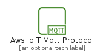
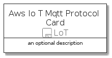
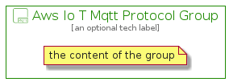

# AwsIoTMqttProtocol


```text
aws-q3-2021/Resource/LoT/AwsIoTMqttProtocol
```

```text
include('aws-q3-2021/Resource/LoT/AwsIoTMqttProtocol')
```


| Illustration | AwsIoTMqttProtocol | AwsIoTMqttProtocolCard | AwsIoTMqttProtocolGroup |
| :---: | :---: | :---: | :---: |
|  |  |  |  |


## AwsIoTMqttProtocol

### Load remotely
```plantuml
@startuml
' configures the library
!global $LIB_BASE_LOCATION="https://github.com/tmorin/plantuml-libs/distribution"

' loads the library's bootstrap
!include $LIB_BASE_LOCATION/bootstrap.puml

' loads the package bootstrap
include('aws-q3-2021/bootstrap')

' loads the Item which embeds the element AwsIoTMqttProtocol
include('aws-q3-2021/Resource/LoT/AwsIoTMqttProtocol')

' renders the element
AwsIoTMqttProtocol('AwsIoTMqttProtocol', 'Aws Io T Mqtt Protocol', 'an optional tech label')
@enduml
```

### Load locally
```plantuml
@startuml
' configures the library
!global $INCLUSION_MODE="local"
!global $LIB_BASE_LOCATION="../../.."

' loads the library's bootstrap
!include $LIB_BASE_LOCATION/bootstrap.puml

' loads the package bootstrap
include('aws-q3-2021/bootstrap')

' loads the Item which embeds the element AwsIoTMqttProtocol
include('aws-q3-2021/Resource/LoT/AwsIoTMqttProtocol')

' renders the element
AwsIoTMqttProtocol('AwsIoTMqttProtocol', 'Aws Io T Mqtt Protocol', 'an optional tech label')
@enduml
```

## AwsIoTMqttProtocolCard

### Load remotely
```plantuml
@startuml
' configures the library
!global $LIB_BASE_LOCATION="https://github.com/tmorin/plantuml-libs/distribution"

' loads the library's bootstrap
!include $LIB_BASE_LOCATION/bootstrap.puml

' loads the package bootstrap
include('aws-q3-2021/bootstrap')

' loads the Item which embeds the element AwsIoTMqttProtocolCard
include('aws-q3-2021/Resource/LoT/AwsIoTMqttProtocol')

' renders the element
AwsIoTMqttProtocolCard('AwsIoTMqttProtocolCard', 'Aws Io T Mqtt Protocol Card', 'an optional description')
@enduml
```

### Load locally
```plantuml
@startuml
' configures the library
!global $INCLUSION_MODE="local"
!global $LIB_BASE_LOCATION="../../.."

' loads the library's bootstrap
!include $LIB_BASE_LOCATION/bootstrap.puml

' loads the package bootstrap
include('aws-q3-2021/bootstrap')

' loads the Item which embeds the element AwsIoTMqttProtocolCard
include('aws-q3-2021/Resource/LoT/AwsIoTMqttProtocol')

' renders the element
AwsIoTMqttProtocolCard('AwsIoTMqttProtocolCard', 'Aws Io T Mqtt Protocol Card', 'an optional description')
@enduml
```

## AwsIoTMqttProtocolGroup

### Load remotely
```plantuml
@startuml
' configures the library
!global $LIB_BASE_LOCATION="https://github.com/tmorin/plantuml-libs/distribution"

' loads the library's bootstrap
!include $LIB_BASE_LOCATION/bootstrap.puml

' loads the package bootstrap
include('aws-q3-2021/bootstrap')

' loads the Item which embeds the element AwsIoTMqttProtocolGroup
include('aws-q3-2021/Resource/LoT/AwsIoTMqttProtocol')

' renders the element
AwsIoTMqttProtocolGroup('AwsIoTMqttProtocolGroup', 'Aws Io T Mqtt Protocol Group', 'an optional tech label') {
    note as note
        the content of the group
    end note
}
@enduml
```

### Load locally
```plantuml
@startuml
' configures the library
!global $INCLUSION_MODE="local"
!global $LIB_BASE_LOCATION="../../.."

' loads the library's bootstrap
!include $LIB_BASE_LOCATION/bootstrap.puml

' loads the package bootstrap
include('aws-q3-2021/bootstrap')

' loads the Item which embeds the element AwsIoTMqttProtocolGroup
include('aws-q3-2021/Resource/LoT/AwsIoTMqttProtocol')

' renders the element
AwsIoTMqttProtocolGroup('AwsIoTMqttProtocolGroup', 'Aws Io T Mqtt Protocol Group', 'an optional tech label') {
    note as note
        the content of the group
    end note
}
@enduml
```

