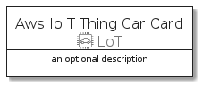
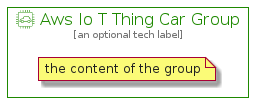

# AwsIoTThingCar


```text
aws-q3-2021/Resource/LoT/AwsIoTThingCar
```

```text
include('aws-q3-2021/Resource/LoT/AwsIoTThingCar')
```


| Illustration | AwsIoTThingCar | AwsIoTThingCarCard | AwsIoTThingCarGroup |
| :---: | :---: | :---: | :---: |
|  |  |  |  |


## AwsIoTThingCar

### Load remotely
```plantuml
@startuml
' configures the library
!global $LIB_BASE_LOCATION="https://github.com/tmorin/plantuml-libs/distribution"

' loads the library's bootstrap
!include $LIB_BASE_LOCATION/bootstrap.puml

' loads the package bootstrap
include('aws-q3-2021/bootstrap')

' loads the Item which embeds the element AwsIoTThingCar
include('aws-q3-2021/Resource/LoT/AwsIoTThingCar')

' renders the element
AwsIoTThingCar('AwsIoTThingCar', 'Aws Io T Thing Car', 'an optional tech label')
@enduml
```

### Load locally
```plantuml
@startuml
' configures the library
!global $INCLUSION_MODE="local"
!global $LIB_BASE_LOCATION="../../.."

' loads the library's bootstrap
!include $LIB_BASE_LOCATION/bootstrap.puml

' loads the package bootstrap
include('aws-q3-2021/bootstrap')

' loads the Item which embeds the element AwsIoTThingCar
include('aws-q3-2021/Resource/LoT/AwsIoTThingCar')

' renders the element
AwsIoTThingCar('AwsIoTThingCar', 'Aws Io T Thing Car', 'an optional tech label')
@enduml
```

## AwsIoTThingCarCard

### Load remotely
```plantuml
@startuml
' configures the library
!global $LIB_BASE_LOCATION="https://github.com/tmorin/plantuml-libs/distribution"

' loads the library's bootstrap
!include $LIB_BASE_LOCATION/bootstrap.puml

' loads the package bootstrap
include('aws-q3-2021/bootstrap')

' loads the Item which embeds the element AwsIoTThingCarCard
include('aws-q3-2021/Resource/LoT/AwsIoTThingCar')

' renders the element
AwsIoTThingCarCard('AwsIoTThingCarCard', 'Aws Io T Thing Car Card', 'an optional description')
@enduml
```

### Load locally
```plantuml
@startuml
' configures the library
!global $INCLUSION_MODE="local"
!global $LIB_BASE_LOCATION="../../.."

' loads the library's bootstrap
!include $LIB_BASE_LOCATION/bootstrap.puml

' loads the package bootstrap
include('aws-q3-2021/bootstrap')

' loads the Item which embeds the element AwsIoTThingCarCard
include('aws-q3-2021/Resource/LoT/AwsIoTThingCar')

' renders the element
AwsIoTThingCarCard('AwsIoTThingCarCard', 'Aws Io T Thing Car Card', 'an optional description')
@enduml
```

## AwsIoTThingCarGroup

### Load remotely
```plantuml
@startuml
' configures the library
!global $LIB_BASE_LOCATION="https://github.com/tmorin/plantuml-libs/distribution"

' loads the library's bootstrap
!include $LIB_BASE_LOCATION/bootstrap.puml

' loads the package bootstrap
include('aws-q3-2021/bootstrap')

' loads the Item which embeds the element AwsIoTThingCarGroup
include('aws-q3-2021/Resource/LoT/AwsIoTThingCar')

' renders the element
AwsIoTThingCarGroup('AwsIoTThingCarGroup', 'Aws Io T Thing Car Group', 'an optional tech label') {
    note as note
        the content of the group
    end note
}
@enduml
```

### Load locally
```plantuml
@startuml
' configures the library
!global $INCLUSION_MODE="local"
!global $LIB_BASE_LOCATION="../../.."

' loads the library's bootstrap
!include $LIB_BASE_LOCATION/bootstrap.puml

' loads the package bootstrap
include('aws-q3-2021/bootstrap')

' loads the Item which embeds the element AwsIoTThingCarGroup
include('aws-q3-2021/Resource/LoT/AwsIoTThingCar')

' renders the element
AwsIoTThingCarGroup('AwsIoTThingCarGroup', 'Aws Io T Thing Car Group', 'an optional tech label') {
    note as note
        the content of the group
    end note
}
@enduml
```

