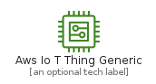
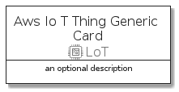
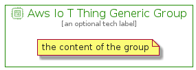

# AwsIoTThingGeneric


```text
aws-q3-2021/Resource/LoT/AwsIoTThingGeneric
```

```text
include('aws-q3-2021/Resource/LoT/AwsIoTThingGeneric')
```


| Illustration | AwsIoTThingGeneric | AwsIoTThingGenericCard | AwsIoTThingGenericGroup |
| :---: | :---: | :---: | :---: |
|  |  |  |  |


## AwsIoTThingGeneric

### Load remotely
```plantuml
@startuml
' configures the library
!global $LIB_BASE_LOCATION="https://github.com/tmorin/plantuml-libs/distribution"

' loads the library's bootstrap
!include $LIB_BASE_LOCATION/bootstrap.puml

' loads the package bootstrap
include('aws-q3-2021/bootstrap')

' loads the Item which embeds the element AwsIoTThingGeneric
include('aws-q3-2021/Resource/LoT/AwsIoTThingGeneric')

' renders the element
AwsIoTThingGeneric('AwsIoTThingGeneric', 'Aws Io T Thing Generic', 'an optional tech label')
@enduml
```

### Load locally
```plantuml
@startuml
' configures the library
!global $INCLUSION_MODE="local"
!global $LIB_BASE_LOCATION="../../.."

' loads the library's bootstrap
!include $LIB_BASE_LOCATION/bootstrap.puml

' loads the package bootstrap
include('aws-q3-2021/bootstrap')

' loads the Item which embeds the element AwsIoTThingGeneric
include('aws-q3-2021/Resource/LoT/AwsIoTThingGeneric')

' renders the element
AwsIoTThingGeneric('AwsIoTThingGeneric', 'Aws Io T Thing Generic', 'an optional tech label')
@enduml
```

## AwsIoTThingGenericCard

### Load remotely
```plantuml
@startuml
' configures the library
!global $LIB_BASE_LOCATION="https://github.com/tmorin/plantuml-libs/distribution"

' loads the library's bootstrap
!include $LIB_BASE_LOCATION/bootstrap.puml

' loads the package bootstrap
include('aws-q3-2021/bootstrap')

' loads the Item which embeds the element AwsIoTThingGenericCard
include('aws-q3-2021/Resource/LoT/AwsIoTThingGeneric')

' renders the element
AwsIoTThingGenericCard('AwsIoTThingGenericCard', 'Aws Io T Thing Generic Card', 'an optional description')
@enduml
```

### Load locally
```plantuml
@startuml
' configures the library
!global $INCLUSION_MODE="local"
!global $LIB_BASE_LOCATION="../../.."

' loads the library's bootstrap
!include $LIB_BASE_LOCATION/bootstrap.puml

' loads the package bootstrap
include('aws-q3-2021/bootstrap')

' loads the Item which embeds the element AwsIoTThingGenericCard
include('aws-q3-2021/Resource/LoT/AwsIoTThingGeneric')

' renders the element
AwsIoTThingGenericCard('AwsIoTThingGenericCard', 'Aws Io T Thing Generic Card', 'an optional description')
@enduml
```

## AwsIoTThingGenericGroup

### Load remotely
```plantuml
@startuml
' configures the library
!global $LIB_BASE_LOCATION="https://github.com/tmorin/plantuml-libs/distribution"

' loads the library's bootstrap
!include $LIB_BASE_LOCATION/bootstrap.puml

' loads the package bootstrap
include('aws-q3-2021/bootstrap')

' loads the Item which embeds the element AwsIoTThingGenericGroup
include('aws-q3-2021/Resource/LoT/AwsIoTThingGeneric')

' renders the element
AwsIoTThingGenericGroup('AwsIoTThingGenericGroup', 'Aws Io T Thing Generic Group', 'an optional tech label') {
    note as note
        the content of the group
    end note
}
@enduml
```

### Load locally
```plantuml
@startuml
' configures the library
!global $INCLUSION_MODE="local"
!global $LIB_BASE_LOCATION="../../.."

' loads the library's bootstrap
!include $LIB_BASE_LOCATION/bootstrap.puml

' loads the package bootstrap
include('aws-q3-2021/bootstrap')

' loads the Item which embeds the element AwsIoTThingGenericGroup
include('aws-q3-2021/Resource/LoT/AwsIoTThingGeneric')

' renders the element
AwsIoTThingGenericGroup('AwsIoTThingGenericGroup', 'Aws Io T Thing Generic Group', 'an optional tech label') {
    note as note
        the content of the group
    end note
}
@enduml
```

