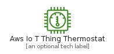
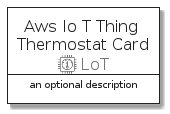
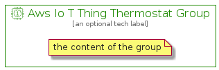

# AwsIoTThingThermostat


```text
aws-q3-2021/Resource/LoT/AwsIoTThingThermostat
```

```text
include('aws-q3-2021/Resource/LoT/AwsIoTThingThermostat')
```


| Illustration | AwsIoTThingThermostat | AwsIoTThingThermostatCard | AwsIoTThingThermostatGroup |
| :---: | :---: | :---: | :---: |
|  |  |  |  |


## AwsIoTThingThermostat

### Load remotely
```plantuml
@startuml
' configures the library
!global $LIB_BASE_LOCATION="https://raw.githubusercontent.com/tmorin/plantuml-libs/master/distribution"

' loads the library's bootstrap
!include $LIB_BASE_LOCATION/bootstrap.puml

' loads the package bootstrap
include('aws-q3-2021/bootstrap')

' loads the Item which embeds the element AwsIoTThingThermostat
include('aws-q3-2021/Resource/LoT/AwsIoTThingThermostat')

' renders the element
AwsIoTThingThermostat('AwsIoTThingThermostat', 'Aws Io T Thing Thermostat', 'an optional tech label')
@enduml
```

### Load locally
```plantuml
@startuml
' configures the library
!global $INCLUSION_MODE="local"
!global $LIB_BASE_LOCATION="../../.."

' loads the library's bootstrap
!include $LIB_BASE_LOCATION/bootstrap.puml

' loads the package bootstrap
include('aws-q3-2021/bootstrap')

' loads the Item which embeds the element AwsIoTThingThermostat
include('aws-q3-2021/Resource/LoT/AwsIoTThingThermostat')

' renders the element
AwsIoTThingThermostat('AwsIoTThingThermostat', 'Aws Io T Thing Thermostat', 'an optional tech label')
@enduml
```

## AwsIoTThingThermostatCard

### Load remotely
```plantuml
@startuml
' configures the library
!global $LIB_BASE_LOCATION="https://raw.githubusercontent.com/tmorin/plantuml-libs/master/distribution"

' loads the library's bootstrap
!include $LIB_BASE_LOCATION/bootstrap.puml

' loads the package bootstrap
include('aws-q3-2021/bootstrap')

' loads the Item which embeds the element AwsIoTThingThermostatCard
include('aws-q3-2021/Resource/LoT/AwsIoTThingThermostat')

' renders the element
AwsIoTThingThermostatCard('AwsIoTThingThermostatCard', 'Aws Io T Thing Thermostat Card', 'an optional description')
@enduml
```

### Load locally
```plantuml
@startuml
' configures the library
!global $INCLUSION_MODE="local"
!global $LIB_BASE_LOCATION="../../.."

' loads the library's bootstrap
!include $LIB_BASE_LOCATION/bootstrap.puml

' loads the package bootstrap
include('aws-q3-2021/bootstrap')

' loads the Item which embeds the element AwsIoTThingThermostatCard
include('aws-q3-2021/Resource/LoT/AwsIoTThingThermostat')

' renders the element
AwsIoTThingThermostatCard('AwsIoTThingThermostatCard', 'Aws Io T Thing Thermostat Card', 'an optional description')
@enduml
```

## AwsIoTThingThermostatGroup

### Load remotely
```plantuml
@startuml
' configures the library
!global $LIB_BASE_LOCATION="https://raw.githubusercontent.com/tmorin/plantuml-libs/master/distribution"

' loads the library's bootstrap
!include $LIB_BASE_LOCATION/bootstrap.puml

' loads the package bootstrap
include('aws-q3-2021/bootstrap')

' loads the Item which embeds the element AwsIoTThingThermostatGroup
include('aws-q3-2021/Resource/LoT/AwsIoTThingThermostat')

' renders the element
AwsIoTThingThermostatGroup('AwsIoTThingThermostatGroup', 'Aws Io T Thing Thermostat Group', 'an optional tech label') {
    note as note
        the content of the group
    end note
}
@enduml
```

### Load locally
```plantuml
@startuml
' configures the library
!global $INCLUSION_MODE="local"
!global $LIB_BASE_LOCATION="../../.."

' loads the library's bootstrap
!include $LIB_BASE_LOCATION/bootstrap.puml

' loads the package bootstrap
include('aws-q3-2021/bootstrap')

' loads the Item which embeds the element AwsIoTThingThermostatGroup
include('aws-q3-2021/Resource/LoT/AwsIoTThingThermostat')

' renders the element
AwsIoTThingThermostatGroup('AwsIoTThingThermostatGroup', 'Aws Io T Thing Thermostat Group', 'an optional tech label') {
    note as note
        the content of the group
    end note
}
@enduml
```

