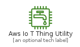
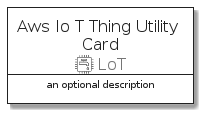
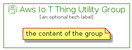

# AwsIoTThingUtility


```text
aws-q3-2021/Resource/LoT/AwsIoTThingUtility
```

```text
include('aws-q3-2021/Resource/LoT/AwsIoTThingUtility')
```


| Illustration | AwsIoTThingUtility | AwsIoTThingUtilityCard | AwsIoTThingUtilityGroup |
| :---: | :---: | :---: | :---: |
|  |  |  |  |


## AwsIoTThingUtility

### Load remotely
```plantuml
@startuml
' configures the library
!global $LIB_BASE_LOCATION="https://github.com/tmorin/plantuml-libs/distribution"

' loads the library's bootstrap
!include $LIB_BASE_LOCATION/bootstrap.puml

' loads the package bootstrap
include('aws-q3-2021/bootstrap')

' loads the Item which embeds the element AwsIoTThingUtility
include('aws-q3-2021/Resource/LoT/AwsIoTThingUtility')

' renders the element
AwsIoTThingUtility('AwsIoTThingUtility', 'Aws Io T Thing Utility', 'an optional tech label')
@enduml
```

### Load locally
```plantuml
@startuml
' configures the library
!global $INCLUSION_MODE="local"
!global $LIB_BASE_LOCATION="../../.."

' loads the library's bootstrap
!include $LIB_BASE_LOCATION/bootstrap.puml

' loads the package bootstrap
include('aws-q3-2021/bootstrap')

' loads the Item which embeds the element AwsIoTThingUtility
include('aws-q3-2021/Resource/LoT/AwsIoTThingUtility')

' renders the element
AwsIoTThingUtility('AwsIoTThingUtility', 'Aws Io T Thing Utility', 'an optional tech label')
@enduml
```

## AwsIoTThingUtilityCard

### Load remotely
```plantuml
@startuml
' configures the library
!global $LIB_BASE_LOCATION="https://github.com/tmorin/plantuml-libs/distribution"

' loads the library's bootstrap
!include $LIB_BASE_LOCATION/bootstrap.puml

' loads the package bootstrap
include('aws-q3-2021/bootstrap')

' loads the Item which embeds the element AwsIoTThingUtilityCard
include('aws-q3-2021/Resource/LoT/AwsIoTThingUtility')

' renders the element
AwsIoTThingUtilityCard('AwsIoTThingUtilityCard', 'Aws Io T Thing Utility Card', 'an optional description')
@enduml
```

### Load locally
```plantuml
@startuml
' configures the library
!global $INCLUSION_MODE="local"
!global $LIB_BASE_LOCATION="../../.."

' loads the library's bootstrap
!include $LIB_BASE_LOCATION/bootstrap.puml

' loads the package bootstrap
include('aws-q3-2021/bootstrap')

' loads the Item which embeds the element AwsIoTThingUtilityCard
include('aws-q3-2021/Resource/LoT/AwsIoTThingUtility')

' renders the element
AwsIoTThingUtilityCard('AwsIoTThingUtilityCard', 'Aws Io T Thing Utility Card', 'an optional description')
@enduml
```

## AwsIoTThingUtilityGroup

### Load remotely
```plantuml
@startuml
' configures the library
!global $LIB_BASE_LOCATION="https://github.com/tmorin/plantuml-libs/distribution"

' loads the library's bootstrap
!include $LIB_BASE_LOCATION/bootstrap.puml

' loads the package bootstrap
include('aws-q3-2021/bootstrap')

' loads the Item which embeds the element AwsIoTThingUtilityGroup
include('aws-q3-2021/Resource/LoT/AwsIoTThingUtility')

' renders the element
AwsIoTThingUtilityGroup('AwsIoTThingUtilityGroup', 'Aws Io T Thing Utility Group', 'an optional tech label') {
    note as note
        the content of the group
    end note
}
@enduml
```

### Load locally
```plantuml
@startuml
' configures the library
!global $INCLUSION_MODE="local"
!global $LIB_BASE_LOCATION="../../.."

' loads the library's bootstrap
!include $LIB_BASE_LOCATION/bootstrap.puml

' loads the package bootstrap
include('aws-q3-2021/bootstrap')

' loads the Item which embeds the element AwsIoTThingUtilityGroup
include('aws-q3-2021/Resource/LoT/AwsIoTThingUtility')

' renders the element
AwsIoTThingUtilityGroup('AwsIoTThingUtilityGroup', 'Aws Io T Thing Utility Group', 'an optional tech label') {
    note as note
        the content of the group
    end note
}
@enduml
```

