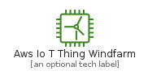
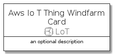
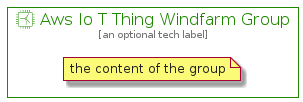

# AwsIoTThingWindfarm


```text
aws-q3-2021/Resource/LoT/AwsIoTThingWindfarm
```

```text
include('aws-q3-2021/Resource/LoT/AwsIoTThingWindfarm')
```


| Illustration | AwsIoTThingWindfarm | AwsIoTThingWindfarmCard | AwsIoTThingWindfarmGroup |
| :---: | :---: | :---: | :---: |
|  |  |  |  |


## AwsIoTThingWindfarm

### Load remotely
```plantuml
@startuml
' configures the library
!global $LIB_BASE_LOCATION="https://github.com/tmorin/plantuml-libs/distribution"

' loads the library's bootstrap
!include $LIB_BASE_LOCATION/bootstrap.puml

' loads the package bootstrap
include('aws-q3-2021/bootstrap')

' loads the Item which embeds the element AwsIoTThingWindfarm
include('aws-q3-2021/Resource/LoT/AwsIoTThingWindfarm')

' renders the element
AwsIoTThingWindfarm('AwsIoTThingWindfarm', 'Aws Io T Thing Windfarm', 'an optional tech label')
@enduml
```

### Load locally
```plantuml
@startuml
' configures the library
!global $INCLUSION_MODE="local"
!global $LIB_BASE_LOCATION="../../.."

' loads the library's bootstrap
!include $LIB_BASE_LOCATION/bootstrap.puml

' loads the package bootstrap
include('aws-q3-2021/bootstrap')

' loads the Item which embeds the element AwsIoTThingWindfarm
include('aws-q3-2021/Resource/LoT/AwsIoTThingWindfarm')

' renders the element
AwsIoTThingWindfarm('AwsIoTThingWindfarm', 'Aws Io T Thing Windfarm', 'an optional tech label')
@enduml
```

## AwsIoTThingWindfarmCard

### Load remotely
```plantuml
@startuml
' configures the library
!global $LIB_BASE_LOCATION="https://github.com/tmorin/plantuml-libs/distribution"

' loads the library's bootstrap
!include $LIB_BASE_LOCATION/bootstrap.puml

' loads the package bootstrap
include('aws-q3-2021/bootstrap')

' loads the Item which embeds the element AwsIoTThingWindfarmCard
include('aws-q3-2021/Resource/LoT/AwsIoTThingWindfarm')

' renders the element
AwsIoTThingWindfarmCard('AwsIoTThingWindfarmCard', 'Aws Io T Thing Windfarm Card', 'an optional description')
@enduml
```

### Load locally
```plantuml
@startuml
' configures the library
!global $INCLUSION_MODE="local"
!global $LIB_BASE_LOCATION="../../.."

' loads the library's bootstrap
!include $LIB_BASE_LOCATION/bootstrap.puml

' loads the package bootstrap
include('aws-q3-2021/bootstrap')

' loads the Item which embeds the element AwsIoTThingWindfarmCard
include('aws-q3-2021/Resource/LoT/AwsIoTThingWindfarm')

' renders the element
AwsIoTThingWindfarmCard('AwsIoTThingWindfarmCard', 'Aws Io T Thing Windfarm Card', 'an optional description')
@enduml
```

## AwsIoTThingWindfarmGroup

### Load remotely
```plantuml
@startuml
' configures the library
!global $LIB_BASE_LOCATION="https://github.com/tmorin/plantuml-libs/distribution"

' loads the library's bootstrap
!include $LIB_BASE_LOCATION/bootstrap.puml

' loads the package bootstrap
include('aws-q3-2021/bootstrap')

' loads the Item which embeds the element AwsIoTThingWindfarmGroup
include('aws-q3-2021/Resource/LoT/AwsIoTThingWindfarm')

' renders the element
AwsIoTThingWindfarmGroup('AwsIoTThingWindfarmGroup', 'Aws Io T Thing Windfarm Group', 'an optional tech label') {
    note as note
        the content of the group
    end note
}
@enduml
```

### Load locally
```plantuml
@startuml
' configures the library
!global $INCLUSION_MODE="local"
!global $LIB_BASE_LOCATION="../../.."

' loads the library's bootstrap
!include $LIB_BASE_LOCATION/bootstrap.puml

' loads the package bootstrap
include('aws-q3-2021/bootstrap')

' loads the Item which embeds the element AwsIoTThingWindfarmGroup
include('aws-q3-2021/Resource/LoT/AwsIoTThingWindfarm')

' renders the element
AwsIoTThingWindfarmGroup('AwsIoTThingWindfarmGroup', 'Aws Io T Thing Windfarm Group', 'an optional tech label') {
    note as note
        the content of the group
    end note
}
@enduml
```

