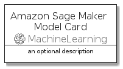
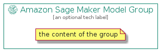

# AmazonSageMakerModel


```text
aws-q3-2021/Resource/MachineLearning/AmazonSageMakerModel
```

```text
include('aws-q3-2021/Resource/MachineLearning/AmazonSageMakerModel')
```


| Illustration | AmazonSageMakerModel | AmazonSageMakerModelCard | AmazonSageMakerModelGroup |
| :---: | :---: | :---: | :---: |
|  |  |  |  |


## AmazonSageMakerModel

### Load remotely
```plantuml
@startuml
' configures the library
!global $LIB_BASE_LOCATION="https://github.com/tmorin/plantuml-libs/distribution"

' loads the library's bootstrap
!include $LIB_BASE_LOCATION/bootstrap.puml

' loads the package bootstrap
include('aws-q3-2021/bootstrap')

' loads the Item which embeds the element AmazonSageMakerModel
include('aws-q3-2021/Resource/MachineLearning/AmazonSageMakerModel')

' renders the element
AmazonSageMakerModel('AmazonSageMakerModel', 'Amazon Sage Maker Model', 'an optional tech label')
@enduml
```

### Load locally
```plantuml
@startuml
' configures the library
!global $INCLUSION_MODE="local"
!global $LIB_BASE_LOCATION="../../.."

' loads the library's bootstrap
!include $LIB_BASE_LOCATION/bootstrap.puml

' loads the package bootstrap
include('aws-q3-2021/bootstrap')

' loads the Item which embeds the element AmazonSageMakerModel
include('aws-q3-2021/Resource/MachineLearning/AmazonSageMakerModel')

' renders the element
AmazonSageMakerModel('AmazonSageMakerModel', 'Amazon Sage Maker Model', 'an optional tech label')
@enduml
```

## AmazonSageMakerModelCard

### Load remotely
```plantuml
@startuml
' configures the library
!global $LIB_BASE_LOCATION="https://github.com/tmorin/plantuml-libs/distribution"

' loads the library's bootstrap
!include $LIB_BASE_LOCATION/bootstrap.puml

' loads the package bootstrap
include('aws-q3-2021/bootstrap')

' loads the Item which embeds the element AmazonSageMakerModelCard
include('aws-q3-2021/Resource/MachineLearning/AmazonSageMakerModel')

' renders the element
AmazonSageMakerModelCard('AmazonSageMakerModelCard', 'Amazon Sage Maker Model Card', 'an optional description')
@enduml
```

### Load locally
```plantuml
@startuml
' configures the library
!global $INCLUSION_MODE="local"
!global $LIB_BASE_LOCATION="../../.."

' loads the library's bootstrap
!include $LIB_BASE_LOCATION/bootstrap.puml

' loads the package bootstrap
include('aws-q3-2021/bootstrap')

' loads the Item which embeds the element AmazonSageMakerModelCard
include('aws-q3-2021/Resource/MachineLearning/AmazonSageMakerModel')

' renders the element
AmazonSageMakerModelCard('AmazonSageMakerModelCard', 'Amazon Sage Maker Model Card', 'an optional description')
@enduml
```

## AmazonSageMakerModelGroup

### Load remotely
```plantuml
@startuml
' configures the library
!global $LIB_BASE_LOCATION="https://github.com/tmorin/plantuml-libs/distribution"

' loads the library's bootstrap
!include $LIB_BASE_LOCATION/bootstrap.puml

' loads the package bootstrap
include('aws-q3-2021/bootstrap')

' loads the Item which embeds the element AmazonSageMakerModelGroup
include('aws-q3-2021/Resource/MachineLearning/AmazonSageMakerModel')

' renders the element
AmazonSageMakerModelGroup('AmazonSageMakerModelGroup', 'Amazon Sage Maker Model Group', 'an optional tech label') {
    note as note
        the content of the group
    end note
}
@enduml
```

### Load locally
```plantuml
@startuml
' configures the library
!global $INCLUSION_MODE="local"
!global $LIB_BASE_LOCATION="../../.."

' loads the library's bootstrap
!include $LIB_BASE_LOCATION/bootstrap.puml

' loads the package bootstrap
include('aws-q3-2021/bootstrap')

' loads the Item which embeds the element AmazonSageMakerModelGroup
include('aws-q3-2021/Resource/MachineLearning/AmazonSageMakerModel')

' renders the element
AmazonSageMakerModelGroup('AmazonSageMakerModelGroup', 'Amazon Sage Maker Model Group', 'an optional tech label') {
    note as note
        the content of the group
    end note
}
@enduml
```

