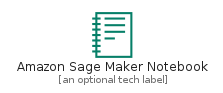
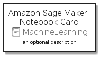
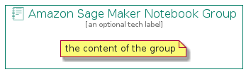

# AmazonSageMakerNotebook


```text
aws-q3-2021/Resource/MachineLearning/AmazonSageMakerNotebook
```

```text
include('aws-q3-2021/Resource/MachineLearning/AmazonSageMakerNotebook')
```


| Illustration | AmazonSageMakerNotebook | AmazonSageMakerNotebookCard | AmazonSageMakerNotebookGroup |
| :---: | :---: | :---: | :---: |
|  |  |  |  |


## AmazonSageMakerNotebook

### Load remotely
```plantuml
@startuml
' configures the library
!global $LIB_BASE_LOCATION="https://github.com/tmorin/plantuml-libs/distribution"

' loads the library's bootstrap
!include $LIB_BASE_LOCATION/bootstrap.puml

' loads the package bootstrap
include('aws-q3-2021/bootstrap')

' loads the Item which embeds the element AmazonSageMakerNotebook
include('aws-q3-2021/Resource/MachineLearning/AmazonSageMakerNotebook')

' renders the element
AmazonSageMakerNotebook('AmazonSageMakerNotebook', 'Amazon Sage Maker Notebook', 'an optional tech label')
@enduml
```

### Load locally
```plantuml
@startuml
' configures the library
!global $INCLUSION_MODE="local"
!global $LIB_BASE_LOCATION="../../.."

' loads the library's bootstrap
!include $LIB_BASE_LOCATION/bootstrap.puml

' loads the package bootstrap
include('aws-q3-2021/bootstrap')

' loads the Item which embeds the element AmazonSageMakerNotebook
include('aws-q3-2021/Resource/MachineLearning/AmazonSageMakerNotebook')

' renders the element
AmazonSageMakerNotebook('AmazonSageMakerNotebook', 'Amazon Sage Maker Notebook', 'an optional tech label')
@enduml
```

## AmazonSageMakerNotebookCard

### Load remotely
```plantuml
@startuml
' configures the library
!global $LIB_BASE_LOCATION="https://github.com/tmorin/plantuml-libs/distribution"

' loads the library's bootstrap
!include $LIB_BASE_LOCATION/bootstrap.puml

' loads the package bootstrap
include('aws-q3-2021/bootstrap')

' loads the Item which embeds the element AmazonSageMakerNotebookCard
include('aws-q3-2021/Resource/MachineLearning/AmazonSageMakerNotebook')

' renders the element
AmazonSageMakerNotebookCard('AmazonSageMakerNotebookCard', 'Amazon Sage Maker Notebook Card', 'an optional description')
@enduml
```

### Load locally
```plantuml
@startuml
' configures the library
!global $INCLUSION_MODE="local"
!global $LIB_BASE_LOCATION="../../.."

' loads the library's bootstrap
!include $LIB_BASE_LOCATION/bootstrap.puml

' loads the package bootstrap
include('aws-q3-2021/bootstrap')

' loads the Item which embeds the element AmazonSageMakerNotebookCard
include('aws-q3-2021/Resource/MachineLearning/AmazonSageMakerNotebook')

' renders the element
AmazonSageMakerNotebookCard('AmazonSageMakerNotebookCard', 'Amazon Sage Maker Notebook Card', 'an optional description')
@enduml
```

## AmazonSageMakerNotebookGroup

### Load remotely
```plantuml
@startuml
' configures the library
!global $LIB_BASE_LOCATION="https://github.com/tmorin/plantuml-libs/distribution"

' loads the library's bootstrap
!include $LIB_BASE_LOCATION/bootstrap.puml

' loads the package bootstrap
include('aws-q3-2021/bootstrap')

' loads the Item which embeds the element AmazonSageMakerNotebookGroup
include('aws-q3-2021/Resource/MachineLearning/AmazonSageMakerNotebook')

' renders the element
AmazonSageMakerNotebookGroup('AmazonSageMakerNotebookGroup', 'Amazon Sage Maker Notebook Group', 'an optional tech label') {
    note as note
        the content of the group
    end note
}
@enduml
```

### Load locally
```plantuml
@startuml
' configures the library
!global $INCLUSION_MODE="local"
!global $LIB_BASE_LOCATION="../../.."

' loads the library's bootstrap
!include $LIB_BASE_LOCATION/bootstrap.puml

' loads the package bootstrap
include('aws-q3-2021/bootstrap')

' loads the Item which embeds the element AmazonSageMakerNotebookGroup
include('aws-q3-2021/Resource/MachineLearning/AmazonSageMakerNotebook')

' renders the element
AmazonSageMakerNotebookGroup('AmazonSageMakerNotebookGroup', 'Amazon Sage Maker Notebook Group', 'an optional tech label') {
    note as note
        the content of the group
    end note
}
@enduml
```

