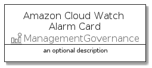
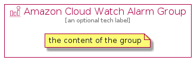

# AmazonCloudWatchAlarm


```text
aws-q3-2021/Resource/ManagementGovernance/AmazonCloudWatchAlarm
```

```text
include('aws-q3-2021/Resource/ManagementGovernance/AmazonCloudWatchAlarm')
```


| Illustration | AmazonCloudWatchAlarm | AmazonCloudWatchAlarmCard | AmazonCloudWatchAlarmGroup |
| :---: | :---: | :---: | :---: |
|  |  |  |  |


## AmazonCloudWatchAlarm

### Load remotely
```plantuml
@startuml
' configures the library
!global $LIB_BASE_LOCATION="https://github.com/tmorin/plantuml-libs/distribution"

' loads the library's bootstrap
!include $LIB_BASE_LOCATION/bootstrap.puml

' loads the package bootstrap
include('aws-q3-2021/bootstrap')

' loads the Item which embeds the element AmazonCloudWatchAlarm
include('aws-q3-2021/Resource/ManagementGovernance/AmazonCloudWatchAlarm')

' renders the element
AmazonCloudWatchAlarm('AmazonCloudWatchAlarm', 'Amazon Cloud Watch Alarm', 'an optional tech label')
@enduml
```

### Load locally
```plantuml
@startuml
' configures the library
!global $INCLUSION_MODE="local"
!global $LIB_BASE_LOCATION="../../.."

' loads the library's bootstrap
!include $LIB_BASE_LOCATION/bootstrap.puml

' loads the package bootstrap
include('aws-q3-2021/bootstrap')

' loads the Item which embeds the element AmazonCloudWatchAlarm
include('aws-q3-2021/Resource/ManagementGovernance/AmazonCloudWatchAlarm')

' renders the element
AmazonCloudWatchAlarm('AmazonCloudWatchAlarm', 'Amazon Cloud Watch Alarm', 'an optional tech label')
@enduml
```

## AmazonCloudWatchAlarmCard

### Load remotely
```plantuml
@startuml
' configures the library
!global $LIB_BASE_LOCATION="https://github.com/tmorin/plantuml-libs/distribution"

' loads the library's bootstrap
!include $LIB_BASE_LOCATION/bootstrap.puml

' loads the package bootstrap
include('aws-q3-2021/bootstrap')

' loads the Item which embeds the element AmazonCloudWatchAlarmCard
include('aws-q3-2021/Resource/ManagementGovernance/AmazonCloudWatchAlarm')

' renders the element
AmazonCloudWatchAlarmCard('AmazonCloudWatchAlarmCard', 'Amazon Cloud Watch Alarm Card', 'an optional description')
@enduml
```

### Load locally
```plantuml
@startuml
' configures the library
!global $INCLUSION_MODE="local"
!global $LIB_BASE_LOCATION="../../.."

' loads the library's bootstrap
!include $LIB_BASE_LOCATION/bootstrap.puml

' loads the package bootstrap
include('aws-q3-2021/bootstrap')

' loads the Item which embeds the element AmazonCloudWatchAlarmCard
include('aws-q3-2021/Resource/ManagementGovernance/AmazonCloudWatchAlarm')

' renders the element
AmazonCloudWatchAlarmCard('AmazonCloudWatchAlarmCard', 'Amazon Cloud Watch Alarm Card', 'an optional description')
@enduml
```

## AmazonCloudWatchAlarmGroup

### Load remotely
```plantuml
@startuml
' configures the library
!global $LIB_BASE_LOCATION="https://github.com/tmorin/plantuml-libs/distribution"

' loads the library's bootstrap
!include $LIB_BASE_LOCATION/bootstrap.puml

' loads the package bootstrap
include('aws-q3-2021/bootstrap')

' loads the Item which embeds the element AmazonCloudWatchAlarmGroup
include('aws-q3-2021/Resource/ManagementGovernance/AmazonCloudWatchAlarm')

' renders the element
AmazonCloudWatchAlarmGroup('AmazonCloudWatchAlarmGroup', 'Amazon Cloud Watch Alarm Group', 'an optional tech label') {
    note as note
        the content of the group
    end note
}
@enduml
```

### Load locally
```plantuml
@startuml
' configures the library
!global $INCLUSION_MODE="local"
!global $LIB_BASE_LOCATION="../../.."

' loads the library's bootstrap
!include $LIB_BASE_LOCATION/bootstrap.puml

' loads the package bootstrap
include('aws-q3-2021/bootstrap')

' loads the Item which embeds the element AmazonCloudWatchAlarmGroup
include('aws-q3-2021/Resource/ManagementGovernance/AmazonCloudWatchAlarm')

' renders the element
AmazonCloudWatchAlarmGroup('AmazonCloudWatchAlarmGroup', 'Amazon Cloud Watch Alarm Group', 'an optional tech label') {
    note as note
        the content of the group
    end note
}
@enduml
```

