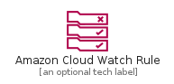
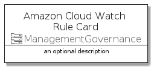
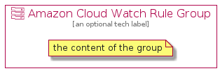

# AmazonCloudWatchRule


```text
aws-q3-2021/Resource/ManagementGovernance/AmazonCloudWatchRule
```

```text
include('aws-q3-2021/Resource/ManagementGovernance/AmazonCloudWatchRule')
```


| Illustration | AmazonCloudWatchRule | AmazonCloudWatchRuleCard | AmazonCloudWatchRuleGroup |
| :---: | :---: | :---: | :---: |
|  |  |  |  |


## AmazonCloudWatchRule

### Load remotely
```plantuml
@startuml
' configures the library
!global $LIB_BASE_LOCATION="https://github.com/tmorin/plantuml-libs/distribution"

' loads the library's bootstrap
!include $LIB_BASE_LOCATION/bootstrap.puml

' loads the package bootstrap
include('aws-q3-2021/bootstrap')

' loads the Item which embeds the element AmazonCloudWatchRule
include('aws-q3-2021/Resource/ManagementGovernance/AmazonCloudWatchRule')

' renders the element
AmazonCloudWatchRule('AmazonCloudWatchRule', 'Amazon Cloud Watch Rule', 'an optional tech label')
@enduml
```

### Load locally
```plantuml
@startuml
' configures the library
!global $INCLUSION_MODE="local"
!global $LIB_BASE_LOCATION="../../.."

' loads the library's bootstrap
!include $LIB_BASE_LOCATION/bootstrap.puml

' loads the package bootstrap
include('aws-q3-2021/bootstrap')

' loads the Item which embeds the element AmazonCloudWatchRule
include('aws-q3-2021/Resource/ManagementGovernance/AmazonCloudWatchRule')

' renders the element
AmazonCloudWatchRule('AmazonCloudWatchRule', 'Amazon Cloud Watch Rule', 'an optional tech label')
@enduml
```

## AmazonCloudWatchRuleCard

### Load remotely
```plantuml
@startuml
' configures the library
!global $LIB_BASE_LOCATION="https://github.com/tmorin/plantuml-libs/distribution"

' loads the library's bootstrap
!include $LIB_BASE_LOCATION/bootstrap.puml

' loads the package bootstrap
include('aws-q3-2021/bootstrap')

' loads the Item which embeds the element AmazonCloudWatchRuleCard
include('aws-q3-2021/Resource/ManagementGovernance/AmazonCloudWatchRule')

' renders the element
AmazonCloudWatchRuleCard('AmazonCloudWatchRuleCard', 'Amazon Cloud Watch Rule Card', 'an optional description')
@enduml
```

### Load locally
```plantuml
@startuml
' configures the library
!global $INCLUSION_MODE="local"
!global $LIB_BASE_LOCATION="../../.."

' loads the library's bootstrap
!include $LIB_BASE_LOCATION/bootstrap.puml

' loads the package bootstrap
include('aws-q3-2021/bootstrap')

' loads the Item which embeds the element AmazonCloudWatchRuleCard
include('aws-q3-2021/Resource/ManagementGovernance/AmazonCloudWatchRule')

' renders the element
AmazonCloudWatchRuleCard('AmazonCloudWatchRuleCard', 'Amazon Cloud Watch Rule Card', 'an optional description')
@enduml
```

## AmazonCloudWatchRuleGroup

### Load remotely
```plantuml
@startuml
' configures the library
!global $LIB_BASE_LOCATION="https://github.com/tmorin/plantuml-libs/distribution"

' loads the library's bootstrap
!include $LIB_BASE_LOCATION/bootstrap.puml

' loads the package bootstrap
include('aws-q3-2021/bootstrap')

' loads the Item which embeds the element AmazonCloudWatchRuleGroup
include('aws-q3-2021/Resource/ManagementGovernance/AmazonCloudWatchRule')

' renders the element
AmazonCloudWatchRuleGroup('AmazonCloudWatchRuleGroup', 'Amazon Cloud Watch Rule Group', 'an optional tech label') {
    note as note
        the content of the group
    end note
}
@enduml
```

### Load locally
```plantuml
@startuml
' configures the library
!global $INCLUSION_MODE="local"
!global $LIB_BASE_LOCATION="../../.."

' loads the library's bootstrap
!include $LIB_BASE_LOCATION/bootstrap.puml

' loads the package bootstrap
include('aws-q3-2021/bootstrap')

' loads the Item which embeds the element AmazonCloudWatchRuleGroup
include('aws-q3-2021/Resource/ManagementGovernance/AmazonCloudWatchRule')

' renders the element
AmazonCloudWatchRuleGroup('AmazonCloudWatchRuleGroup', 'Amazon Cloud Watch Rule Group', 'an optional tech label') {
    note as note
        the content of the group
    end note
}
@enduml
```

