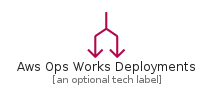
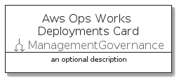
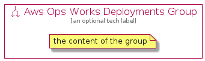

# AwsOpsWorksDeployments


```text
aws-q3-2021/Resource/ManagementGovernance/AwsOpsWorksDeployments
```

```text
include('aws-q3-2021/Resource/ManagementGovernance/AwsOpsWorksDeployments')
```


| Illustration | AwsOpsWorksDeployments | AwsOpsWorksDeploymentsCard | AwsOpsWorksDeploymentsGroup |
| :---: | :---: | :---: | :---: |
|  |  |  |  |


## AwsOpsWorksDeployments

### Load remotely
```plantuml
@startuml
' configures the library
!global $LIB_BASE_LOCATION="https://raw.githubusercontent.com/tmorin/plantuml-libs/master/distribution"

' loads the library's bootstrap
!include $LIB_BASE_LOCATION/bootstrap.puml

' loads the package bootstrap
include('aws-q3-2021/bootstrap')

' loads the Item which embeds the element AwsOpsWorksDeployments
include('aws-q3-2021/Resource/ManagementGovernance/AwsOpsWorksDeployments')

' renders the element
AwsOpsWorksDeployments('AwsOpsWorksDeployments', 'Aws Ops Works Deployments', 'an optional tech label')
@enduml
```

### Load locally
```plantuml
@startuml
' configures the library
!global $INCLUSION_MODE="local"
!global $LIB_BASE_LOCATION="../../.."

' loads the library's bootstrap
!include $LIB_BASE_LOCATION/bootstrap.puml

' loads the package bootstrap
include('aws-q3-2021/bootstrap')

' loads the Item which embeds the element AwsOpsWorksDeployments
include('aws-q3-2021/Resource/ManagementGovernance/AwsOpsWorksDeployments')

' renders the element
AwsOpsWorksDeployments('AwsOpsWorksDeployments', 'Aws Ops Works Deployments', 'an optional tech label')
@enduml
```

## AwsOpsWorksDeploymentsCard

### Load remotely
```plantuml
@startuml
' configures the library
!global $LIB_BASE_LOCATION="https://raw.githubusercontent.com/tmorin/plantuml-libs/master/distribution"

' loads the library's bootstrap
!include $LIB_BASE_LOCATION/bootstrap.puml

' loads the package bootstrap
include('aws-q3-2021/bootstrap')

' loads the Item which embeds the element AwsOpsWorksDeploymentsCard
include('aws-q3-2021/Resource/ManagementGovernance/AwsOpsWorksDeployments')

' renders the element
AwsOpsWorksDeploymentsCard('AwsOpsWorksDeploymentsCard', 'Aws Ops Works Deployments Card', 'an optional description')
@enduml
```

### Load locally
```plantuml
@startuml
' configures the library
!global $INCLUSION_MODE="local"
!global $LIB_BASE_LOCATION="../../.."

' loads the library's bootstrap
!include $LIB_BASE_LOCATION/bootstrap.puml

' loads the package bootstrap
include('aws-q3-2021/bootstrap')

' loads the Item which embeds the element AwsOpsWorksDeploymentsCard
include('aws-q3-2021/Resource/ManagementGovernance/AwsOpsWorksDeployments')

' renders the element
AwsOpsWorksDeploymentsCard('AwsOpsWorksDeploymentsCard', 'Aws Ops Works Deployments Card', 'an optional description')
@enduml
```

## AwsOpsWorksDeploymentsGroup

### Load remotely
```plantuml
@startuml
' configures the library
!global $LIB_BASE_LOCATION="https://raw.githubusercontent.com/tmorin/plantuml-libs/master/distribution"

' loads the library's bootstrap
!include $LIB_BASE_LOCATION/bootstrap.puml

' loads the package bootstrap
include('aws-q3-2021/bootstrap')

' loads the Item which embeds the element AwsOpsWorksDeploymentsGroup
include('aws-q3-2021/Resource/ManagementGovernance/AwsOpsWorksDeployments')

' renders the element
AwsOpsWorksDeploymentsGroup('AwsOpsWorksDeploymentsGroup', 'Aws Ops Works Deployments Group', 'an optional tech label') {
    note as note
        the content of the group
    end note
}
@enduml
```

### Load locally
```plantuml
@startuml
' configures the library
!global $INCLUSION_MODE="local"
!global $LIB_BASE_LOCATION="../../.."

' loads the library's bootstrap
!include $LIB_BASE_LOCATION/bootstrap.puml

' loads the package bootstrap
include('aws-q3-2021/bootstrap')

' loads the Item which embeds the element AwsOpsWorksDeploymentsGroup
include('aws-q3-2021/Resource/ManagementGovernance/AwsOpsWorksDeployments')

' renders the element
AwsOpsWorksDeploymentsGroup('AwsOpsWorksDeploymentsGroup', 'Aws Ops Works Deployments Group', 'an optional tech label') {
    note as note
        the content of the group
    end note
}
@enduml
```

