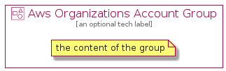

# AwsOrganizationsAccount


```text
aws-q3-2021/Resource/ManagementGovernance/AwsOrganizationsAccount
```

```text
include('aws-q3-2021/Resource/ManagementGovernance/AwsOrganizationsAccount')
```


| Illustration | AwsOrganizationsAccount | AwsOrganizationsAccountCard | AwsOrganizationsAccountGroup |
| :---: | :---: | :---: | :---: |
|  |  |  |  |


## AwsOrganizationsAccount

### Load remotely
```plantuml
@startuml
' configures the library
!global $LIB_BASE_LOCATION="https://github.com/tmorin/plantuml-libs/distribution"

' loads the library's bootstrap
!include $LIB_BASE_LOCATION/bootstrap.puml

' loads the package bootstrap
include('aws-q3-2021/bootstrap')

' loads the Item which embeds the element AwsOrganizationsAccount
include('aws-q3-2021/Resource/ManagementGovernance/AwsOrganizationsAccount')

' renders the element
AwsOrganizationsAccount('AwsOrganizationsAccount', 'Aws Organizations Account', 'an optional tech label')
@enduml
```

### Load locally
```plantuml
@startuml
' configures the library
!global $INCLUSION_MODE="local"
!global $LIB_BASE_LOCATION="../../.."

' loads the library's bootstrap
!include $LIB_BASE_LOCATION/bootstrap.puml

' loads the package bootstrap
include('aws-q3-2021/bootstrap')

' loads the Item which embeds the element AwsOrganizationsAccount
include('aws-q3-2021/Resource/ManagementGovernance/AwsOrganizationsAccount')

' renders the element
AwsOrganizationsAccount('AwsOrganizationsAccount', 'Aws Organizations Account', 'an optional tech label')
@enduml
```

## AwsOrganizationsAccountCard

### Load remotely
```plantuml
@startuml
' configures the library
!global $LIB_BASE_LOCATION="https://github.com/tmorin/plantuml-libs/distribution"

' loads the library's bootstrap
!include $LIB_BASE_LOCATION/bootstrap.puml

' loads the package bootstrap
include('aws-q3-2021/bootstrap')

' loads the Item which embeds the element AwsOrganizationsAccountCard
include('aws-q3-2021/Resource/ManagementGovernance/AwsOrganizationsAccount')

' renders the element
AwsOrganizationsAccountCard('AwsOrganizationsAccountCard', 'Aws Organizations Account Card', 'an optional description')
@enduml
```

### Load locally
```plantuml
@startuml
' configures the library
!global $INCLUSION_MODE="local"
!global $LIB_BASE_LOCATION="../../.."

' loads the library's bootstrap
!include $LIB_BASE_LOCATION/bootstrap.puml

' loads the package bootstrap
include('aws-q3-2021/bootstrap')

' loads the Item which embeds the element AwsOrganizationsAccountCard
include('aws-q3-2021/Resource/ManagementGovernance/AwsOrganizationsAccount')

' renders the element
AwsOrganizationsAccountCard('AwsOrganizationsAccountCard', 'Aws Organizations Account Card', 'an optional description')
@enduml
```

## AwsOrganizationsAccountGroup

### Load remotely
```plantuml
@startuml
' configures the library
!global $LIB_BASE_LOCATION="https://github.com/tmorin/plantuml-libs/distribution"

' loads the library's bootstrap
!include $LIB_BASE_LOCATION/bootstrap.puml

' loads the package bootstrap
include('aws-q3-2021/bootstrap')

' loads the Item which embeds the element AwsOrganizationsAccountGroup
include('aws-q3-2021/Resource/ManagementGovernance/AwsOrganizationsAccount')

' renders the element
AwsOrganizationsAccountGroup('AwsOrganizationsAccountGroup', 'Aws Organizations Account Group', 'an optional tech label') {
    note as note
        the content of the group
    end note
}
@enduml
```

### Load locally
```plantuml
@startuml
' configures the library
!global $INCLUSION_MODE="local"
!global $LIB_BASE_LOCATION="../../.."

' loads the library's bootstrap
!include $LIB_BASE_LOCATION/bootstrap.puml

' loads the package bootstrap
include('aws-q3-2021/bootstrap')

' loads the Item which embeds the element AwsOrganizationsAccountGroup
include('aws-q3-2021/Resource/ManagementGovernance/AwsOrganizationsAccount')

' renders the element
AwsOrganizationsAccountGroup('AwsOrganizationsAccountGroup', 'Aws Organizations Account Group', 'an optional tech label') {
    note as note
        the content of the group
    end note
}
@enduml
```

