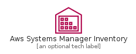
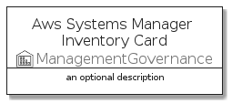
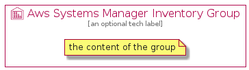

# AwsSystemsManagerInventory


```text
aws-q3-2021/Resource/ManagementGovernance/AwsSystemsManagerInventory
```

```text
include('aws-q3-2021/Resource/ManagementGovernance/AwsSystemsManagerInventory')
```


| Illustration | AwsSystemsManagerInventory | AwsSystemsManagerInventoryCard | AwsSystemsManagerInventoryGroup |
| :---: | :---: | :---: | :---: |
|  |  |  |  |


## AwsSystemsManagerInventory

### Load remotely
```plantuml
@startuml
' configures the library
!global $LIB_BASE_LOCATION="https://github.com/tmorin/plantuml-libs/distribution"

' loads the library's bootstrap
!include $LIB_BASE_LOCATION/bootstrap.puml

' loads the package bootstrap
include('aws-q3-2021/bootstrap')

' loads the Item which embeds the element AwsSystemsManagerInventory
include('aws-q3-2021/Resource/ManagementGovernance/AwsSystemsManagerInventory')

' renders the element
AwsSystemsManagerInventory('AwsSystemsManagerInventory', 'Aws Systems Manager Inventory', 'an optional tech label')
@enduml
```

### Load locally
```plantuml
@startuml
' configures the library
!global $INCLUSION_MODE="local"
!global $LIB_BASE_LOCATION="../../.."

' loads the library's bootstrap
!include $LIB_BASE_LOCATION/bootstrap.puml

' loads the package bootstrap
include('aws-q3-2021/bootstrap')

' loads the Item which embeds the element AwsSystemsManagerInventory
include('aws-q3-2021/Resource/ManagementGovernance/AwsSystemsManagerInventory')

' renders the element
AwsSystemsManagerInventory('AwsSystemsManagerInventory', 'Aws Systems Manager Inventory', 'an optional tech label')
@enduml
```

## AwsSystemsManagerInventoryCard

### Load remotely
```plantuml
@startuml
' configures the library
!global $LIB_BASE_LOCATION="https://github.com/tmorin/plantuml-libs/distribution"

' loads the library's bootstrap
!include $LIB_BASE_LOCATION/bootstrap.puml

' loads the package bootstrap
include('aws-q3-2021/bootstrap')

' loads the Item which embeds the element AwsSystemsManagerInventoryCard
include('aws-q3-2021/Resource/ManagementGovernance/AwsSystemsManagerInventory')

' renders the element
AwsSystemsManagerInventoryCard('AwsSystemsManagerInventoryCard', 'Aws Systems Manager Inventory Card', 'an optional description')
@enduml
```

### Load locally
```plantuml
@startuml
' configures the library
!global $INCLUSION_MODE="local"
!global $LIB_BASE_LOCATION="../../.."

' loads the library's bootstrap
!include $LIB_BASE_LOCATION/bootstrap.puml

' loads the package bootstrap
include('aws-q3-2021/bootstrap')

' loads the Item which embeds the element AwsSystemsManagerInventoryCard
include('aws-q3-2021/Resource/ManagementGovernance/AwsSystemsManagerInventory')

' renders the element
AwsSystemsManagerInventoryCard('AwsSystemsManagerInventoryCard', 'Aws Systems Manager Inventory Card', 'an optional description')
@enduml
```

## AwsSystemsManagerInventoryGroup

### Load remotely
```plantuml
@startuml
' configures the library
!global $LIB_BASE_LOCATION="https://github.com/tmorin/plantuml-libs/distribution"

' loads the library's bootstrap
!include $LIB_BASE_LOCATION/bootstrap.puml

' loads the package bootstrap
include('aws-q3-2021/bootstrap')

' loads the Item which embeds the element AwsSystemsManagerInventoryGroup
include('aws-q3-2021/Resource/ManagementGovernance/AwsSystemsManagerInventory')

' renders the element
AwsSystemsManagerInventoryGroup('AwsSystemsManagerInventoryGroup', 'Aws Systems Manager Inventory Group', 'an optional tech label') {
    note as note
        the content of the group
    end note
}
@enduml
```

### Load locally
```plantuml
@startuml
' configures the library
!global $INCLUSION_MODE="local"
!global $LIB_BASE_LOCATION="../../.."

' loads the library's bootstrap
!include $LIB_BASE_LOCATION/bootstrap.puml

' loads the package bootstrap
include('aws-q3-2021/bootstrap')

' loads the Item which embeds the element AwsSystemsManagerInventoryGroup
include('aws-q3-2021/Resource/ManagementGovernance/AwsSystemsManagerInventory')

' renders the element
AwsSystemsManagerInventoryGroup('AwsSystemsManagerInventoryGroup', 'Aws Systems Manager Inventory Group', 'an optional tech label') {
    note as note
        the content of the group
    end note
}
@enduml
```

