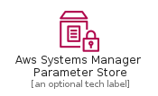
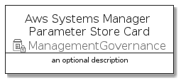
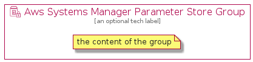

# AwsSystemsManagerParameterStore


```text
aws-q3-2021/Resource/ManagementGovernance/AwsSystemsManagerParameterStore
```

```text
include('aws-q3-2021/Resource/ManagementGovernance/AwsSystemsManagerParameterStore')
```


| Illustration | AwsSystemsManagerParameterStore | AwsSystemsManagerParameterStoreCard | AwsSystemsManagerParameterStoreGroup |
| :---: | :---: | :---: | :---: |
|  |  |  |  |


## AwsSystemsManagerParameterStore

### Load remotely
```plantuml
@startuml
' configures the library
!global $LIB_BASE_LOCATION="https://raw.githubusercontent.com/tmorin/plantuml-libs/master/distribution"

' loads the library's bootstrap
!include $LIB_BASE_LOCATION/bootstrap.puml

' loads the package bootstrap
include('aws-q3-2021/bootstrap')

' loads the Item which embeds the element AwsSystemsManagerParameterStore
include('aws-q3-2021/Resource/ManagementGovernance/AwsSystemsManagerParameterStore')

' renders the element
AwsSystemsManagerParameterStore('AwsSystemsManagerParameterStore', 'Aws Systems Manager Parameter Store', 'an optional tech label')
@enduml
```

### Load locally
```plantuml
@startuml
' configures the library
!global $INCLUSION_MODE="local"
!global $LIB_BASE_LOCATION="../../.."

' loads the library's bootstrap
!include $LIB_BASE_LOCATION/bootstrap.puml

' loads the package bootstrap
include('aws-q3-2021/bootstrap')

' loads the Item which embeds the element AwsSystemsManagerParameterStore
include('aws-q3-2021/Resource/ManagementGovernance/AwsSystemsManagerParameterStore')

' renders the element
AwsSystemsManagerParameterStore('AwsSystemsManagerParameterStore', 'Aws Systems Manager Parameter Store', 'an optional tech label')
@enduml
```

## AwsSystemsManagerParameterStoreCard

### Load remotely
```plantuml
@startuml
' configures the library
!global $LIB_BASE_LOCATION="https://raw.githubusercontent.com/tmorin/plantuml-libs/master/distribution"

' loads the library's bootstrap
!include $LIB_BASE_LOCATION/bootstrap.puml

' loads the package bootstrap
include('aws-q3-2021/bootstrap')

' loads the Item which embeds the element AwsSystemsManagerParameterStoreCard
include('aws-q3-2021/Resource/ManagementGovernance/AwsSystemsManagerParameterStore')

' renders the element
AwsSystemsManagerParameterStoreCard('AwsSystemsManagerParameterStoreCard', 'Aws Systems Manager Parameter Store Card', 'an optional description')
@enduml
```

### Load locally
```plantuml
@startuml
' configures the library
!global $INCLUSION_MODE="local"
!global $LIB_BASE_LOCATION="../../.."

' loads the library's bootstrap
!include $LIB_BASE_LOCATION/bootstrap.puml

' loads the package bootstrap
include('aws-q3-2021/bootstrap')

' loads the Item which embeds the element AwsSystemsManagerParameterStoreCard
include('aws-q3-2021/Resource/ManagementGovernance/AwsSystemsManagerParameterStore')

' renders the element
AwsSystemsManagerParameterStoreCard('AwsSystemsManagerParameterStoreCard', 'Aws Systems Manager Parameter Store Card', 'an optional description')
@enduml
```

## AwsSystemsManagerParameterStoreGroup

### Load remotely
```plantuml
@startuml
' configures the library
!global $LIB_BASE_LOCATION="https://raw.githubusercontent.com/tmorin/plantuml-libs/master/distribution"

' loads the library's bootstrap
!include $LIB_BASE_LOCATION/bootstrap.puml

' loads the package bootstrap
include('aws-q3-2021/bootstrap')

' loads the Item which embeds the element AwsSystemsManagerParameterStoreGroup
include('aws-q3-2021/Resource/ManagementGovernance/AwsSystemsManagerParameterStore')

' renders the element
AwsSystemsManagerParameterStoreGroup('AwsSystemsManagerParameterStoreGroup', 'Aws Systems Manager Parameter Store Group', 'an optional tech label') {
    note as note
        the content of the group
    end note
}
@enduml
```

### Load locally
```plantuml
@startuml
' configures the library
!global $INCLUSION_MODE="local"
!global $LIB_BASE_LOCATION="../../.."

' loads the library's bootstrap
!include $LIB_BASE_LOCATION/bootstrap.puml

' loads the package bootstrap
include('aws-q3-2021/bootstrap')

' loads the Item which embeds the element AwsSystemsManagerParameterStoreGroup
include('aws-q3-2021/Resource/ManagementGovernance/AwsSystemsManagerParameterStore')

' renders the element
AwsSystemsManagerParameterStoreGroup('AwsSystemsManagerParameterStoreGroup', 'Aws Systems Manager Parameter Store Group', 'an optional tech label') {
    note as note
        the content of the group
    end note
}
@enduml
```

