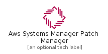
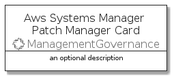
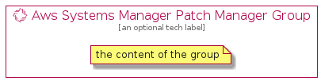

# AwsSystemsManagerPatchManager


```text
aws-q3-2021/Resource/ManagementGovernance/AwsSystemsManagerPatchManager
```

```text
include('aws-q3-2021/Resource/ManagementGovernance/AwsSystemsManagerPatchManager')
```


| Illustration | AwsSystemsManagerPatchManager | AwsSystemsManagerPatchManagerCard | AwsSystemsManagerPatchManagerGroup |
| :---: | :---: | :---: | :---: |
|  |  |  |  |


## AwsSystemsManagerPatchManager

### Load remotely
```plantuml
@startuml
' configures the library
!global $LIB_BASE_LOCATION="https://github.com/tmorin/plantuml-libs/distribution"

' loads the library's bootstrap
!include $LIB_BASE_LOCATION/bootstrap.puml

' loads the package bootstrap
include('aws-q3-2021/bootstrap')

' loads the Item which embeds the element AwsSystemsManagerPatchManager
include('aws-q3-2021/Resource/ManagementGovernance/AwsSystemsManagerPatchManager')

' renders the element
AwsSystemsManagerPatchManager('AwsSystemsManagerPatchManager', 'Aws Systems Manager Patch Manager', 'an optional tech label')
@enduml
```

### Load locally
```plantuml
@startuml
' configures the library
!global $INCLUSION_MODE="local"
!global $LIB_BASE_LOCATION="../../.."

' loads the library's bootstrap
!include $LIB_BASE_LOCATION/bootstrap.puml

' loads the package bootstrap
include('aws-q3-2021/bootstrap')

' loads the Item which embeds the element AwsSystemsManagerPatchManager
include('aws-q3-2021/Resource/ManagementGovernance/AwsSystemsManagerPatchManager')

' renders the element
AwsSystemsManagerPatchManager('AwsSystemsManagerPatchManager', 'Aws Systems Manager Patch Manager', 'an optional tech label')
@enduml
```

## AwsSystemsManagerPatchManagerCard

### Load remotely
```plantuml
@startuml
' configures the library
!global $LIB_BASE_LOCATION="https://github.com/tmorin/plantuml-libs/distribution"

' loads the library's bootstrap
!include $LIB_BASE_LOCATION/bootstrap.puml

' loads the package bootstrap
include('aws-q3-2021/bootstrap')

' loads the Item which embeds the element AwsSystemsManagerPatchManagerCard
include('aws-q3-2021/Resource/ManagementGovernance/AwsSystemsManagerPatchManager')

' renders the element
AwsSystemsManagerPatchManagerCard('AwsSystemsManagerPatchManagerCard', 'Aws Systems Manager Patch Manager Card', 'an optional description')
@enduml
```

### Load locally
```plantuml
@startuml
' configures the library
!global $INCLUSION_MODE="local"
!global $LIB_BASE_LOCATION="../../.."

' loads the library's bootstrap
!include $LIB_BASE_LOCATION/bootstrap.puml

' loads the package bootstrap
include('aws-q3-2021/bootstrap')

' loads the Item which embeds the element AwsSystemsManagerPatchManagerCard
include('aws-q3-2021/Resource/ManagementGovernance/AwsSystemsManagerPatchManager')

' renders the element
AwsSystemsManagerPatchManagerCard('AwsSystemsManagerPatchManagerCard', 'Aws Systems Manager Patch Manager Card', 'an optional description')
@enduml
```

## AwsSystemsManagerPatchManagerGroup

### Load remotely
```plantuml
@startuml
' configures the library
!global $LIB_BASE_LOCATION="https://github.com/tmorin/plantuml-libs/distribution"

' loads the library's bootstrap
!include $LIB_BASE_LOCATION/bootstrap.puml

' loads the package bootstrap
include('aws-q3-2021/bootstrap')

' loads the Item which embeds the element AwsSystemsManagerPatchManagerGroup
include('aws-q3-2021/Resource/ManagementGovernance/AwsSystemsManagerPatchManager')

' renders the element
AwsSystemsManagerPatchManagerGroup('AwsSystemsManagerPatchManagerGroup', 'Aws Systems Manager Patch Manager Group', 'an optional tech label') {
    note as note
        the content of the group
    end note
}
@enduml
```

### Load locally
```plantuml
@startuml
' configures the library
!global $INCLUSION_MODE="local"
!global $LIB_BASE_LOCATION="../../.."

' loads the library's bootstrap
!include $LIB_BASE_LOCATION/bootstrap.puml

' loads the package bootstrap
include('aws-q3-2021/bootstrap')

' loads the Item which embeds the element AwsSystemsManagerPatchManagerGroup
include('aws-q3-2021/Resource/ManagementGovernance/AwsSystemsManagerPatchManager')

' renders the element
AwsSystemsManagerPatchManagerGroup('AwsSystemsManagerPatchManagerGroup', 'Aws Systems Manager Patch Manager Group', 'an optional tech label') {
    note as note
        the content of the group
    end note
}
@enduml
```

