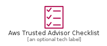
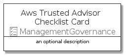
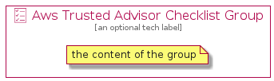

# AwsTrustedAdvisorChecklist


```text
aws-q3-2021/Resource/ManagementGovernance/AwsTrustedAdvisorChecklist
```

```text
include('aws-q3-2021/Resource/ManagementGovernance/AwsTrustedAdvisorChecklist')
```


| Illustration | AwsTrustedAdvisorChecklist | AwsTrustedAdvisorChecklistCard | AwsTrustedAdvisorChecklistGroup |
| :---: | :---: | :---: | :---: |
|  |  |  |  |


## AwsTrustedAdvisorChecklist

### Load remotely
```plantuml
@startuml
' configures the library
!global $LIB_BASE_LOCATION="https://raw.githubusercontent.com/tmorin/plantuml-libs/master/distribution"

' loads the library's bootstrap
!include $LIB_BASE_LOCATION/bootstrap.puml

' loads the package bootstrap
include('aws-q3-2021/bootstrap')

' loads the Item which embeds the element AwsTrustedAdvisorChecklist
include('aws-q3-2021/Resource/ManagementGovernance/AwsTrustedAdvisorChecklist')

' renders the element
AwsTrustedAdvisorChecklist('AwsTrustedAdvisorChecklist', 'Aws Trusted Advisor Checklist', 'an optional tech label')
@enduml
```

### Load locally
```plantuml
@startuml
' configures the library
!global $INCLUSION_MODE="local"
!global $LIB_BASE_LOCATION="../../.."

' loads the library's bootstrap
!include $LIB_BASE_LOCATION/bootstrap.puml

' loads the package bootstrap
include('aws-q3-2021/bootstrap')

' loads the Item which embeds the element AwsTrustedAdvisorChecklist
include('aws-q3-2021/Resource/ManagementGovernance/AwsTrustedAdvisorChecklist')

' renders the element
AwsTrustedAdvisorChecklist('AwsTrustedAdvisorChecklist', 'Aws Trusted Advisor Checklist', 'an optional tech label')
@enduml
```

## AwsTrustedAdvisorChecklistCard

### Load remotely
```plantuml
@startuml
' configures the library
!global $LIB_BASE_LOCATION="https://raw.githubusercontent.com/tmorin/plantuml-libs/master/distribution"

' loads the library's bootstrap
!include $LIB_BASE_LOCATION/bootstrap.puml

' loads the package bootstrap
include('aws-q3-2021/bootstrap')

' loads the Item which embeds the element AwsTrustedAdvisorChecklistCard
include('aws-q3-2021/Resource/ManagementGovernance/AwsTrustedAdvisorChecklist')

' renders the element
AwsTrustedAdvisorChecklistCard('AwsTrustedAdvisorChecklistCard', 'Aws Trusted Advisor Checklist Card', 'an optional description')
@enduml
```

### Load locally
```plantuml
@startuml
' configures the library
!global $INCLUSION_MODE="local"
!global $LIB_BASE_LOCATION="../../.."

' loads the library's bootstrap
!include $LIB_BASE_LOCATION/bootstrap.puml

' loads the package bootstrap
include('aws-q3-2021/bootstrap')

' loads the Item which embeds the element AwsTrustedAdvisorChecklistCard
include('aws-q3-2021/Resource/ManagementGovernance/AwsTrustedAdvisorChecklist')

' renders the element
AwsTrustedAdvisorChecklistCard('AwsTrustedAdvisorChecklistCard', 'Aws Trusted Advisor Checklist Card', 'an optional description')
@enduml
```

## AwsTrustedAdvisorChecklistGroup

### Load remotely
```plantuml
@startuml
' configures the library
!global $LIB_BASE_LOCATION="https://raw.githubusercontent.com/tmorin/plantuml-libs/master/distribution"

' loads the library's bootstrap
!include $LIB_BASE_LOCATION/bootstrap.puml

' loads the package bootstrap
include('aws-q3-2021/bootstrap')

' loads the Item which embeds the element AwsTrustedAdvisorChecklistGroup
include('aws-q3-2021/Resource/ManagementGovernance/AwsTrustedAdvisorChecklist')

' renders the element
AwsTrustedAdvisorChecklistGroup('AwsTrustedAdvisorChecklistGroup', 'Aws Trusted Advisor Checklist Group', 'an optional tech label') {
    note as note
        the content of the group
    end note
}
@enduml
```

### Load locally
```plantuml
@startuml
' configures the library
!global $INCLUSION_MODE="local"
!global $LIB_BASE_LOCATION="../../.."

' loads the library's bootstrap
!include $LIB_BASE_LOCATION/bootstrap.puml

' loads the package bootstrap
include('aws-q3-2021/bootstrap')

' loads the Item which embeds the element AwsTrustedAdvisorChecklistGroup
include('aws-q3-2021/Resource/ManagementGovernance/AwsTrustedAdvisorChecklist')

' renders the element
AwsTrustedAdvisorChecklistGroup('AwsTrustedAdvisorChecklistGroup', 'Aws Trusted Advisor Checklist Group', 'an optional tech label') {
    note as note
        the content of the group
    end note
}
@enduml
```

