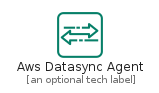
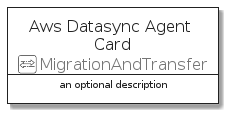
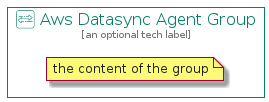

# AwsDatasyncAgent


```text
aws-q3-2021/Resource/MigrationAndTransfer/AwsDatasyncAgent
```

```text
include('aws-q3-2021/Resource/MigrationAndTransfer/AwsDatasyncAgent')
```


| Illustration | AwsDatasyncAgent | AwsDatasyncAgentCard | AwsDatasyncAgentGroup |
| :---: | :---: | :---: | :---: |
|  |  |  |  |


## AwsDatasyncAgent

### Load remotely
```plantuml
@startuml
' configures the library
!global $LIB_BASE_LOCATION="https://raw.githubusercontent.com/tmorin/plantuml-libs/master/distribution"

' loads the library's bootstrap
!include $LIB_BASE_LOCATION/bootstrap.puml

' loads the package bootstrap
include('aws-q3-2021/bootstrap')

' loads the Item which embeds the element AwsDatasyncAgent
include('aws-q3-2021/Resource/MigrationAndTransfer/AwsDatasyncAgent')

' renders the element
AwsDatasyncAgent('AwsDatasyncAgent', 'Aws Datasync Agent', 'an optional tech label')
@enduml
```

### Load locally
```plantuml
@startuml
' configures the library
!global $INCLUSION_MODE="local"
!global $LIB_BASE_LOCATION="../../.."

' loads the library's bootstrap
!include $LIB_BASE_LOCATION/bootstrap.puml

' loads the package bootstrap
include('aws-q3-2021/bootstrap')

' loads the Item which embeds the element AwsDatasyncAgent
include('aws-q3-2021/Resource/MigrationAndTransfer/AwsDatasyncAgent')

' renders the element
AwsDatasyncAgent('AwsDatasyncAgent', 'Aws Datasync Agent', 'an optional tech label')
@enduml
```

## AwsDatasyncAgentCard

### Load remotely
```plantuml
@startuml
' configures the library
!global $LIB_BASE_LOCATION="https://raw.githubusercontent.com/tmorin/plantuml-libs/master/distribution"

' loads the library's bootstrap
!include $LIB_BASE_LOCATION/bootstrap.puml

' loads the package bootstrap
include('aws-q3-2021/bootstrap')

' loads the Item which embeds the element AwsDatasyncAgentCard
include('aws-q3-2021/Resource/MigrationAndTransfer/AwsDatasyncAgent')

' renders the element
AwsDatasyncAgentCard('AwsDatasyncAgentCard', 'Aws Datasync Agent Card', 'an optional description')
@enduml
```

### Load locally
```plantuml
@startuml
' configures the library
!global $INCLUSION_MODE="local"
!global $LIB_BASE_LOCATION="../../.."

' loads the library's bootstrap
!include $LIB_BASE_LOCATION/bootstrap.puml

' loads the package bootstrap
include('aws-q3-2021/bootstrap')

' loads the Item which embeds the element AwsDatasyncAgentCard
include('aws-q3-2021/Resource/MigrationAndTransfer/AwsDatasyncAgent')

' renders the element
AwsDatasyncAgentCard('AwsDatasyncAgentCard', 'Aws Datasync Agent Card', 'an optional description')
@enduml
```

## AwsDatasyncAgentGroup

### Load remotely
```plantuml
@startuml
' configures the library
!global $LIB_BASE_LOCATION="https://raw.githubusercontent.com/tmorin/plantuml-libs/master/distribution"

' loads the library's bootstrap
!include $LIB_BASE_LOCATION/bootstrap.puml

' loads the package bootstrap
include('aws-q3-2021/bootstrap')

' loads the Item which embeds the element AwsDatasyncAgentGroup
include('aws-q3-2021/Resource/MigrationAndTransfer/AwsDatasyncAgent')

' renders the element
AwsDatasyncAgentGroup('AwsDatasyncAgentGroup', 'Aws Datasync Agent Group', 'an optional tech label') {
    note as note
        the content of the group
    end note
}
@enduml
```

### Load locally
```plantuml
@startuml
' configures the library
!global $INCLUSION_MODE="local"
!global $LIB_BASE_LOCATION="../../.."

' loads the library's bootstrap
!include $LIB_BASE_LOCATION/bootstrap.puml

' loads the package bootstrap
include('aws-q3-2021/bootstrap')

' loads the Item which embeds the element AwsDatasyncAgentGroup
include('aws-q3-2021/Resource/MigrationAndTransfer/AwsDatasyncAgent')

' renders the element
AwsDatasyncAgentGroup('AwsDatasyncAgentGroup', 'Aws Datasync Agent Group', 'an optional tech label') {
    note as note
        the content of the group
    end note
}
@enduml
```

