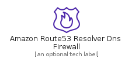
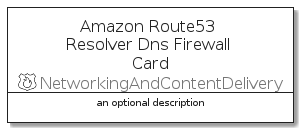
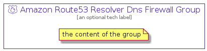

# AmazonRoute53ResolverDnsFirewall


```text
aws-q3-2021/Resource/NetworkingAndContentDelivery/AmazonRoute53ResolverDnsFirewall
```

```text
include('aws-q3-2021/Resource/NetworkingAndContentDelivery/AmazonRoute53ResolverDnsFirewall')
```


| Illustration | AmazonRoute53ResolverDnsFirewall | AmazonRoute53ResolverDnsFirewallCard | AmazonRoute53ResolverDnsFirewallGroup |
| :---: | :---: | :---: | :---: |
|  |  |  |  |


## AmazonRoute53ResolverDnsFirewall

### Load remotely
```plantuml
@startuml
' configures the library
!global $LIB_BASE_LOCATION="https://github.com/tmorin/plantuml-libs/distribution"

' loads the library's bootstrap
!include $LIB_BASE_LOCATION/bootstrap.puml

' loads the package bootstrap
include('aws-q3-2021/bootstrap')

' loads the Item which embeds the element AmazonRoute53ResolverDnsFirewall
include('aws-q3-2021/Resource/NetworkingAndContentDelivery/AmazonRoute53ResolverDnsFirewall')

' renders the element
AmazonRoute53ResolverDnsFirewall('AmazonRoute53ResolverDnsFirewall', 'Amazon Route53 Resolver Dns Firewall', 'an optional tech label')
@enduml
```

### Load locally
```plantuml
@startuml
' configures the library
!global $INCLUSION_MODE="local"
!global $LIB_BASE_LOCATION="../../.."

' loads the library's bootstrap
!include $LIB_BASE_LOCATION/bootstrap.puml

' loads the package bootstrap
include('aws-q3-2021/bootstrap')

' loads the Item which embeds the element AmazonRoute53ResolverDnsFirewall
include('aws-q3-2021/Resource/NetworkingAndContentDelivery/AmazonRoute53ResolverDnsFirewall')

' renders the element
AmazonRoute53ResolverDnsFirewall('AmazonRoute53ResolverDnsFirewall', 'Amazon Route53 Resolver Dns Firewall', 'an optional tech label')
@enduml
```

## AmazonRoute53ResolverDnsFirewallCard

### Load remotely
```plantuml
@startuml
' configures the library
!global $LIB_BASE_LOCATION="https://github.com/tmorin/plantuml-libs/distribution"

' loads the library's bootstrap
!include $LIB_BASE_LOCATION/bootstrap.puml

' loads the package bootstrap
include('aws-q3-2021/bootstrap')

' loads the Item which embeds the element AmazonRoute53ResolverDnsFirewallCard
include('aws-q3-2021/Resource/NetworkingAndContentDelivery/AmazonRoute53ResolverDnsFirewall')

' renders the element
AmazonRoute53ResolverDnsFirewallCard('AmazonRoute53ResolverDnsFirewallCard', 'Amazon Route53 Resolver Dns Firewall Card', 'an optional description')
@enduml
```

### Load locally
```plantuml
@startuml
' configures the library
!global $INCLUSION_MODE="local"
!global $LIB_BASE_LOCATION="../../.."

' loads the library's bootstrap
!include $LIB_BASE_LOCATION/bootstrap.puml

' loads the package bootstrap
include('aws-q3-2021/bootstrap')

' loads the Item which embeds the element AmazonRoute53ResolverDnsFirewallCard
include('aws-q3-2021/Resource/NetworkingAndContentDelivery/AmazonRoute53ResolverDnsFirewall')

' renders the element
AmazonRoute53ResolverDnsFirewallCard('AmazonRoute53ResolverDnsFirewallCard', 'Amazon Route53 Resolver Dns Firewall Card', 'an optional description')
@enduml
```

## AmazonRoute53ResolverDnsFirewallGroup

### Load remotely
```plantuml
@startuml
' configures the library
!global $LIB_BASE_LOCATION="https://github.com/tmorin/plantuml-libs/distribution"

' loads the library's bootstrap
!include $LIB_BASE_LOCATION/bootstrap.puml

' loads the package bootstrap
include('aws-q3-2021/bootstrap')

' loads the Item which embeds the element AmazonRoute53ResolverDnsFirewallGroup
include('aws-q3-2021/Resource/NetworkingAndContentDelivery/AmazonRoute53ResolverDnsFirewall')

' renders the element
AmazonRoute53ResolverDnsFirewallGroup('AmazonRoute53ResolverDnsFirewallGroup', 'Amazon Route53 Resolver Dns Firewall Group', 'an optional tech label') {
    note as note
        the content of the group
    end note
}
@enduml
```

### Load locally
```plantuml
@startuml
' configures the library
!global $INCLUSION_MODE="local"
!global $LIB_BASE_LOCATION="../../.."

' loads the library's bootstrap
!include $LIB_BASE_LOCATION/bootstrap.puml

' loads the package bootstrap
include('aws-q3-2021/bootstrap')

' loads the Item which embeds the element AmazonRoute53ResolverDnsFirewallGroup
include('aws-q3-2021/Resource/NetworkingAndContentDelivery/AmazonRoute53ResolverDnsFirewall')

' renders the element
AmazonRoute53ResolverDnsFirewallGroup('AmazonRoute53ResolverDnsFirewallGroup', 'Amazon Route53 Resolver Dns Firewall Group', 'an optional tech label') {
    note as note
        the content of the group
    end note
}
@enduml
```

