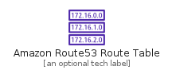
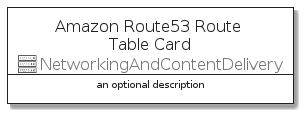
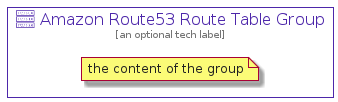

# AmazonRoute53RouteTable


```text
aws-q3-2021/Resource/NetworkingAndContentDelivery/AmazonRoute53RouteTable
```

```text
include('aws-q3-2021/Resource/NetworkingAndContentDelivery/AmazonRoute53RouteTable')
```


| Illustration | AmazonRoute53RouteTable | AmazonRoute53RouteTableCard | AmazonRoute53RouteTableGroup |
| :---: | :---: | :---: | :---: |
|  |  |  |  |


## AmazonRoute53RouteTable

### Load remotely
```plantuml
@startuml
' configures the library
!global $LIB_BASE_LOCATION="https://raw.githubusercontent.com/tmorin/plantuml-libs/master/distribution"

' loads the library's bootstrap
!include $LIB_BASE_LOCATION/bootstrap.puml

' loads the package bootstrap
include('aws-q3-2021/bootstrap')

' loads the Item which embeds the element AmazonRoute53RouteTable
include('aws-q3-2021/Resource/NetworkingAndContentDelivery/AmazonRoute53RouteTable')

' renders the element
AmazonRoute53RouteTable('AmazonRoute53RouteTable', 'Amazon Route53 Route Table', 'an optional tech label')
@enduml
```

### Load locally
```plantuml
@startuml
' configures the library
!global $INCLUSION_MODE="local"
!global $LIB_BASE_LOCATION="../../.."

' loads the library's bootstrap
!include $LIB_BASE_LOCATION/bootstrap.puml

' loads the package bootstrap
include('aws-q3-2021/bootstrap')

' loads the Item which embeds the element AmazonRoute53RouteTable
include('aws-q3-2021/Resource/NetworkingAndContentDelivery/AmazonRoute53RouteTable')

' renders the element
AmazonRoute53RouteTable('AmazonRoute53RouteTable', 'Amazon Route53 Route Table', 'an optional tech label')
@enduml
```

## AmazonRoute53RouteTableCard

### Load remotely
```plantuml
@startuml
' configures the library
!global $LIB_BASE_LOCATION="https://raw.githubusercontent.com/tmorin/plantuml-libs/master/distribution"

' loads the library's bootstrap
!include $LIB_BASE_LOCATION/bootstrap.puml

' loads the package bootstrap
include('aws-q3-2021/bootstrap')

' loads the Item which embeds the element AmazonRoute53RouteTableCard
include('aws-q3-2021/Resource/NetworkingAndContentDelivery/AmazonRoute53RouteTable')

' renders the element
AmazonRoute53RouteTableCard('AmazonRoute53RouteTableCard', 'Amazon Route53 Route Table Card', 'an optional description')
@enduml
```

### Load locally
```plantuml
@startuml
' configures the library
!global $INCLUSION_MODE="local"
!global $LIB_BASE_LOCATION="../../.."

' loads the library's bootstrap
!include $LIB_BASE_LOCATION/bootstrap.puml

' loads the package bootstrap
include('aws-q3-2021/bootstrap')

' loads the Item which embeds the element AmazonRoute53RouteTableCard
include('aws-q3-2021/Resource/NetworkingAndContentDelivery/AmazonRoute53RouteTable')

' renders the element
AmazonRoute53RouteTableCard('AmazonRoute53RouteTableCard', 'Amazon Route53 Route Table Card', 'an optional description')
@enduml
```

## AmazonRoute53RouteTableGroup

### Load remotely
```plantuml
@startuml
' configures the library
!global $LIB_BASE_LOCATION="https://raw.githubusercontent.com/tmorin/plantuml-libs/master/distribution"

' loads the library's bootstrap
!include $LIB_BASE_LOCATION/bootstrap.puml

' loads the package bootstrap
include('aws-q3-2021/bootstrap')

' loads the Item which embeds the element AmazonRoute53RouteTableGroup
include('aws-q3-2021/Resource/NetworkingAndContentDelivery/AmazonRoute53RouteTable')

' renders the element
AmazonRoute53RouteTableGroup('AmazonRoute53RouteTableGroup', 'Amazon Route53 Route Table Group', 'an optional tech label') {
    note as note
        the content of the group
    end note
}
@enduml
```

### Load locally
```plantuml
@startuml
' configures the library
!global $INCLUSION_MODE="local"
!global $LIB_BASE_LOCATION="../../.."

' loads the library's bootstrap
!include $LIB_BASE_LOCATION/bootstrap.puml

' loads the package bootstrap
include('aws-q3-2021/bootstrap')

' loads the Item which embeds the element AmazonRoute53RouteTableGroup
include('aws-q3-2021/Resource/NetworkingAndContentDelivery/AmazonRoute53RouteTable')

' renders the element
AmazonRoute53RouteTableGroup('AmazonRoute53RouteTableGroup', 'Amazon Route53 Route Table Group', 'an optional tech label') {
    note as note
        the content of the group
    end note
}
@enduml
```

