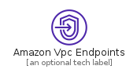
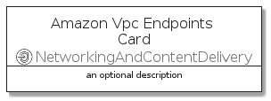
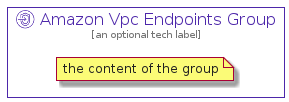

# AmazonVpcEndpoints


```text
aws-q3-2021/Resource/NetworkingAndContentDelivery/AmazonVpcEndpoints
```

```text
include('aws-q3-2021/Resource/NetworkingAndContentDelivery/AmazonVpcEndpoints')
```


| Illustration | AmazonVpcEndpoints | AmazonVpcEndpointsCard | AmazonVpcEndpointsGroup |
| :---: | :---: | :---: | :---: |
|  |  |  |  |


## AmazonVpcEndpoints

### Load remotely
```plantuml
@startuml
' configures the library
!global $LIB_BASE_LOCATION="https://github.com/tmorin/plantuml-libs/distribution"

' loads the library's bootstrap
!include $LIB_BASE_LOCATION/bootstrap.puml

' loads the package bootstrap
include('aws-q3-2021/bootstrap')

' loads the Item which embeds the element AmazonVpcEndpoints
include('aws-q3-2021/Resource/NetworkingAndContentDelivery/AmazonVpcEndpoints')

' renders the element
AmazonVpcEndpoints('AmazonVpcEndpoints', 'Amazon Vpc Endpoints', 'an optional tech label')
@enduml
```

### Load locally
```plantuml
@startuml
' configures the library
!global $INCLUSION_MODE="local"
!global $LIB_BASE_LOCATION="../../.."

' loads the library's bootstrap
!include $LIB_BASE_LOCATION/bootstrap.puml

' loads the package bootstrap
include('aws-q3-2021/bootstrap')

' loads the Item which embeds the element AmazonVpcEndpoints
include('aws-q3-2021/Resource/NetworkingAndContentDelivery/AmazonVpcEndpoints')

' renders the element
AmazonVpcEndpoints('AmazonVpcEndpoints', 'Amazon Vpc Endpoints', 'an optional tech label')
@enduml
```

## AmazonVpcEndpointsCard

### Load remotely
```plantuml
@startuml
' configures the library
!global $LIB_BASE_LOCATION="https://github.com/tmorin/plantuml-libs/distribution"

' loads the library's bootstrap
!include $LIB_BASE_LOCATION/bootstrap.puml

' loads the package bootstrap
include('aws-q3-2021/bootstrap')

' loads the Item which embeds the element AmazonVpcEndpointsCard
include('aws-q3-2021/Resource/NetworkingAndContentDelivery/AmazonVpcEndpoints')

' renders the element
AmazonVpcEndpointsCard('AmazonVpcEndpointsCard', 'Amazon Vpc Endpoints Card', 'an optional description')
@enduml
```

### Load locally
```plantuml
@startuml
' configures the library
!global $INCLUSION_MODE="local"
!global $LIB_BASE_LOCATION="../../.."

' loads the library's bootstrap
!include $LIB_BASE_LOCATION/bootstrap.puml

' loads the package bootstrap
include('aws-q3-2021/bootstrap')

' loads the Item which embeds the element AmazonVpcEndpointsCard
include('aws-q3-2021/Resource/NetworkingAndContentDelivery/AmazonVpcEndpoints')

' renders the element
AmazonVpcEndpointsCard('AmazonVpcEndpointsCard', 'Amazon Vpc Endpoints Card', 'an optional description')
@enduml
```

## AmazonVpcEndpointsGroup

### Load remotely
```plantuml
@startuml
' configures the library
!global $LIB_BASE_LOCATION="https://github.com/tmorin/plantuml-libs/distribution"

' loads the library's bootstrap
!include $LIB_BASE_LOCATION/bootstrap.puml

' loads the package bootstrap
include('aws-q3-2021/bootstrap')

' loads the Item which embeds the element AmazonVpcEndpointsGroup
include('aws-q3-2021/Resource/NetworkingAndContentDelivery/AmazonVpcEndpoints')

' renders the element
AmazonVpcEndpointsGroup('AmazonVpcEndpointsGroup', 'Amazon Vpc Endpoints Group', 'an optional tech label') {
    note as note
        the content of the group
    end note
}
@enduml
```

### Load locally
```plantuml
@startuml
' configures the library
!global $INCLUSION_MODE="local"
!global $LIB_BASE_LOCATION="../../.."

' loads the library's bootstrap
!include $LIB_BASE_LOCATION/bootstrap.puml

' loads the package bootstrap
include('aws-q3-2021/bootstrap')

' loads the Item which embeds the element AmazonVpcEndpointsGroup
include('aws-q3-2021/Resource/NetworkingAndContentDelivery/AmazonVpcEndpoints')

' renders the element
AmazonVpcEndpointsGroup('AmazonVpcEndpointsGroup', 'Amazon Vpc Endpoints Group', 'an optional tech label') {
    note as note
        the content of the group
    end note
}
@enduml
```

