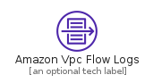
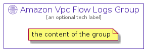

# AmazonVpcFlowLogs


```text
aws-q3-2021/Resource/NetworkingAndContentDelivery/AmazonVpcFlowLogs
```

```text
include('aws-q3-2021/Resource/NetworkingAndContentDelivery/AmazonVpcFlowLogs')
```


| Illustration | AmazonVpcFlowLogs | AmazonVpcFlowLogsCard | AmazonVpcFlowLogsGroup |
| :---: | :---: | :---: | :---: |
|  |  |  |  |


## AmazonVpcFlowLogs

### Load remotely
```plantuml
@startuml
' configures the library
!global $LIB_BASE_LOCATION="https://github.com/tmorin/plantuml-libs/distribution"

' loads the library's bootstrap
!include $LIB_BASE_LOCATION/bootstrap.puml

' loads the package bootstrap
include('aws-q3-2021/bootstrap')

' loads the Item which embeds the element AmazonVpcFlowLogs
include('aws-q3-2021/Resource/NetworkingAndContentDelivery/AmazonVpcFlowLogs')

' renders the element
AmazonVpcFlowLogs('AmazonVpcFlowLogs', 'Amazon Vpc Flow Logs', 'an optional tech label')
@enduml
```

### Load locally
```plantuml
@startuml
' configures the library
!global $INCLUSION_MODE="local"
!global $LIB_BASE_LOCATION="../../.."

' loads the library's bootstrap
!include $LIB_BASE_LOCATION/bootstrap.puml

' loads the package bootstrap
include('aws-q3-2021/bootstrap')

' loads the Item which embeds the element AmazonVpcFlowLogs
include('aws-q3-2021/Resource/NetworkingAndContentDelivery/AmazonVpcFlowLogs')

' renders the element
AmazonVpcFlowLogs('AmazonVpcFlowLogs', 'Amazon Vpc Flow Logs', 'an optional tech label')
@enduml
```

## AmazonVpcFlowLogsCard

### Load remotely
```plantuml
@startuml
' configures the library
!global $LIB_BASE_LOCATION="https://github.com/tmorin/plantuml-libs/distribution"

' loads the library's bootstrap
!include $LIB_BASE_LOCATION/bootstrap.puml

' loads the package bootstrap
include('aws-q3-2021/bootstrap')

' loads the Item which embeds the element AmazonVpcFlowLogsCard
include('aws-q3-2021/Resource/NetworkingAndContentDelivery/AmazonVpcFlowLogs')

' renders the element
AmazonVpcFlowLogsCard('AmazonVpcFlowLogsCard', 'Amazon Vpc Flow Logs Card', 'an optional description')
@enduml
```

### Load locally
```plantuml
@startuml
' configures the library
!global $INCLUSION_MODE="local"
!global $LIB_BASE_LOCATION="../../.."

' loads the library's bootstrap
!include $LIB_BASE_LOCATION/bootstrap.puml

' loads the package bootstrap
include('aws-q3-2021/bootstrap')

' loads the Item which embeds the element AmazonVpcFlowLogsCard
include('aws-q3-2021/Resource/NetworkingAndContentDelivery/AmazonVpcFlowLogs')

' renders the element
AmazonVpcFlowLogsCard('AmazonVpcFlowLogsCard', 'Amazon Vpc Flow Logs Card', 'an optional description')
@enduml
```

## AmazonVpcFlowLogsGroup

### Load remotely
```plantuml
@startuml
' configures the library
!global $LIB_BASE_LOCATION="https://github.com/tmorin/plantuml-libs/distribution"

' loads the library's bootstrap
!include $LIB_BASE_LOCATION/bootstrap.puml

' loads the package bootstrap
include('aws-q3-2021/bootstrap')

' loads the Item which embeds the element AmazonVpcFlowLogsGroup
include('aws-q3-2021/Resource/NetworkingAndContentDelivery/AmazonVpcFlowLogs')

' renders the element
AmazonVpcFlowLogsGroup('AmazonVpcFlowLogsGroup', 'Amazon Vpc Flow Logs Group', 'an optional tech label') {
    note as note
        the content of the group
    end note
}
@enduml
```

### Load locally
```plantuml
@startuml
' configures the library
!global $INCLUSION_MODE="local"
!global $LIB_BASE_LOCATION="../../.."

' loads the library's bootstrap
!include $LIB_BASE_LOCATION/bootstrap.puml

' loads the package bootstrap
include('aws-q3-2021/bootstrap')

' loads the Item which embeds the element AmazonVpcFlowLogsGroup
include('aws-q3-2021/Resource/NetworkingAndContentDelivery/AmazonVpcFlowLogs')

' renders the element
AmazonVpcFlowLogsGroup('AmazonVpcFlowLogsGroup', 'Amazon Vpc Flow Logs Group', 'an optional tech label') {
    note as note
        the content of the group
    end note
}
@enduml
```

