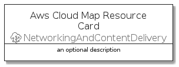
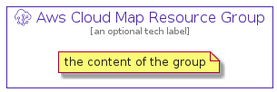

# AwsCloudMapResource


```text
aws-q3-2021/Resource/NetworkingAndContentDelivery/AwsCloudMapResource
```

```text
include('aws-q3-2021/Resource/NetworkingAndContentDelivery/AwsCloudMapResource')
```


| Illustration | AwsCloudMapResource | AwsCloudMapResourceCard | AwsCloudMapResourceGroup |
| :---: | :---: | :---: | :---: |
|  |  |  |  |


## AwsCloudMapResource

### Load remotely
```plantuml
@startuml
' configures the library
!global $LIB_BASE_LOCATION="https://github.com/tmorin/plantuml-libs/distribution"

' loads the library's bootstrap
!include $LIB_BASE_LOCATION/bootstrap.puml

' loads the package bootstrap
include('aws-q3-2021/bootstrap')

' loads the Item which embeds the element AwsCloudMapResource
include('aws-q3-2021/Resource/NetworkingAndContentDelivery/AwsCloudMapResource')

' renders the element
AwsCloudMapResource('AwsCloudMapResource', 'Aws Cloud Map Resource', 'an optional tech label')
@enduml
```

### Load locally
```plantuml
@startuml
' configures the library
!global $INCLUSION_MODE="local"
!global $LIB_BASE_LOCATION="../../.."

' loads the library's bootstrap
!include $LIB_BASE_LOCATION/bootstrap.puml

' loads the package bootstrap
include('aws-q3-2021/bootstrap')

' loads the Item which embeds the element AwsCloudMapResource
include('aws-q3-2021/Resource/NetworkingAndContentDelivery/AwsCloudMapResource')

' renders the element
AwsCloudMapResource('AwsCloudMapResource', 'Aws Cloud Map Resource', 'an optional tech label')
@enduml
```

## AwsCloudMapResourceCard

### Load remotely
```plantuml
@startuml
' configures the library
!global $LIB_BASE_LOCATION="https://github.com/tmorin/plantuml-libs/distribution"

' loads the library's bootstrap
!include $LIB_BASE_LOCATION/bootstrap.puml

' loads the package bootstrap
include('aws-q3-2021/bootstrap')

' loads the Item which embeds the element AwsCloudMapResourceCard
include('aws-q3-2021/Resource/NetworkingAndContentDelivery/AwsCloudMapResource')

' renders the element
AwsCloudMapResourceCard('AwsCloudMapResourceCard', 'Aws Cloud Map Resource Card', 'an optional description')
@enduml
```

### Load locally
```plantuml
@startuml
' configures the library
!global $INCLUSION_MODE="local"
!global $LIB_BASE_LOCATION="../../.."

' loads the library's bootstrap
!include $LIB_BASE_LOCATION/bootstrap.puml

' loads the package bootstrap
include('aws-q3-2021/bootstrap')

' loads the Item which embeds the element AwsCloudMapResourceCard
include('aws-q3-2021/Resource/NetworkingAndContentDelivery/AwsCloudMapResource')

' renders the element
AwsCloudMapResourceCard('AwsCloudMapResourceCard', 'Aws Cloud Map Resource Card', 'an optional description')
@enduml
```

## AwsCloudMapResourceGroup

### Load remotely
```plantuml
@startuml
' configures the library
!global $LIB_BASE_LOCATION="https://github.com/tmorin/plantuml-libs/distribution"

' loads the library's bootstrap
!include $LIB_BASE_LOCATION/bootstrap.puml

' loads the package bootstrap
include('aws-q3-2021/bootstrap')

' loads the Item which embeds the element AwsCloudMapResourceGroup
include('aws-q3-2021/Resource/NetworkingAndContentDelivery/AwsCloudMapResource')

' renders the element
AwsCloudMapResourceGroup('AwsCloudMapResourceGroup', 'Aws Cloud Map Resource Group', 'an optional tech label') {
    note as note
        the content of the group
    end note
}
@enduml
```

### Load locally
```plantuml
@startuml
' configures the library
!global $INCLUSION_MODE="local"
!global $LIB_BASE_LOCATION="../../.."

' loads the library's bootstrap
!include $LIB_BASE_LOCATION/bootstrap.puml

' loads the package bootstrap
include('aws-q3-2021/bootstrap')

' loads the Item which embeds the element AwsCloudMapResourceGroup
include('aws-q3-2021/Resource/NetworkingAndContentDelivery/AwsCloudMapResource')

' renders the element
AwsCloudMapResourceGroup('AwsCloudMapResourceGroup', 'Aws Cloud Map Resource Group', 'an optional tech label') {
    note as note
        the content of the group
    end note
}
@enduml
```

