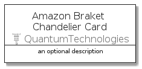
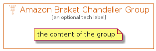

# AmazonBraketChandelier


```text
aws-q3-2021/Resource/QuantumTechnologies/AmazonBraketChandelier
```

```text
include('aws-q3-2021/Resource/QuantumTechnologies/AmazonBraketChandelier')
```


| Illustration | AmazonBraketChandelier | AmazonBraketChandelierCard | AmazonBraketChandelierGroup |
| :---: | :---: | :---: | :---: |
|  |  |  |  |


## AmazonBraketChandelier

### Load remotely
```plantuml
@startuml
' configures the library
!global $LIB_BASE_LOCATION="https://github.com/tmorin/plantuml-libs/distribution"

' loads the library's bootstrap
!include $LIB_BASE_LOCATION/bootstrap.puml

' loads the package bootstrap
include('aws-q3-2021/bootstrap')

' loads the Item which embeds the element AmazonBraketChandelier
include('aws-q3-2021/Resource/QuantumTechnologies/AmazonBraketChandelier')

' renders the element
AmazonBraketChandelier('AmazonBraketChandelier', 'Amazon Braket Chandelier', 'an optional tech label')
@enduml
```

### Load locally
```plantuml
@startuml
' configures the library
!global $INCLUSION_MODE="local"
!global $LIB_BASE_LOCATION="../../.."

' loads the library's bootstrap
!include $LIB_BASE_LOCATION/bootstrap.puml

' loads the package bootstrap
include('aws-q3-2021/bootstrap')

' loads the Item which embeds the element AmazonBraketChandelier
include('aws-q3-2021/Resource/QuantumTechnologies/AmazonBraketChandelier')

' renders the element
AmazonBraketChandelier('AmazonBraketChandelier', 'Amazon Braket Chandelier', 'an optional tech label')
@enduml
```

## AmazonBraketChandelierCard

### Load remotely
```plantuml
@startuml
' configures the library
!global $LIB_BASE_LOCATION="https://github.com/tmorin/plantuml-libs/distribution"

' loads the library's bootstrap
!include $LIB_BASE_LOCATION/bootstrap.puml

' loads the package bootstrap
include('aws-q3-2021/bootstrap')

' loads the Item which embeds the element AmazonBraketChandelierCard
include('aws-q3-2021/Resource/QuantumTechnologies/AmazonBraketChandelier')

' renders the element
AmazonBraketChandelierCard('AmazonBraketChandelierCard', 'Amazon Braket Chandelier Card', 'an optional description')
@enduml
```

### Load locally
```plantuml
@startuml
' configures the library
!global $INCLUSION_MODE="local"
!global $LIB_BASE_LOCATION="../../.."

' loads the library's bootstrap
!include $LIB_BASE_LOCATION/bootstrap.puml

' loads the package bootstrap
include('aws-q3-2021/bootstrap')

' loads the Item which embeds the element AmazonBraketChandelierCard
include('aws-q3-2021/Resource/QuantumTechnologies/AmazonBraketChandelier')

' renders the element
AmazonBraketChandelierCard('AmazonBraketChandelierCard', 'Amazon Braket Chandelier Card', 'an optional description')
@enduml
```

## AmazonBraketChandelierGroup

### Load remotely
```plantuml
@startuml
' configures the library
!global $LIB_BASE_LOCATION="https://github.com/tmorin/plantuml-libs/distribution"

' loads the library's bootstrap
!include $LIB_BASE_LOCATION/bootstrap.puml

' loads the package bootstrap
include('aws-q3-2021/bootstrap')

' loads the Item which embeds the element AmazonBraketChandelierGroup
include('aws-q3-2021/Resource/QuantumTechnologies/AmazonBraketChandelier')

' renders the element
AmazonBraketChandelierGroup('AmazonBraketChandelierGroup', 'Amazon Braket Chandelier Group', 'an optional tech label') {
    note as note
        the content of the group
    end note
}
@enduml
```

### Load locally
```plantuml
@startuml
' configures the library
!global $INCLUSION_MODE="local"
!global $LIB_BASE_LOCATION="../../.."

' loads the library's bootstrap
!include $LIB_BASE_LOCATION/bootstrap.puml

' loads the package bootstrap
include('aws-q3-2021/bootstrap')

' loads the Item which embeds the element AmazonBraketChandelierGroup
include('aws-q3-2021/Resource/QuantumTechnologies/AmazonBraketChandelier')

' renders the element
AmazonBraketChandelierGroup('AmazonBraketChandelierGroup', 'Amazon Braket Chandelier Group', 'an optional tech label') {
    note as note
        the content of the group
    end note
}
@enduml
```

