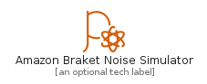
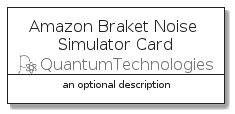

# AmazonBraketNoiseSimulator


```text
aws-q3-2021/Resource/QuantumTechnologies/AmazonBraketNoiseSimulator
```

```text
include('aws-q3-2021/Resource/QuantumTechnologies/AmazonBraketNoiseSimulator')
```


| Illustration | AmazonBraketNoiseSimulator | AmazonBraketNoiseSimulatorCard | AmazonBraketNoiseSimulatorGroup |
| :---: | :---: | :---: | :---: |
|  |  |  |  |


## AmazonBraketNoiseSimulator

### Load remotely
```plantuml
@startuml
' configures the library
!global $LIB_BASE_LOCATION="https://raw.githubusercontent.com/tmorin/plantuml-libs/master/distribution"

' loads the library's bootstrap
!include $LIB_BASE_LOCATION/bootstrap.puml

' loads the package bootstrap
include('aws-q3-2021/bootstrap')

' loads the Item which embeds the element AmazonBraketNoiseSimulator
include('aws-q3-2021/Resource/QuantumTechnologies/AmazonBraketNoiseSimulator')

' renders the element
AmazonBraketNoiseSimulator('AmazonBraketNoiseSimulator', 'Amazon Braket Noise Simulator', 'an optional tech label')
@enduml
```

### Load locally
```plantuml
@startuml
' configures the library
!global $INCLUSION_MODE="local"
!global $LIB_BASE_LOCATION="../../.."

' loads the library's bootstrap
!include $LIB_BASE_LOCATION/bootstrap.puml

' loads the package bootstrap
include('aws-q3-2021/bootstrap')

' loads the Item which embeds the element AmazonBraketNoiseSimulator
include('aws-q3-2021/Resource/QuantumTechnologies/AmazonBraketNoiseSimulator')

' renders the element
AmazonBraketNoiseSimulator('AmazonBraketNoiseSimulator', 'Amazon Braket Noise Simulator', 'an optional tech label')
@enduml
```

## AmazonBraketNoiseSimulatorCard

### Load remotely
```plantuml
@startuml
' configures the library
!global $LIB_BASE_LOCATION="https://raw.githubusercontent.com/tmorin/plantuml-libs/master/distribution"

' loads the library's bootstrap
!include $LIB_BASE_LOCATION/bootstrap.puml

' loads the package bootstrap
include('aws-q3-2021/bootstrap')

' loads the Item which embeds the element AmazonBraketNoiseSimulatorCard
include('aws-q3-2021/Resource/QuantumTechnologies/AmazonBraketNoiseSimulator')

' renders the element
AmazonBraketNoiseSimulatorCard('AmazonBraketNoiseSimulatorCard', 'Amazon Braket Noise Simulator Card', 'an optional description')
@enduml
```

### Load locally
```plantuml
@startuml
' configures the library
!global $INCLUSION_MODE="local"
!global $LIB_BASE_LOCATION="../../.."

' loads the library's bootstrap
!include $LIB_BASE_LOCATION/bootstrap.puml

' loads the package bootstrap
include('aws-q3-2021/bootstrap')

' loads the Item which embeds the element AmazonBraketNoiseSimulatorCard
include('aws-q3-2021/Resource/QuantumTechnologies/AmazonBraketNoiseSimulator')

' renders the element
AmazonBraketNoiseSimulatorCard('AmazonBraketNoiseSimulatorCard', 'Amazon Braket Noise Simulator Card', 'an optional description')
@enduml
```

## AmazonBraketNoiseSimulatorGroup

### Load remotely
```plantuml
@startuml
' configures the library
!global $LIB_BASE_LOCATION="https://raw.githubusercontent.com/tmorin/plantuml-libs/master/distribution"

' loads the library's bootstrap
!include $LIB_BASE_LOCATION/bootstrap.puml

' loads the package bootstrap
include('aws-q3-2021/bootstrap')

' loads the Item which embeds the element AmazonBraketNoiseSimulatorGroup
include('aws-q3-2021/Resource/QuantumTechnologies/AmazonBraketNoiseSimulator')

' renders the element
AmazonBraketNoiseSimulatorGroup('AmazonBraketNoiseSimulatorGroup', 'Amazon Braket Noise Simulator Group', 'an optional tech label') {
    note as note
        the content of the group
    end note
}
@enduml
```

### Load locally
```plantuml
@startuml
' configures the library
!global $INCLUSION_MODE="local"
!global $LIB_BASE_LOCATION="../../.."

' loads the library's bootstrap
!include $LIB_BASE_LOCATION/bootstrap.puml

' loads the package bootstrap
include('aws-q3-2021/bootstrap')

' loads the Item which embeds the element AmazonBraketNoiseSimulatorGroup
include('aws-q3-2021/Resource/QuantumTechnologies/AmazonBraketNoiseSimulator')

' renders the element
AmazonBraketNoiseSimulatorGroup('AmazonBraketNoiseSimulatorGroup', 'Amazon Braket Noise Simulator Group', 'an optional tech label') {
    note as note
        the content of the group
    end note
}
@enduml
```

