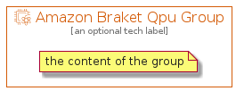

# AmazonBraketQpu


```text
aws-q3-2021/Resource/QuantumTechnologies/AmazonBraketQpu
```

```text
include('aws-q3-2021/Resource/QuantumTechnologies/AmazonBraketQpu')
```


| Illustration | AmazonBraketQpu | AmazonBraketQpuCard | AmazonBraketQpuGroup |
| :---: | :---: | :---: | :---: |
|  |  |  |  |


## AmazonBraketQpu

### Load remotely
```plantuml
@startuml
' configures the library
!global $LIB_BASE_LOCATION="https://raw.githubusercontent.com/tmorin/plantuml-libs/master/distribution"

' loads the library's bootstrap
!include $LIB_BASE_LOCATION/bootstrap.puml

' loads the package bootstrap
include('aws-q3-2021/bootstrap')

' loads the Item which embeds the element AmazonBraketQpu
include('aws-q3-2021/Resource/QuantumTechnologies/AmazonBraketQpu')

' renders the element
AmazonBraketQpu('AmazonBraketQpu', 'Amazon Braket Qpu', 'an optional tech label')
@enduml
```

### Load locally
```plantuml
@startuml
' configures the library
!global $INCLUSION_MODE="local"
!global $LIB_BASE_LOCATION="../../.."

' loads the library's bootstrap
!include $LIB_BASE_LOCATION/bootstrap.puml

' loads the package bootstrap
include('aws-q3-2021/bootstrap')

' loads the Item which embeds the element AmazonBraketQpu
include('aws-q3-2021/Resource/QuantumTechnologies/AmazonBraketQpu')

' renders the element
AmazonBraketQpu('AmazonBraketQpu', 'Amazon Braket Qpu', 'an optional tech label')
@enduml
```

## AmazonBraketQpuCard

### Load remotely
```plantuml
@startuml
' configures the library
!global $LIB_BASE_LOCATION="https://raw.githubusercontent.com/tmorin/plantuml-libs/master/distribution"

' loads the library's bootstrap
!include $LIB_BASE_LOCATION/bootstrap.puml

' loads the package bootstrap
include('aws-q3-2021/bootstrap')

' loads the Item which embeds the element AmazonBraketQpuCard
include('aws-q3-2021/Resource/QuantumTechnologies/AmazonBraketQpu')

' renders the element
AmazonBraketQpuCard('AmazonBraketQpuCard', 'Amazon Braket Qpu Card', 'an optional description')
@enduml
```

### Load locally
```plantuml
@startuml
' configures the library
!global $INCLUSION_MODE="local"
!global $LIB_BASE_LOCATION="../../.."

' loads the library's bootstrap
!include $LIB_BASE_LOCATION/bootstrap.puml

' loads the package bootstrap
include('aws-q3-2021/bootstrap')

' loads the Item which embeds the element AmazonBraketQpuCard
include('aws-q3-2021/Resource/QuantumTechnologies/AmazonBraketQpu')

' renders the element
AmazonBraketQpuCard('AmazonBraketQpuCard', 'Amazon Braket Qpu Card', 'an optional description')
@enduml
```

## AmazonBraketQpuGroup

### Load remotely
```plantuml
@startuml
' configures the library
!global $LIB_BASE_LOCATION="https://raw.githubusercontent.com/tmorin/plantuml-libs/master/distribution"

' loads the library's bootstrap
!include $LIB_BASE_LOCATION/bootstrap.puml

' loads the package bootstrap
include('aws-q3-2021/bootstrap')

' loads the Item which embeds the element AmazonBraketQpuGroup
include('aws-q3-2021/Resource/QuantumTechnologies/AmazonBraketQpu')

' renders the element
AmazonBraketQpuGroup('AmazonBraketQpuGroup', 'Amazon Braket Qpu Group', 'an optional tech label') {
    note as note
        the content of the group
    end note
}
@enduml
```

### Load locally
```plantuml
@startuml
' configures the library
!global $INCLUSION_MODE="local"
!global $LIB_BASE_LOCATION="../../.."

' loads the library's bootstrap
!include $LIB_BASE_LOCATION/bootstrap.puml

' loads the package bootstrap
include('aws-q3-2021/bootstrap')

' loads the Item which embeds the element AmazonBraketQpuGroup
include('aws-q3-2021/Resource/QuantumTechnologies/AmazonBraketQpu')

' renders the element
AmazonBraketQpuGroup('AmazonBraketQpuGroup', 'Amazon Braket Qpu Group', 'an optional tech label') {
    note as note
        the content of the group
    end note
}
@enduml
```

