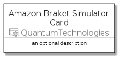
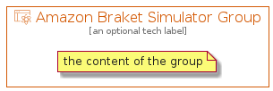

# AmazonBraketSimulator


```text
aws-q3-2021/Resource/QuantumTechnologies/AmazonBraketSimulator
```

```text
include('aws-q3-2021/Resource/QuantumTechnologies/AmazonBraketSimulator')
```


| Illustration | AmazonBraketSimulator | AmazonBraketSimulatorCard | AmazonBraketSimulatorGroup |
| :---: | :---: | :---: | :---: |
|  |  |  |  |


## AmazonBraketSimulator

### Load remotely
```plantuml
@startuml
' configures the library
!global $LIB_BASE_LOCATION="https://github.com/tmorin/plantuml-libs/distribution"

' loads the library's bootstrap
!include $LIB_BASE_LOCATION/bootstrap.puml

' loads the package bootstrap
include('aws-q3-2021/bootstrap')

' loads the Item which embeds the element AmazonBraketSimulator
include('aws-q3-2021/Resource/QuantumTechnologies/AmazonBraketSimulator')

' renders the element
AmazonBraketSimulator('AmazonBraketSimulator', 'Amazon Braket Simulator', 'an optional tech label')
@enduml
```

### Load locally
```plantuml
@startuml
' configures the library
!global $INCLUSION_MODE="local"
!global $LIB_BASE_LOCATION="../../.."

' loads the library's bootstrap
!include $LIB_BASE_LOCATION/bootstrap.puml

' loads the package bootstrap
include('aws-q3-2021/bootstrap')

' loads the Item which embeds the element AmazonBraketSimulator
include('aws-q3-2021/Resource/QuantumTechnologies/AmazonBraketSimulator')

' renders the element
AmazonBraketSimulator('AmazonBraketSimulator', 'Amazon Braket Simulator', 'an optional tech label')
@enduml
```

## AmazonBraketSimulatorCard

### Load remotely
```plantuml
@startuml
' configures the library
!global $LIB_BASE_LOCATION="https://github.com/tmorin/plantuml-libs/distribution"

' loads the library's bootstrap
!include $LIB_BASE_LOCATION/bootstrap.puml

' loads the package bootstrap
include('aws-q3-2021/bootstrap')

' loads the Item which embeds the element AmazonBraketSimulatorCard
include('aws-q3-2021/Resource/QuantumTechnologies/AmazonBraketSimulator')

' renders the element
AmazonBraketSimulatorCard('AmazonBraketSimulatorCard', 'Amazon Braket Simulator Card', 'an optional description')
@enduml
```

### Load locally
```plantuml
@startuml
' configures the library
!global $INCLUSION_MODE="local"
!global $LIB_BASE_LOCATION="../../.."

' loads the library's bootstrap
!include $LIB_BASE_LOCATION/bootstrap.puml

' loads the package bootstrap
include('aws-q3-2021/bootstrap')

' loads the Item which embeds the element AmazonBraketSimulatorCard
include('aws-q3-2021/Resource/QuantumTechnologies/AmazonBraketSimulator')

' renders the element
AmazonBraketSimulatorCard('AmazonBraketSimulatorCard', 'Amazon Braket Simulator Card', 'an optional description')
@enduml
```

## AmazonBraketSimulatorGroup

### Load remotely
```plantuml
@startuml
' configures the library
!global $LIB_BASE_LOCATION="https://github.com/tmorin/plantuml-libs/distribution"

' loads the library's bootstrap
!include $LIB_BASE_LOCATION/bootstrap.puml

' loads the package bootstrap
include('aws-q3-2021/bootstrap')

' loads the Item which embeds the element AmazonBraketSimulatorGroup
include('aws-q3-2021/Resource/QuantumTechnologies/AmazonBraketSimulator')

' renders the element
AmazonBraketSimulatorGroup('AmazonBraketSimulatorGroup', 'Amazon Braket Simulator Group', 'an optional tech label') {
    note as note
        the content of the group
    end note
}
@enduml
```

### Load locally
```plantuml
@startuml
' configures the library
!global $INCLUSION_MODE="local"
!global $LIB_BASE_LOCATION="../../.."

' loads the library's bootstrap
!include $LIB_BASE_LOCATION/bootstrap.puml

' loads the package bootstrap
include('aws-q3-2021/bootstrap')

' loads the Item which embeds the element AmazonBraketSimulatorGroup
include('aws-q3-2021/Resource/QuantumTechnologies/AmazonBraketSimulator')

' renders the element
AmazonBraketSimulatorGroup('AmazonBraketSimulatorGroup', 'Amazon Braket Simulator Group', 'an optional tech label') {
    note as note
        the content of the group
    end note
}
@enduml
```

