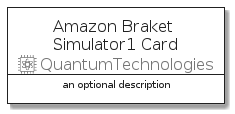
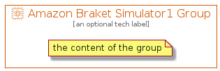

# AmazonBraketSimulator1


```text
aws-q3-2021/Resource/QuantumTechnologies/AmazonBraketSimulator1
```

```text
include('aws-q3-2021/Resource/QuantumTechnologies/AmazonBraketSimulator1')
```


| Illustration | AmazonBraketSimulator1 | AmazonBraketSimulator1Card | AmazonBraketSimulator1Group |
| :---: | :---: | :---: | :---: |
|  |  |  |  |


## AmazonBraketSimulator1

### Load remotely
```plantuml
@startuml
' configures the library
!global $LIB_BASE_LOCATION="https://raw.githubusercontent.com/tmorin/plantuml-libs/master/distribution"

' loads the library's bootstrap
!include $LIB_BASE_LOCATION/bootstrap.puml

' loads the package bootstrap
include('aws-q3-2021/bootstrap')

' loads the Item which embeds the element AmazonBraketSimulator1
include('aws-q3-2021/Resource/QuantumTechnologies/AmazonBraketSimulator1')

' renders the element
AmazonBraketSimulator1('AmazonBraketSimulator1', 'Amazon Braket Simulator1', 'an optional tech label')
@enduml
```

### Load locally
```plantuml
@startuml
' configures the library
!global $INCLUSION_MODE="local"
!global $LIB_BASE_LOCATION="../../.."

' loads the library's bootstrap
!include $LIB_BASE_LOCATION/bootstrap.puml

' loads the package bootstrap
include('aws-q3-2021/bootstrap')

' loads the Item which embeds the element AmazonBraketSimulator1
include('aws-q3-2021/Resource/QuantumTechnologies/AmazonBraketSimulator1')

' renders the element
AmazonBraketSimulator1('AmazonBraketSimulator1', 'Amazon Braket Simulator1', 'an optional tech label')
@enduml
```

## AmazonBraketSimulator1Card

### Load remotely
```plantuml
@startuml
' configures the library
!global $LIB_BASE_LOCATION="https://raw.githubusercontent.com/tmorin/plantuml-libs/master/distribution"

' loads the library's bootstrap
!include $LIB_BASE_LOCATION/bootstrap.puml

' loads the package bootstrap
include('aws-q3-2021/bootstrap')

' loads the Item which embeds the element AmazonBraketSimulator1Card
include('aws-q3-2021/Resource/QuantumTechnologies/AmazonBraketSimulator1')

' renders the element
AmazonBraketSimulator1Card('AmazonBraketSimulator1Card', 'Amazon Braket Simulator1 Card', 'an optional description')
@enduml
```

### Load locally
```plantuml
@startuml
' configures the library
!global $INCLUSION_MODE="local"
!global $LIB_BASE_LOCATION="../../.."

' loads the library's bootstrap
!include $LIB_BASE_LOCATION/bootstrap.puml

' loads the package bootstrap
include('aws-q3-2021/bootstrap')

' loads the Item which embeds the element AmazonBraketSimulator1Card
include('aws-q3-2021/Resource/QuantumTechnologies/AmazonBraketSimulator1')

' renders the element
AmazonBraketSimulator1Card('AmazonBraketSimulator1Card', 'Amazon Braket Simulator1 Card', 'an optional description')
@enduml
```

## AmazonBraketSimulator1Group

### Load remotely
```plantuml
@startuml
' configures the library
!global $LIB_BASE_LOCATION="https://raw.githubusercontent.com/tmorin/plantuml-libs/master/distribution"

' loads the library's bootstrap
!include $LIB_BASE_LOCATION/bootstrap.puml

' loads the package bootstrap
include('aws-q3-2021/bootstrap')

' loads the Item which embeds the element AmazonBraketSimulator1Group
include('aws-q3-2021/Resource/QuantumTechnologies/AmazonBraketSimulator1')

' renders the element
AmazonBraketSimulator1Group('AmazonBraketSimulator1Group', 'Amazon Braket Simulator1 Group', 'an optional tech label') {
    note as note
        the content of the group
    end note
}
@enduml
```

### Load locally
```plantuml
@startuml
' configures the library
!global $INCLUSION_MODE="local"
!global $LIB_BASE_LOCATION="../../.."

' loads the library's bootstrap
!include $LIB_BASE_LOCATION/bootstrap.puml

' loads the package bootstrap
include('aws-q3-2021/bootstrap')

' loads the Item which embeds the element AmazonBraketSimulator1Group
include('aws-q3-2021/Resource/QuantumTechnologies/AmazonBraketSimulator1')

' renders the element
AmazonBraketSimulator1Group('AmazonBraketSimulator1Group', 'Amazon Braket Simulator1 Group', 'an optional tech label') {
    note as note
        the content of the group
    end note
}
@enduml
```

