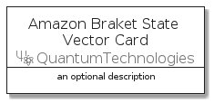
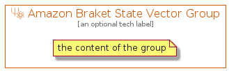

# AmazonBraketStateVector


```text
aws-q3-2021/Resource/QuantumTechnologies/AmazonBraketStateVector
```

```text
include('aws-q3-2021/Resource/QuantumTechnologies/AmazonBraketStateVector')
```


| Illustration | AmazonBraketStateVector | AmazonBraketStateVectorCard | AmazonBraketStateVectorGroup |
| :---: | :---: | :---: | :---: |
|  |  |  |  |


## AmazonBraketStateVector

### Load remotely
```plantuml
@startuml
' configures the library
!global $LIB_BASE_LOCATION="https://github.com/tmorin/plantuml-libs/distribution"

' loads the library's bootstrap
!include $LIB_BASE_LOCATION/bootstrap.puml

' loads the package bootstrap
include('aws-q3-2021/bootstrap')

' loads the Item which embeds the element AmazonBraketStateVector
include('aws-q3-2021/Resource/QuantumTechnologies/AmazonBraketStateVector')

' renders the element
AmazonBraketStateVector('AmazonBraketStateVector', 'Amazon Braket State Vector', 'an optional tech label')
@enduml
```

### Load locally
```plantuml
@startuml
' configures the library
!global $INCLUSION_MODE="local"
!global $LIB_BASE_LOCATION="../../.."

' loads the library's bootstrap
!include $LIB_BASE_LOCATION/bootstrap.puml

' loads the package bootstrap
include('aws-q3-2021/bootstrap')

' loads the Item which embeds the element AmazonBraketStateVector
include('aws-q3-2021/Resource/QuantumTechnologies/AmazonBraketStateVector')

' renders the element
AmazonBraketStateVector('AmazonBraketStateVector', 'Amazon Braket State Vector', 'an optional tech label')
@enduml
```

## AmazonBraketStateVectorCard

### Load remotely
```plantuml
@startuml
' configures the library
!global $LIB_BASE_LOCATION="https://github.com/tmorin/plantuml-libs/distribution"

' loads the library's bootstrap
!include $LIB_BASE_LOCATION/bootstrap.puml

' loads the package bootstrap
include('aws-q3-2021/bootstrap')

' loads the Item which embeds the element AmazonBraketStateVectorCard
include('aws-q3-2021/Resource/QuantumTechnologies/AmazonBraketStateVector')

' renders the element
AmazonBraketStateVectorCard('AmazonBraketStateVectorCard', 'Amazon Braket State Vector Card', 'an optional description')
@enduml
```

### Load locally
```plantuml
@startuml
' configures the library
!global $INCLUSION_MODE="local"
!global $LIB_BASE_LOCATION="../../.."

' loads the library's bootstrap
!include $LIB_BASE_LOCATION/bootstrap.puml

' loads the package bootstrap
include('aws-q3-2021/bootstrap')

' loads the Item which embeds the element AmazonBraketStateVectorCard
include('aws-q3-2021/Resource/QuantumTechnologies/AmazonBraketStateVector')

' renders the element
AmazonBraketStateVectorCard('AmazonBraketStateVectorCard', 'Amazon Braket State Vector Card', 'an optional description')
@enduml
```

## AmazonBraketStateVectorGroup

### Load remotely
```plantuml
@startuml
' configures the library
!global $LIB_BASE_LOCATION="https://github.com/tmorin/plantuml-libs/distribution"

' loads the library's bootstrap
!include $LIB_BASE_LOCATION/bootstrap.puml

' loads the package bootstrap
include('aws-q3-2021/bootstrap')

' loads the Item which embeds the element AmazonBraketStateVectorGroup
include('aws-q3-2021/Resource/QuantumTechnologies/AmazonBraketStateVector')

' renders the element
AmazonBraketStateVectorGroup('AmazonBraketStateVectorGroup', 'Amazon Braket State Vector Group', 'an optional tech label') {
    note as note
        the content of the group
    end note
}
@enduml
```

### Load locally
```plantuml
@startuml
' configures the library
!global $INCLUSION_MODE="local"
!global $LIB_BASE_LOCATION="../../.."

' loads the library's bootstrap
!include $LIB_BASE_LOCATION/bootstrap.puml

' loads the package bootstrap
include('aws-q3-2021/bootstrap')

' loads the Item which embeds the element AmazonBraketStateVectorGroup
include('aws-q3-2021/Resource/QuantumTechnologies/AmazonBraketStateVector')

' renders the element
AmazonBraketStateVectorGroup('AmazonBraketStateVectorGroup', 'Amazon Braket State Vector Group', 'an optional tech label') {
    note as note
        the content of the group
    end note
}
@enduml
```

