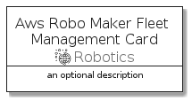

# AwsRoboMakerFleetManagement


```text
aws-q3-2021/Resource/Robotics/AwsRoboMakerFleetManagement
```

```text
include('aws-q3-2021/Resource/Robotics/AwsRoboMakerFleetManagement')
```


| Illustration | AwsRoboMakerFleetManagement | AwsRoboMakerFleetManagementCard | AwsRoboMakerFleetManagementGroup |
| :---: | :---: | :---: | :---: |
|  |  |  |  |


## AwsRoboMakerFleetManagement

### Load remotely
```plantuml
@startuml
' configures the library
!global $LIB_BASE_LOCATION="https://raw.githubusercontent.com/tmorin/plantuml-libs/master/distribution"

' loads the library's bootstrap
!include $LIB_BASE_LOCATION/bootstrap.puml

' loads the package bootstrap
include('aws-q3-2021/bootstrap')

' loads the Item which embeds the element AwsRoboMakerFleetManagement
include('aws-q3-2021/Resource/Robotics/AwsRoboMakerFleetManagement')

' renders the element
AwsRoboMakerFleetManagement('AwsRoboMakerFleetManagement', 'Aws Robo Maker Fleet Management', 'an optional tech label')
@enduml
```

### Load locally
```plantuml
@startuml
' configures the library
!global $INCLUSION_MODE="local"
!global $LIB_BASE_LOCATION="../../.."

' loads the library's bootstrap
!include $LIB_BASE_LOCATION/bootstrap.puml

' loads the package bootstrap
include('aws-q3-2021/bootstrap')

' loads the Item which embeds the element AwsRoboMakerFleetManagement
include('aws-q3-2021/Resource/Robotics/AwsRoboMakerFleetManagement')

' renders the element
AwsRoboMakerFleetManagement('AwsRoboMakerFleetManagement', 'Aws Robo Maker Fleet Management', 'an optional tech label')
@enduml
```

## AwsRoboMakerFleetManagementCard

### Load remotely
```plantuml
@startuml
' configures the library
!global $LIB_BASE_LOCATION="https://raw.githubusercontent.com/tmorin/plantuml-libs/master/distribution"

' loads the library's bootstrap
!include $LIB_BASE_LOCATION/bootstrap.puml

' loads the package bootstrap
include('aws-q3-2021/bootstrap')

' loads the Item which embeds the element AwsRoboMakerFleetManagementCard
include('aws-q3-2021/Resource/Robotics/AwsRoboMakerFleetManagement')

' renders the element
AwsRoboMakerFleetManagementCard('AwsRoboMakerFleetManagementCard', 'Aws Robo Maker Fleet Management Card', 'an optional description')
@enduml
```

### Load locally
```plantuml
@startuml
' configures the library
!global $INCLUSION_MODE="local"
!global $LIB_BASE_LOCATION="../../.."

' loads the library's bootstrap
!include $LIB_BASE_LOCATION/bootstrap.puml

' loads the package bootstrap
include('aws-q3-2021/bootstrap')

' loads the Item which embeds the element AwsRoboMakerFleetManagementCard
include('aws-q3-2021/Resource/Robotics/AwsRoboMakerFleetManagement')

' renders the element
AwsRoboMakerFleetManagementCard('AwsRoboMakerFleetManagementCard', 'Aws Robo Maker Fleet Management Card', 'an optional description')
@enduml
```

## AwsRoboMakerFleetManagementGroup

### Load remotely
```plantuml
@startuml
' configures the library
!global $LIB_BASE_LOCATION="https://raw.githubusercontent.com/tmorin/plantuml-libs/master/distribution"

' loads the library's bootstrap
!include $LIB_BASE_LOCATION/bootstrap.puml

' loads the package bootstrap
include('aws-q3-2021/bootstrap')

' loads the Item which embeds the element AwsRoboMakerFleetManagementGroup
include('aws-q3-2021/Resource/Robotics/AwsRoboMakerFleetManagement')

' renders the element
AwsRoboMakerFleetManagementGroup('AwsRoboMakerFleetManagementGroup', 'Aws Robo Maker Fleet Management Group', 'an optional tech label') {
    note as note
        the content of the group
    end note
}
@enduml
```

### Load locally
```plantuml
@startuml
' configures the library
!global $INCLUSION_MODE="local"
!global $LIB_BASE_LOCATION="../../.."

' loads the library's bootstrap
!include $LIB_BASE_LOCATION/bootstrap.puml

' loads the package bootstrap
include('aws-q3-2021/bootstrap')

' loads the Item which embeds the element AwsRoboMakerFleetManagementGroup
include('aws-q3-2021/Resource/Robotics/AwsRoboMakerFleetManagement')

' renders the element
AwsRoboMakerFleetManagementGroup('AwsRoboMakerFleetManagementGroup', 'Aws Robo Maker Fleet Management Group', 'an optional tech label') {
    note as note
        the content of the group
    end note
}
@enduml
```

