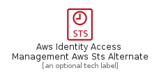
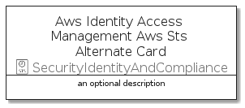
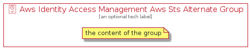

# AwsIdentityAccessManagementAwsStsAlternate


```text
aws-q3-2021/Resource/SecurityIdentityAndCompliance/AwsIdentityAccessManagementAwsStsAlternate
```

```text
include('aws-q3-2021/Resource/SecurityIdentityAndCompliance/AwsIdentityAccessManagementAwsStsAlternate')
```


| Illustration | AwsIdentityAccessManagementAwsStsAlternate | AwsIdentityAccessManagementAwsStsAlternateCard | AwsIdentityAccessManagementAwsStsAlternateGroup |
| :---: | :---: | :---: | :---: |
|  |  |  |  |


## AwsIdentityAccessManagementAwsStsAlternate

### Load remotely
```plantuml
@startuml
' configures the library
!global $LIB_BASE_LOCATION="https://raw.githubusercontent.com/tmorin/plantuml-libs/master/distribution"

' loads the library's bootstrap
!include $LIB_BASE_LOCATION/bootstrap.puml

' loads the package bootstrap
include('aws-q3-2021/bootstrap')

' loads the Item which embeds the element AwsIdentityAccessManagementAwsStsAlternate
include('aws-q3-2021/Resource/SecurityIdentityAndCompliance/AwsIdentityAccessManagementAwsStsAlternate')

' renders the element
AwsIdentityAccessManagementAwsStsAlternate('AwsIdentityAccessManagementAwsStsAlternate', 'Aws Identity Access Management Aws Sts Alternate', 'an optional tech label')
@enduml
```

### Load locally
```plantuml
@startuml
' configures the library
!global $INCLUSION_MODE="local"
!global $LIB_BASE_LOCATION="../../.."

' loads the library's bootstrap
!include $LIB_BASE_LOCATION/bootstrap.puml

' loads the package bootstrap
include('aws-q3-2021/bootstrap')

' loads the Item which embeds the element AwsIdentityAccessManagementAwsStsAlternate
include('aws-q3-2021/Resource/SecurityIdentityAndCompliance/AwsIdentityAccessManagementAwsStsAlternate')

' renders the element
AwsIdentityAccessManagementAwsStsAlternate('AwsIdentityAccessManagementAwsStsAlternate', 'Aws Identity Access Management Aws Sts Alternate', 'an optional tech label')
@enduml
```

## AwsIdentityAccessManagementAwsStsAlternateCard

### Load remotely
```plantuml
@startuml
' configures the library
!global $LIB_BASE_LOCATION="https://raw.githubusercontent.com/tmorin/plantuml-libs/master/distribution"

' loads the library's bootstrap
!include $LIB_BASE_LOCATION/bootstrap.puml

' loads the package bootstrap
include('aws-q3-2021/bootstrap')

' loads the Item which embeds the element AwsIdentityAccessManagementAwsStsAlternateCard
include('aws-q3-2021/Resource/SecurityIdentityAndCompliance/AwsIdentityAccessManagementAwsStsAlternate')

' renders the element
AwsIdentityAccessManagementAwsStsAlternateCard('AwsIdentityAccessManagementAwsStsAlternateCard', 'Aws Identity Access Management Aws Sts Alternate Card', 'an optional description')
@enduml
```

### Load locally
```plantuml
@startuml
' configures the library
!global $INCLUSION_MODE="local"
!global $LIB_BASE_LOCATION="../../.."

' loads the library's bootstrap
!include $LIB_BASE_LOCATION/bootstrap.puml

' loads the package bootstrap
include('aws-q3-2021/bootstrap')

' loads the Item which embeds the element AwsIdentityAccessManagementAwsStsAlternateCard
include('aws-q3-2021/Resource/SecurityIdentityAndCompliance/AwsIdentityAccessManagementAwsStsAlternate')

' renders the element
AwsIdentityAccessManagementAwsStsAlternateCard('AwsIdentityAccessManagementAwsStsAlternateCard', 'Aws Identity Access Management Aws Sts Alternate Card', 'an optional description')
@enduml
```

## AwsIdentityAccessManagementAwsStsAlternateGroup

### Load remotely
```plantuml
@startuml
' configures the library
!global $LIB_BASE_LOCATION="https://raw.githubusercontent.com/tmorin/plantuml-libs/master/distribution"

' loads the library's bootstrap
!include $LIB_BASE_LOCATION/bootstrap.puml

' loads the package bootstrap
include('aws-q3-2021/bootstrap')

' loads the Item which embeds the element AwsIdentityAccessManagementAwsStsAlternateGroup
include('aws-q3-2021/Resource/SecurityIdentityAndCompliance/AwsIdentityAccessManagementAwsStsAlternate')

' renders the element
AwsIdentityAccessManagementAwsStsAlternateGroup('AwsIdentityAccessManagementAwsStsAlternateGroup', 'Aws Identity Access Management Aws Sts Alternate Group', 'an optional tech label') {
    note as note
        the content of the group
    end note
}
@enduml
```

### Load locally
```plantuml
@startuml
' configures the library
!global $INCLUSION_MODE="local"
!global $LIB_BASE_LOCATION="../../.."

' loads the library's bootstrap
!include $LIB_BASE_LOCATION/bootstrap.puml

' loads the package bootstrap
include('aws-q3-2021/bootstrap')

' loads the Item which embeds the element AwsIdentityAccessManagementAwsStsAlternateGroup
include('aws-q3-2021/Resource/SecurityIdentityAndCompliance/AwsIdentityAccessManagementAwsStsAlternate')

' renders the element
AwsIdentityAccessManagementAwsStsAlternateGroup('AwsIdentityAccessManagementAwsStsAlternateGroup', 'Aws Identity Access Management Aws Sts Alternate Group', 'an optional tech label') {
    note as note
        the content of the group
    end note
}
@enduml
```

