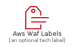
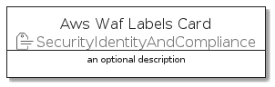
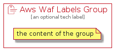

# AwsWafLabels


```text
aws-q3-2021/Resource/SecurityIdentityAndCompliance/AwsWafLabels
```

```text
include('aws-q3-2021/Resource/SecurityIdentityAndCompliance/AwsWafLabels')
```


| Illustration | AwsWafLabels | AwsWafLabelsCard | AwsWafLabelsGroup |
| :---: | :---: | :---: | :---: |
|  |  |  |  |


## AwsWafLabels

### Load remotely
```plantuml
@startuml
' configures the library
!global $LIB_BASE_LOCATION="https://raw.githubusercontent.com/tmorin/plantuml-libs/master/distribution"

' loads the library's bootstrap
!include $LIB_BASE_LOCATION/bootstrap.puml

' loads the package bootstrap
include('aws-q3-2021/bootstrap')

' loads the Item which embeds the element AwsWafLabels
include('aws-q3-2021/Resource/SecurityIdentityAndCompliance/AwsWafLabels')

' renders the element
AwsWafLabels('AwsWafLabels', 'Aws Waf Labels', 'an optional tech label')
@enduml
```

### Load locally
```plantuml
@startuml
' configures the library
!global $INCLUSION_MODE="local"
!global $LIB_BASE_LOCATION="../../.."

' loads the library's bootstrap
!include $LIB_BASE_LOCATION/bootstrap.puml

' loads the package bootstrap
include('aws-q3-2021/bootstrap')

' loads the Item which embeds the element AwsWafLabels
include('aws-q3-2021/Resource/SecurityIdentityAndCompliance/AwsWafLabels')

' renders the element
AwsWafLabels('AwsWafLabels', 'Aws Waf Labels', 'an optional tech label')
@enduml
```

## AwsWafLabelsCard

### Load remotely
```plantuml
@startuml
' configures the library
!global $LIB_BASE_LOCATION="https://raw.githubusercontent.com/tmorin/plantuml-libs/master/distribution"

' loads the library's bootstrap
!include $LIB_BASE_LOCATION/bootstrap.puml

' loads the package bootstrap
include('aws-q3-2021/bootstrap')

' loads the Item which embeds the element AwsWafLabelsCard
include('aws-q3-2021/Resource/SecurityIdentityAndCompliance/AwsWafLabels')

' renders the element
AwsWafLabelsCard('AwsWafLabelsCard', 'Aws Waf Labels Card', 'an optional description')
@enduml
```

### Load locally
```plantuml
@startuml
' configures the library
!global $INCLUSION_MODE="local"
!global $LIB_BASE_LOCATION="../../.."

' loads the library's bootstrap
!include $LIB_BASE_LOCATION/bootstrap.puml

' loads the package bootstrap
include('aws-q3-2021/bootstrap')

' loads the Item which embeds the element AwsWafLabelsCard
include('aws-q3-2021/Resource/SecurityIdentityAndCompliance/AwsWafLabels')

' renders the element
AwsWafLabelsCard('AwsWafLabelsCard', 'Aws Waf Labels Card', 'an optional description')
@enduml
```

## AwsWafLabelsGroup

### Load remotely
```plantuml
@startuml
' configures the library
!global $LIB_BASE_LOCATION="https://raw.githubusercontent.com/tmorin/plantuml-libs/master/distribution"

' loads the library's bootstrap
!include $LIB_BASE_LOCATION/bootstrap.puml

' loads the package bootstrap
include('aws-q3-2021/bootstrap')

' loads the Item which embeds the element AwsWafLabelsGroup
include('aws-q3-2021/Resource/SecurityIdentityAndCompliance/AwsWafLabels')

' renders the element
AwsWafLabelsGroup('AwsWafLabelsGroup', 'Aws Waf Labels Group', 'an optional tech label') {
    note as note
        the content of the group
    end note
}
@enduml
```

### Load locally
```plantuml
@startuml
' configures the library
!global $INCLUSION_MODE="local"
!global $LIB_BASE_LOCATION="../../.."

' loads the library's bootstrap
!include $LIB_BASE_LOCATION/bootstrap.puml

' loads the package bootstrap
include('aws-q3-2021/bootstrap')

' loads the Item which embeds the element AwsWafLabelsGroup
include('aws-q3-2021/Resource/SecurityIdentityAndCompliance/AwsWafLabels')

' renders the element
AwsWafLabelsGroup('AwsWafLabelsGroup', 'Aws Waf Labels Group', 'an optional tech label') {
    note as note
        the content of the group
    end note
}
@enduml
```

