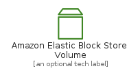
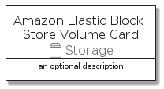

# AmazonElasticBlockStoreVolume


```text
aws-q3-2021/Resource/Storage/AmazonElasticBlockStoreVolume
```

```text
include('aws-q3-2021/Resource/Storage/AmazonElasticBlockStoreVolume')
```


| Illustration | AmazonElasticBlockStoreVolume | AmazonElasticBlockStoreVolumeCard | AmazonElasticBlockStoreVolumeGroup |
| :---: | :---: | :---: | :---: |
|  |  |  |  |


## AmazonElasticBlockStoreVolume

### Load remotely
```plantuml
@startuml
' configures the library
!global $LIB_BASE_LOCATION="https://github.com/tmorin/plantuml-libs/distribution"

' loads the library's bootstrap
!include $LIB_BASE_LOCATION/bootstrap.puml

' loads the package bootstrap
include('aws-q3-2021/bootstrap')

' loads the Item which embeds the element AmazonElasticBlockStoreVolume
include('aws-q3-2021/Resource/Storage/AmazonElasticBlockStoreVolume')

' renders the element
AmazonElasticBlockStoreVolume('AmazonElasticBlockStoreVolume', 'Amazon Elastic Block Store Volume', 'an optional tech label')
@enduml
```

### Load locally
```plantuml
@startuml
' configures the library
!global $INCLUSION_MODE="local"
!global $LIB_BASE_LOCATION="../../.."

' loads the library's bootstrap
!include $LIB_BASE_LOCATION/bootstrap.puml

' loads the package bootstrap
include('aws-q3-2021/bootstrap')

' loads the Item which embeds the element AmazonElasticBlockStoreVolume
include('aws-q3-2021/Resource/Storage/AmazonElasticBlockStoreVolume')

' renders the element
AmazonElasticBlockStoreVolume('AmazonElasticBlockStoreVolume', 'Amazon Elastic Block Store Volume', 'an optional tech label')
@enduml
```

## AmazonElasticBlockStoreVolumeCard

### Load remotely
```plantuml
@startuml
' configures the library
!global $LIB_BASE_LOCATION="https://github.com/tmorin/plantuml-libs/distribution"

' loads the library's bootstrap
!include $LIB_BASE_LOCATION/bootstrap.puml

' loads the package bootstrap
include('aws-q3-2021/bootstrap')

' loads the Item which embeds the element AmazonElasticBlockStoreVolumeCard
include('aws-q3-2021/Resource/Storage/AmazonElasticBlockStoreVolume')

' renders the element
AmazonElasticBlockStoreVolumeCard('AmazonElasticBlockStoreVolumeCard', 'Amazon Elastic Block Store Volume Card', 'an optional description')
@enduml
```

### Load locally
```plantuml
@startuml
' configures the library
!global $INCLUSION_MODE="local"
!global $LIB_BASE_LOCATION="../../.."

' loads the library's bootstrap
!include $LIB_BASE_LOCATION/bootstrap.puml

' loads the package bootstrap
include('aws-q3-2021/bootstrap')

' loads the Item which embeds the element AmazonElasticBlockStoreVolumeCard
include('aws-q3-2021/Resource/Storage/AmazonElasticBlockStoreVolume')

' renders the element
AmazonElasticBlockStoreVolumeCard('AmazonElasticBlockStoreVolumeCard', 'Amazon Elastic Block Store Volume Card', 'an optional description')
@enduml
```

## AmazonElasticBlockStoreVolumeGroup

### Load remotely
```plantuml
@startuml
' configures the library
!global $LIB_BASE_LOCATION="https://github.com/tmorin/plantuml-libs/distribution"

' loads the library's bootstrap
!include $LIB_BASE_LOCATION/bootstrap.puml

' loads the package bootstrap
include('aws-q3-2021/bootstrap')

' loads the Item which embeds the element AmazonElasticBlockStoreVolumeGroup
include('aws-q3-2021/Resource/Storage/AmazonElasticBlockStoreVolume')

' renders the element
AmazonElasticBlockStoreVolumeGroup('AmazonElasticBlockStoreVolumeGroup', 'Amazon Elastic Block Store Volume Group', 'an optional tech label') {
    note as note
        the content of the group
    end note
}
@enduml
```

### Load locally
```plantuml
@startuml
' configures the library
!global $INCLUSION_MODE="local"
!global $LIB_BASE_LOCATION="../../.."

' loads the library's bootstrap
!include $LIB_BASE_LOCATION/bootstrap.puml

' loads the package bootstrap
include('aws-q3-2021/bootstrap')

' loads the Item which embeds the element AmazonElasticBlockStoreVolumeGroup
include('aws-q3-2021/Resource/Storage/AmazonElasticBlockStoreVolume')

' renders the element
AmazonElasticBlockStoreVolumeGroup('AmazonElasticBlockStoreVolumeGroup', 'Amazon Elastic Block Store Volume Group', 'an optional tech label') {
    note as note
        the content of the group
    end note
}
@enduml
```

