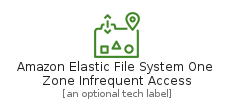
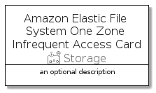

# AmazonElasticFileSystemOneZoneInfrequentAccess


```text
aws-q3-2021/Resource/Storage/AmazonElasticFileSystemOneZoneInfrequentAccess
```

```text
include('aws-q3-2021/Resource/Storage/AmazonElasticFileSystemOneZoneInfrequentAccess')
```


| Illustration | AmazonElasticFileSystemOneZoneInfrequentAccess | AmazonElasticFileSystemOneZoneInfrequentAccessCard | AmazonElasticFileSystemOneZoneInfrequentAccessGroup |
| :---: | :---: | :---: | :---: |
|  |  |  |  |


## AmazonElasticFileSystemOneZoneInfrequentAccess

### Load remotely
```plantuml
@startuml
' configures the library
!global $LIB_BASE_LOCATION="https://raw.githubusercontent.com/tmorin/plantuml-libs/master/distribution"

' loads the library's bootstrap
!include $LIB_BASE_LOCATION/bootstrap.puml

' loads the package bootstrap
include('aws-q3-2021/bootstrap')

' loads the Item which embeds the element AmazonElasticFileSystemOneZoneInfrequentAccess
include('aws-q3-2021/Resource/Storage/AmazonElasticFileSystemOneZoneInfrequentAccess')

' renders the element
AmazonElasticFileSystemOneZoneInfrequentAccess('AmazonElasticFileSystemOneZoneInfrequentAccess', 'Amazon Elastic File System One Zone Infrequent Access', 'an optional tech label')
@enduml
```

### Load locally
```plantuml
@startuml
' configures the library
!global $INCLUSION_MODE="local"
!global $LIB_BASE_LOCATION="../../.."

' loads the library's bootstrap
!include $LIB_BASE_LOCATION/bootstrap.puml

' loads the package bootstrap
include('aws-q3-2021/bootstrap')

' loads the Item which embeds the element AmazonElasticFileSystemOneZoneInfrequentAccess
include('aws-q3-2021/Resource/Storage/AmazonElasticFileSystemOneZoneInfrequentAccess')

' renders the element
AmazonElasticFileSystemOneZoneInfrequentAccess('AmazonElasticFileSystemOneZoneInfrequentAccess', 'Amazon Elastic File System One Zone Infrequent Access', 'an optional tech label')
@enduml
```

## AmazonElasticFileSystemOneZoneInfrequentAccessCard

### Load remotely
```plantuml
@startuml
' configures the library
!global $LIB_BASE_LOCATION="https://raw.githubusercontent.com/tmorin/plantuml-libs/master/distribution"

' loads the library's bootstrap
!include $LIB_BASE_LOCATION/bootstrap.puml

' loads the package bootstrap
include('aws-q3-2021/bootstrap')

' loads the Item which embeds the element AmazonElasticFileSystemOneZoneInfrequentAccessCard
include('aws-q3-2021/Resource/Storage/AmazonElasticFileSystemOneZoneInfrequentAccess')

' renders the element
AmazonElasticFileSystemOneZoneInfrequentAccessCard('AmazonElasticFileSystemOneZoneInfrequentAccessCard', 'Amazon Elastic File System One Zone Infrequent Access Card', 'an optional description')
@enduml
```

### Load locally
```plantuml
@startuml
' configures the library
!global $INCLUSION_MODE="local"
!global $LIB_BASE_LOCATION="../../.."

' loads the library's bootstrap
!include $LIB_BASE_LOCATION/bootstrap.puml

' loads the package bootstrap
include('aws-q3-2021/bootstrap')

' loads the Item which embeds the element AmazonElasticFileSystemOneZoneInfrequentAccessCard
include('aws-q3-2021/Resource/Storage/AmazonElasticFileSystemOneZoneInfrequentAccess')

' renders the element
AmazonElasticFileSystemOneZoneInfrequentAccessCard('AmazonElasticFileSystemOneZoneInfrequentAccessCard', 'Amazon Elastic File System One Zone Infrequent Access Card', 'an optional description')
@enduml
```

## AmazonElasticFileSystemOneZoneInfrequentAccessGroup

### Load remotely
```plantuml
@startuml
' configures the library
!global $LIB_BASE_LOCATION="https://raw.githubusercontent.com/tmorin/plantuml-libs/master/distribution"

' loads the library's bootstrap
!include $LIB_BASE_LOCATION/bootstrap.puml

' loads the package bootstrap
include('aws-q3-2021/bootstrap')

' loads the Item which embeds the element AmazonElasticFileSystemOneZoneInfrequentAccessGroup
include('aws-q3-2021/Resource/Storage/AmazonElasticFileSystemOneZoneInfrequentAccess')

' renders the element
AmazonElasticFileSystemOneZoneInfrequentAccessGroup('AmazonElasticFileSystemOneZoneInfrequentAccessGroup', 'Amazon Elastic File System One Zone Infrequent Access Group', 'an optional tech label') {
    note as note
        the content of the group
    end note
}
@enduml
```

### Load locally
```plantuml
@startuml
' configures the library
!global $INCLUSION_MODE="local"
!global $LIB_BASE_LOCATION="../../.."

' loads the library's bootstrap
!include $LIB_BASE_LOCATION/bootstrap.puml

' loads the package bootstrap
include('aws-q3-2021/bootstrap')

' loads the Item which embeds the element AmazonElasticFileSystemOneZoneInfrequentAccessGroup
include('aws-q3-2021/Resource/Storage/AmazonElasticFileSystemOneZoneInfrequentAccess')

' renders the element
AmazonElasticFileSystemOneZoneInfrequentAccessGroup('AmazonElasticFileSystemOneZoneInfrequentAccessGroup', 'Amazon Elastic File System One Zone Infrequent Access Group', 'an optional tech label') {
    note as note
        the content of the group
    end note
}
@enduml
```

