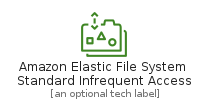
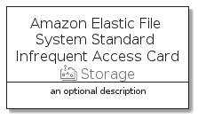

# AmazonElasticFileSystemStandardInfrequentAccess


```text
aws-q3-2021/Resource/Storage/AmazonElasticFileSystemStandardInfrequentAccess
```

```text
include('aws-q3-2021/Resource/Storage/AmazonElasticFileSystemStandardInfrequentAccess')
```


| Illustration | AmazonElasticFileSystemStandardInfrequentAccess | AmazonElasticFileSystemStandardInfrequentAccessCard | AmazonElasticFileSystemStandardInfrequentAccessGroup |
| :---: | :---: | :---: | :---: |
|  |  |  |  |


## AmazonElasticFileSystemStandardInfrequentAccess

### Load remotely
```plantuml
@startuml
' configures the library
!global $LIB_BASE_LOCATION="https://github.com/tmorin/plantuml-libs/distribution"

' loads the library's bootstrap
!include $LIB_BASE_LOCATION/bootstrap.puml

' loads the package bootstrap
include('aws-q3-2021/bootstrap')

' loads the Item which embeds the element AmazonElasticFileSystemStandardInfrequentAccess
include('aws-q3-2021/Resource/Storage/AmazonElasticFileSystemStandardInfrequentAccess')

' renders the element
AmazonElasticFileSystemStandardInfrequentAccess('AmazonElasticFileSystemStandardInfrequentAccess', 'Amazon Elastic File System Standard Infrequent Access', 'an optional tech label')
@enduml
```

### Load locally
```plantuml
@startuml
' configures the library
!global $INCLUSION_MODE="local"
!global $LIB_BASE_LOCATION="../../.."

' loads the library's bootstrap
!include $LIB_BASE_LOCATION/bootstrap.puml

' loads the package bootstrap
include('aws-q3-2021/bootstrap')

' loads the Item which embeds the element AmazonElasticFileSystemStandardInfrequentAccess
include('aws-q3-2021/Resource/Storage/AmazonElasticFileSystemStandardInfrequentAccess')

' renders the element
AmazonElasticFileSystemStandardInfrequentAccess('AmazonElasticFileSystemStandardInfrequentAccess', 'Amazon Elastic File System Standard Infrequent Access', 'an optional tech label')
@enduml
```

## AmazonElasticFileSystemStandardInfrequentAccessCard

### Load remotely
```plantuml
@startuml
' configures the library
!global $LIB_BASE_LOCATION="https://github.com/tmorin/plantuml-libs/distribution"

' loads the library's bootstrap
!include $LIB_BASE_LOCATION/bootstrap.puml

' loads the package bootstrap
include('aws-q3-2021/bootstrap')

' loads the Item which embeds the element AmazonElasticFileSystemStandardInfrequentAccessCard
include('aws-q3-2021/Resource/Storage/AmazonElasticFileSystemStandardInfrequentAccess')

' renders the element
AmazonElasticFileSystemStandardInfrequentAccessCard('AmazonElasticFileSystemStandardInfrequentAccessCard', 'Amazon Elastic File System Standard Infrequent Access Card', 'an optional description')
@enduml
```

### Load locally
```plantuml
@startuml
' configures the library
!global $INCLUSION_MODE="local"
!global $LIB_BASE_LOCATION="../../.."

' loads the library's bootstrap
!include $LIB_BASE_LOCATION/bootstrap.puml

' loads the package bootstrap
include('aws-q3-2021/bootstrap')

' loads the Item which embeds the element AmazonElasticFileSystemStandardInfrequentAccessCard
include('aws-q3-2021/Resource/Storage/AmazonElasticFileSystemStandardInfrequentAccess')

' renders the element
AmazonElasticFileSystemStandardInfrequentAccessCard('AmazonElasticFileSystemStandardInfrequentAccessCard', 'Amazon Elastic File System Standard Infrequent Access Card', 'an optional description')
@enduml
```

## AmazonElasticFileSystemStandardInfrequentAccessGroup

### Load remotely
```plantuml
@startuml
' configures the library
!global $LIB_BASE_LOCATION="https://github.com/tmorin/plantuml-libs/distribution"

' loads the library's bootstrap
!include $LIB_BASE_LOCATION/bootstrap.puml

' loads the package bootstrap
include('aws-q3-2021/bootstrap')

' loads the Item which embeds the element AmazonElasticFileSystemStandardInfrequentAccessGroup
include('aws-q3-2021/Resource/Storage/AmazonElasticFileSystemStandardInfrequentAccess')

' renders the element
AmazonElasticFileSystemStandardInfrequentAccessGroup('AmazonElasticFileSystemStandardInfrequentAccessGroup', 'Amazon Elastic File System Standard Infrequent Access Group', 'an optional tech label') {
    note as note
        the content of the group
    end note
}
@enduml
```

### Load locally
```plantuml
@startuml
' configures the library
!global $INCLUSION_MODE="local"
!global $LIB_BASE_LOCATION="../../.."

' loads the library's bootstrap
!include $LIB_BASE_LOCATION/bootstrap.puml

' loads the package bootstrap
include('aws-q3-2021/bootstrap')

' loads the Item which embeds the element AmazonElasticFileSystemStandardInfrequentAccessGroup
include('aws-q3-2021/Resource/Storage/AmazonElasticFileSystemStandardInfrequentAccess')

' renders the element
AmazonElasticFileSystemStandardInfrequentAccessGroup('AmazonElasticFileSystemStandardInfrequentAccessGroup', 'Amazon Elastic File System Standard Infrequent Access Group', 'an optional tech label') {
    note as note
        the content of the group
    end note
}
@enduml
```

