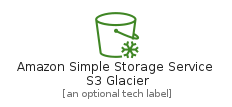
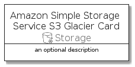

# AmazonSimpleStorageServiceS3Glacier


```text
aws-q3-2021/Resource/Storage/AmazonSimpleStorageServiceS3Glacier
```

```text
include('aws-q3-2021/Resource/Storage/AmazonSimpleStorageServiceS3Glacier')
```


| Illustration | AmazonSimpleStorageServiceS3Glacier | AmazonSimpleStorageServiceS3GlacierCard | AmazonSimpleStorageServiceS3GlacierGroup |
| :---: | :---: | :---: | :---: |
|  |  |  |  |


## AmazonSimpleStorageServiceS3Glacier

### Load remotely
```plantuml
@startuml
' configures the library
!global $LIB_BASE_LOCATION="https://raw.githubusercontent.com/tmorin/plantuml-libs/master/distribution"

' loads the library's bootstrap
!include $LIB_BASE_LOCATION/bootstrap.puml

' loads the package bootstrap
include('aws-q3-2021/bootstrap')

' loads the Item which embeds the element AmazonSimpleStorageServiceS3Glacier
include('aws-q3-2021/Resource/Storage/AmazonSimpleStorageServiceS3Glacier')

' renders the element
AmazonSimpleStorageServiceS3Glacier('AmazonSimpleStorageServiceS3Glacier', 'Amazon Simple Storage Service S3 Glacier', 'an optional tech label')
@enduml
```

### Load locally
```plantuml
@startuml
' configures the library
!global $INCLUSION_MODE="local"
!global $LIB_BASE_LOCATION="../../.."

' loads the library's bootstrap
!include $LIB_BASE_LOCATION/bootstrap.puml

' loads the package bootstrap
include('aws-q3-2021/bootstrap')

' loads the Item which embeds the element AmazonSimpleStorageServiceS3Glacier
include('aws-q3-2021/Resource/Storage/AmazonSimpleStorageServiceS3Glacier')

' renders the element
AmazonSimpleStorageServiceS3Glacier('AmazonSimpleStorageServiceS3Glacier', 'Amazon Simple Storage Service S3 Glacier', 'an optional tech label')
@enduml
```

## AmazonSimpleStorageServiceS3GlacierCard

### Load remotely
```plantuml
@startuml
' configures the library
!global $LIB_BASE_LOCATION="https://raw.githubusercontent.com/tmorin/plantuml-libs/master/distribution"

' loads the library's bootstrap
!include $LIB_BASE_LOCATION/bootstrap.puml

' loads the package bootstrap
include('aws-q3-2021/bootstrap')

' loads the Item which embeds the element AmazonSimpleStorageServiceS3GlacierCard
include('aws-q3-2021/Resource/Storage/AmazonSimpleStorageServiceS3Glacier')

' renders the element
AmazonSimpleStorageServiceS3GlacierCard('AmazonSimpleStorageServiceS3GlacierCard', 'Amazon Simple Storage Service S3 Glacier Card', 'an optional description')
@enduml
```

### Load locally
```plantuml
@startuml
' configures the library
!global $INCLUSION_MODE="local"
!global $LIB_BASE_LOCATION="../../.."

' loads the library's bootstrap
!include $LIB_BASE_LOCATION/bootstrap.puml

' loads the package bootstrap
include('aws-q3-2021/bootstrap')

' loads the Item which embeds the element AmazonSimpleStorageServiceS3GlacierCard
include('aws-q3-2021/Resource/Storage/AmazonSimpleStorageServiceS3Glacier')

' renders the element
AmazonSimpleStorageServiceS3GlacierCard('AmazonSimpleStorageServiceS3GlacierCard', 'Amazon Simple Storage Service S3 Glacier Card', 'an optional description')
@enduml
```

## AmazonSimpleStorageServiceS3GlacierGroup

### Load remotely
```plantuml
@startuml
' configures the library
!global $LIB_BASE_LOCATION="https://raw.githubusercontent.com/tmorin/plantuml-libs/master/distribution"

' loads the library's bootstrap
!include $LIB_BASE_LOCATION/bootstrap.puml

' loads the package bootstrap
include('aws-q3-2021/bootstrap')

' loads the Item which embeds the element AmazonSimpleStorageServiceS3GlacierGroup
include('aws-q3-2021/Resource/Storage/AmazonSimpleStorageServiceS3Glacier')

' renders the element
AmazonSimpleStorageServiceS3GlacierGroup('AmazonSimpleStorageServiceS3GlacierGroup', 'Amazon Simple Storage Service S3 Glacier Group', 'an optional tech label') {
    note as note
        the content of the group
    end note
}
@enduml
```

### Load locally
```plantuml
@startuml
' configures the library
!global $INCLUSION_MODE="local"
!global $LIB_BASE_LOCATION="../../.."

' loads the library's bootstrap
!include $LIB_BASE_LOCATION/bootstrap.puml

' loads the package bootstrap
include('aws-q3-2021/bootstrap')

' loads the Item which embeds the element AmazonSimpleStorageServiceS3GlacierGroup
include('aws-q3-2021/Resource/Storage/AmazonSimpleStorageServiceS3Glacier')

' renders the element
AmazonSimpleStorageServiceS3GlacierGroup('AmazonSimpleStorageServiceS3GlacierGroup', 'Amazon Simple Storage Service S3 Glacier Group', 'an optional tech label') {
    note as note
        the content of the group
    end note
}
@enduml
```

