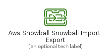
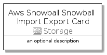
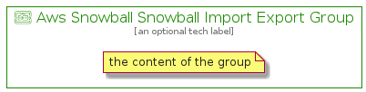

# AwsSnowballSnowballImportExport


```text
aws-q3-2021/Resource/Storage/AwsSnowballSnowballImportExport
```

```text
include('aws-q3-2021/Resource/Storage/AwsSnowballSnowballImportExport')
```


| Illustration | AwsSnowballSnowballImportExport | AwsSnowballSnowballImportExportCard | AwsSnowballSnowballImportExportGroup |
| :---: | :---: | :---: | :---: |
|  |  |  |  |


## AwsSnowballSnowballImportExport

### Load remotely
```plantuml
@startuml
' configures the library
!global $LIB_BASE_LOCATION="https://raw.githubusercontent.com/tmorin/plantuml-libs/master/distribution"

' loads the library's bootstrap
!include $LIB_BASE_LOCATION/bootstrap.puml

' loads the package bootstrap
include('aws-q3-2021/bootstrap')

' loads the Item which embeds the element AwsSnowballSnowballImportExport
include('aws-q3-2021/Resource/Storage/AwsSnowballSnowballImportExport')

' renders the element
AwsSnowballSnowballImportExport('AwsSnowballSnowballImportExport', 'Aws Snowball Snowball Import Export', 'an optional tech label')
@enduml
```

### Load locally
```plantuml
@startuml
' configures the library
!global $INCLUSION_MODE="local"
!global $LIB_BASE_LOCATION="../../.."

' loads the library's bootstrap
!include $LIB_BASE_LOCATION/bootstrap.puml

' loads the package bootstrap
include('aws-q3-2021/bootstrap')

' loads the Item which embeds the element AwsSnowballSnowballImportExport
include('aws-q3-2021/Resource/Storage/AwsSnowballSnowballImportExport')

' renders the element
AwsSnowballSnowballImportExport('AwsSnowballSnowballImportExport', 'Aws Snowball Snowball Import Export', 'an optional tech label')
@enduml
```

## AwsSnowballSnowballImportExportCard

### Load remotely
```plantuml
@startuml
' configures the library
!global $LIB_BASE_LOCATION="https://raw.githubusercontent.com/tmorin/plantuml-libs/master/distribution"

' loads the library's bootstrap
!include $LIB_BASE_LOCATION/bootstrap.puml

' loads the package bootstrap
include('aws-q3-2021/bootstrap')

' loads the Item which embeds the element AwsSnowballSnowballImportExportCard
include('aws-q3-2021/Resource/Storage/AwsSnowballSnowballImportExport')

' renders the element
AwsSnowballSnowballImportExportCard('AwsSnowballSnowballImportExportCard', 'Aws Snowball Snowball Import Export Card', 'an optional description')
@enduml
```

### Load locally
```plantuml
@startuml
' configures the library
!global $INCLUSION_MODE="local"
!global $LIB_BASE_LOCATION="../../.."

' loads the library's bootstrap
!include $LIB_BASE_LOCATION/bootstrap.puml

' loads the package bootstrap
include('aws-q3-2021/bootstrap')

' loads the Item which embeds the element AwsSnowballSnowballImportExportCard
include('aws-q3-2021/Resource/Storage/AwsSnowballSnowballImportExport')

' renders the element
AwsSnowballSnowballImportExportCard('AwsSnowballSnowballImportExportCard', 'Aws Snowball Snowball Import Export Card', 'an optional description')
@enduml
```

## AwsSnowballSnowballImportExportGroup

### Load remotely
```plantuml
@startuml
' configures the library
!global $LIB_BASE_LOCATION="https://raw.githubusercontent.com/tmorin/plantuml-libs/master/distribution"

' loads the library's bootstrap
!include $LIB_BASE_LOCATION/bootstrap.puml

' loads the package bootstrap
include('aws-q3-2021/bootstrap')

' loads the Item which embeds the element AwsSnowballSnowballImportExportGroup
include('aws-q3-2021/Resource/Storage/AwsSnowballSnowballImportExport')

' renders the element
AwsSnowballSnowballImportExportGroup('AwsSnowballSnowballImportExportGroup', 'Aws Snowball Snowball Import Export Group', 'an optional tech label') {
    note as note
        the content of the group
    end note
}
@enduml
```

### Load locally
```plantuml
@startuml
' configures the library
!global $INCLUSION_MODE="local"
!global $LIB_BASE_LOCATION="../../.."

' loads the library's bootstrap
!include $LIB_BASE_LOCATION/bootstrap.puml

' loads the package bootstrap
include('aws-q3-2021/bootstrap')

' loads the Item which embeds the element AwsSnowballSnowballImportExportGroup
include('aws-q3-2021/Resource/Storage/AwsSnowballSnowballImportExport')

' renders the element
AwsSnowballSnowballImportExportGroup('AwsSnowballSnowballImportExportGroup', 'Aws Snowball Snowball Import Export Group', 'an optional tech label') {
    note as note
        the content of the group
    end note
}
@enduml
```

