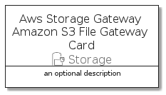
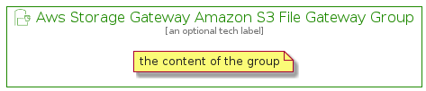

# AwsStorageGatewayAmazonS3FileGateway


```text
aws-q3-2021/Resource/Storage/AwsStorageGatewayAmazonS3FileGateway
```

```text
include('aws-q3-2021/Resource/Storage/AwsStorageGatewayAmazonS3FileGateway')
```


| Illustration | AwsStorageGatewayAmazonS3FileGateway | AwsStorageGatewayAmazonS3FileGatewayCard | AwsStorageGatewayAmazonS3FileGatewayGroup |
| :---: | :---: | :---: | :---: |
|  |  |  |  |


## AwsStorageGatewayAmazonS3FileGateway

### Load remotely
```plantuml
@startuml
' configures the library
!global $LIB_BASE_LOCATION="https://raw.githubusercontent.com/tmorin/plantuml-libs/master/distribution"

' loads the library's bootstrap
!include $LIB_BASE_LOCATION/bootstrap.puml

' loads the package bootstrap
include('aws-q3-2021/bootstrap')

' loads the Item which embeds the element AwsStorageGatewayAmazonS3FileGateway
include('aws-q3-2021/Resource/Storage/AwsStorageGatewayAmazonS3FileGateway')

' renders the element
AwsStorageGatewayAmazonS3FileGateway('AwsStorageGatewayAmazonS3FileGateway', 'Aws Storage Gateway Amazon S3 File Gateway', 'an optional tech label')
@enduml
```

### Load locally
```plantuml
@startuml
' configures the library
!global $INCLUSION_MODE="local"
!global $LIB_BASE_LOCATION="../../.."

' loads the library's bootstrap
!include $LIB_BASE_LOCATION/bootstrap.puml

' loads the package bootstrap
include('aws-q3-2021/bootstrap')

' loads the Item which embeds the element AwsStorageGatewayAmazonS3FileGateway
include('aws-q3-2021/Resource/Storage/AwsStorageGatewayAmazonS3FileGateway')

' renders the element
AwsStorageGatewayAmazonS3FileGateway('AwsStorageGatewayAmazonS3FileGateway', 'Aws Storage Gateway Amazon S3 File Gateway', 'an optional tech label')
@enduml
```

## AwsStorageGatewayAmazonS3FileGatewayCard

### Load remotely
```plantuml
@startuml
' configures the library
!global $LIB_BASE_LOCATION="https://raw.githubusercontent.com/tmorin/plantuml-libs/master/distribution"

' loads the library's bootstrap
!include $LIB_BASE_LOCATION/bootstrap.puml

' loads the package bootstrap
include('aws-q3-2021/bootstrap')

' loads the Item which embeds the element AwsStorageGatewayAmazonS3FileGatewayCard
include('aws-q3-2021/Resource/Storage/AwsStorageGatewayAmazonS3FileGateway')

' renders the element
AwsStorageGatewayAmazonS3FileGatewayCard('AwsStorageGatewayAmazonS3FileGatewayCard', 'Aws Storage Gateway Amazon S3 File Gateway Card', 'an optional description')
@enduml
```

### Load locally
```plantuml
@startuml
' configures the library
!global $INCLUSION_MODE="local"
!global $LIB_BASE_LOCATION="../../.."

' loads the library's bootstrap
!include $LIB_BASE_LOCATION/bootstrap.puml

' loads the package bootstrap
include('aws-q3-2021/bootstrap')

' loads the Item which embeds the element AwsStorageGatewayAmazonS3FileGatewayCard
include('aws-q3-2021/Resource/Storage/AwsStorageGatewayAmazonS3FileGateway')

' renders the element
AwsStorageGatewayAmazonS3FileGatewayCard('AwsStorageGatewayAmazonS3FileGatewayCard', 'Aws Storage Gateway Amazon S3 File Gateway Card', 'an optional description')
@enduml
```

## AwsStorageGatewayAmazonS3FileGatewayGroup

### Load remotely
```plantuml
@startuml
' configures the library
!global $LIB_BASE_LOCATION="https://raw.githubusercontent.com/tmorin/plantuml-libs/master/distribution"

' loads the library's bootstrap
!include $LIB_BASE_LOCATION/bootstrap.puml

' loads the package bootstrap
include('aws-q3-2021/bootstrap')

' loads the Item which embeds the element AwsStorageGatewayAmazonS3FileGatewayGroup
include('aws-q3-2021/Resource/Storage/AwsStorageGatewayAmazonS3FileGateway')

' renders the element
AwsStorageGatewayAmazonS3FileGatewayGroup('AwsStorageGatewayAmazonS3FileGatewayGroup', 'Aws Storage Gateway Amazon S3 File Gateway Group', 'an optional tech label') {
    note as note
        the content of the group
    end note
}
@enduml
```

### Load locally
```plantuml
@startuml
' configures the library
!global $INCLUSION_MODE="local"
!global $LIB_BASE_LOCATION="../../.."

' loads the library's bootstrap
!include $LIB_BASE_LOCATION/bootstrap.puml

' loads the package bootstrap
include('aws-q3-2021/bootstrap')

' loads the Item which embeds the element AwsStorageGatewayAmazonS3FileGatewayGroup
include('aws-q3-2021/Resource/Storage/AwsStorageGatewayAmazonS3FileGateway')

' renders the element
AwsStorageGatewayAmazonS3FileGatewayGroup('AwsStorageGatewayAmazonS3FileGatewayGroup', 'Aws Storage Gateway Amazon S3 File Gateway Group', 'an optional tech label') {
    note as note
        the content of the group
    end note
}
@enduml
```

