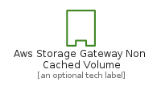
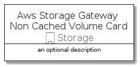

# AwsStorageGatewayNonCachedVolume


```text
aws-q3-2021/Resource/Storage/AwsStorageGatewayNonCachedVolume
```

```text
include('aws-q3-2021/Resource/Storage/AwsStorageGatewayNonCachedVolume')
```


| Illustration | AwsStorageGatewayNonCachedVolume | AwsStorageGatewayNonCachedVolumeCard | AwsStorageGatewayNonCachedVolumeGroup |
| :---: | :---: | :---: | :---: |
|  |  |  |  |


## AwsStorageGatewayNonCachedVolume

### Load remotely
```plantuml
@startuml
' configures the library
!global $LIB_BASE_LOCATION="https://github.com/tmorin/plantuml-libs/distribution"

' loads the library's bootstrap
!include $LIB_BASE_LOCATION/bootstrap.puml

' loads the package bootstrap
include('aws-q3-2021/bootstrap')

' loads the Item which embeds the element AwsStorageGatewayNonCachedVolume
include('aws-q3-2021/Resource/Storage/AwsStorageGatewayNonCachedVolume')

' renders the element
AwsStorageGatewayNonCachedVolume('AwsStorageGatewayNonCachedVolume', 'Aws Storage Gateway Non Cached Volume', 'an optional tech label')
@enduml
```

### Load locally
```plantuml
@startuml
' configures the library
!global $INCLUSION_MODE="local"
!global $LIB_BASE_LOCATION="../../.."

' loads the library's bootstrap
!include $LIB_BASE_LOCATION/bootstrap.puml

' loads the package bootstrap
include('aws-q3-2021/bootstrap')

' loads the Item which embeds the element AwsStorageGatewayNonCachedVolume
include('aws-q3-2021/Resource/Storage/AwsStorageGatewayNonCachedVolume')

' renders the element
AwsStorageGatewayNonCachedVolume('AwsStorageGatewayNonCachedVolume', 'Aws Storage Gateway Non Cached Volume', 'an optional tech label')
@enduml
```

## AwsStorageGatewayNonCachedVolumeCard

### Load remotely
```plantuml
@startuml
' configures the library
!global $LIB_BASE_LOCATION="https://github.com/tmorin/plantuml-libs/distribution"

' loads the library's bootstrap
!include $LIB_BASE_LOCATION/bootstrap.puml

' loads the package bootstrap
include('aws-q3-2021/bootstrap')

' loads the Item which embeds the element AwsStorageGatewayNonCachedVolumeCard
include('aws-q3-2021/Resource/Storage/AwsStorageGatewayNonCachedVolume')

' renders the element
AwsStorageGatewayNonCachedVolumeCard('AwsStorageGatewayNonCachedVolumeCard', 'Aws Storage Gateway Non Cached Volume Card', 'an optional description')
@enduml
```

### Load locally
```plantuml
@startuml
' configures the library
!global $INCLUSION_MODE="local"
!global $LIB_BASE_LOCATION="../../.."

' loads the library's bootstrap
!include $LIB_BASE_LOCATION/bootstrap.puml

' loads the package bootstrap
include('aws-q3-2021/bootstrap')

' loads the Item which embeds the element AwsStorageGatewayNonCachedVolumeCard
include('aws-q3-2021/Resource/Storage/AwsStorageGatewayNonCachedVolume')

' renders the element
AwsStorageGatewayNonCachedVolumeCard('AwsStorageGatewayNonCachedVolumeCard', 'Aws Storage Gateway Non Cached Volume Card', 'an optional description')
@enduml
```

## AwsStorageGatewayNonCachedVolumeGroup

### Load remotely
```plantuml
@startuml
' configures the library
!global $LIB_BASE_LOCATION="https://github.com/tmorin/plantuml-libs/distribution"

' loads the library's bootstrap
!include $LIB_BASE_LOCATION/bootstrap.puml

' loads the package bootstrap
include('aws-q3-2021/bootstrap')

' loads the Item which embeds the element AwsStorageGatewayNonCachedVolumeGroup
include('aws-q3-2021/Resource/Storage/AwsStorageGatewayNonCachedVolume')

' renders the element
AwsStorageGatewayNonCachedVolumeGroup('AwsStorageGatewayNonCachedVolumeGroup', 'Aws Storage Gateway Non Cached Volume Group', 'an optional tech label') {
    note as note
        the content of the group
    end note
}
@enduml
```

### Load locally
```plantuml
@startuml
' configures the library
!global $INCLUSION_MODE="local"
!global $LIB_BASE_LOCATION="../../.."

' loads the library's bootstrap
!include $LIB_BASE_LOCATION/bootstrap.puml

' loads the package bootstrap
include('aws-q3-2021/bootstrap')

' loads the Item which embeds the element AwsStorageGatewayNonCachedVolumeGroup
include('aws-q3-2021/Resource/Storage/AwsStorageGatewayNonCachedVolume')

' renders the element
AwsStorageGatewayNonCachedVolumeGroup('AwsStorageGatewayNonCachedVolumeGroup', 'Aws Storage Gateway Non Cached Volume Group', 'an optional tech label') {
    note as note
        the content of the group
    end note
}
@enduml
```

