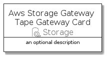
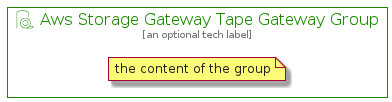

# AwsStorageGatewayTapeGateway


```text
aws-q3-2021/Resource/Storage/AwsStorageGatewayTapeGateway
```

```text
include('aws-q3-2021/Resource/Storage/AwsStorageGatewayTapeGateway')
```


| Illustration | AwsStorageGatewayTapeGateway | AwsStorageGatewayTapeGatewayCard | AwsStorageGatewayTapeGatewayGroup |
| :---: | :---: | :---: | :---: |
|  |  |  |  |


## AwsStorageGatewayTapeGateway

### Load remotely
```plantuml
@startuml
' configures the library
!global $LIB_BASE_LOCATION="https://github.com/tmorin/plantuml-libs/distribution"

' loads the library's bootstrap
!include $LIB_BASE_LOCATION/bootstrap.puml

' loads the package bootstrap
include('aws-q3-2021/bootstrap')

' loads the Item which embeds the element AwsStorageGatewayTapeGateway
include('aws-q3-2021/Resource/Storage/AwsStorageGatewayTapeGateway')

' renders the element
AwsStorageGatewayTapeGateway('AwsStorageGatewayTapeGateway', 'Aws Storage Gateway Tape Gateway', 'an optional tech label')
@enduml
```

### Load locally
```plantuml
@startuml
' configures the library
!global $INCLUSION_MODE="local"
!global $LIB_BASE_LOCATION="../../.."

' loads the library's bootstrap
!include $LIB_BASE_LOCATION/bootstrap.puml

' loads the package bootstrap
include('aws-q3-2021/bootstrap')

' loads the Item which embeds the element AwsStorageGatewayTapeGateway
include('aws-q3-2021/Resource/Storage/AwsStorageGatewayTapeGateway')

' renders the element
AwsStorageGatewayTapeGateway('AwsStorageGatewayTapeGateway', 'Aws Storage Gateway Tape Gateway', 'an optional tech label')
@enduml
```

## AwsStorageGatewayTapeGatewayCard

### Load remotely
```plantuml
@startuml
' configures the library
!global $LIB_BASE_LOCATION="https://github.com/tmorin/plantuml-libs/distribution"

' loads the library's bootstrap
!include $LIB_BASE_LOCATION/bootstrap.puml

' loads the package bootstrap
include('aws-q3-2021/bootstrap')

' loads the Item which embeds the element AwsStorageGatewayTapeGatewayCard
include('aws-q3-2021/Resource/Storage/AwsStorageGatewayTapeGateway')

' renders the element
AwsStorageGatewayTapeGatewayCard('AwsStorageGatewayTapeGatewayCard', 'Aws Storage Gateway Tape Gateway Card', 'an optional description')
@enduml
```

### Load locally
```plantuml
@startuml
' configures the library
!global $INCLUSION_MODE="local"
!global $LIB_BASE_LOCATION="../../.."

' loads the library's bootstrap
!include $LIB_BASE_LOCATION/bootstrap.puml

' loads the package bootstrap
include('aws-q3-2021/bootstrap')

' loads the Item which embeds the element AwsStorageGatewayTapeGatewayCard
include('aws-q3-2021/Resource/Storage/AwsStorageGatewayTapeGateway')

' renders the element
AwsStorageGatewayTapeGatewayCard('AwsStorageGatewayTapeGatewayCard', 'Aws Storage Gateway Tape Gateway Card', 'an optional description')
@enduml
```

## AwsStorageGatewayTapeGatewayGroup

### Load remotely
```plantuml
@startuml
' configures the library
!global $LIB_BASE_LOCATION="https://github.com/tmorin/plantuml-libs/distribution"

' loads the library's bootstrap
!include $LIB_BASE_LOCATION/bootstrap.puml

' loads the package bootstrap
include('aws-q3-2021/bootstrap')

' loads the Item which embeds the element AwsStorageGatewayTapeGatewayGroup
include('aws-q3-2021/Resource/Storage/AwsStorageGatewayTapeGateway')

' renders the element
AwsStorageGatewayTapeGatewayGroup('AwsStorageGatewayTapeGatewayGroup', 'Aws Storage Gateway Tape Gateway Group', 'an optional tech label') {
    note as note
        the content of the group
    end note
}
@enduml
```

### Load locally
```plantuml
@startuml
' configures the library
!global $INCLUSION_MODE="local"
!global $LIB_BASE_LOCATION="../../.."

' loads the library's bootstrap
!include $LIB_BASE_LOCATION/bootstrap.puml

' loads the package bootstrap
include('aws-q3-2021/bootstrap')

' loads the Item which embeds the element AwsStorageGatewayTapeGatewayGroup
include('aws-q3-2021/Resource/Storage/AwsStorageGatewayTapeGateway')

' renders the element
AwsStorageGatewayTapeGatewayGroup('AwsStorageGatewayTapeGatewayGroup', 'Aws Storage Gateway Tape Gateway Group', 'an optional tech label') {
    note as note
        the content of the group
    end note
}
@enduml
```

