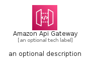
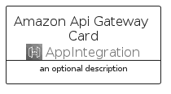

# AmazonApiGateway


```text
aws-q3-2022/Architecture/AppIntegration/AmazonApiGateway
```

```text
include('aws-q3-2022/Architecture/AppIntegration/AmazonApiGateway')
```


| Illustration | AmazonApiGateway | AmazonApiGatewayCard | AmazonApiGatewayGroup |
| :---: | :---: | :---: | :---: |
|  |  |  |  |


## AmazonApiGateway

### Load remotely
```plantuml
@startuml
' configures the library
!global $LIB_BASE_LOCATION="https://raw.githubusercontent.com/tmorin/plantuml-libs/master/distribution"

' loads the library's bootstrap
!include $LIB_BASE_LOCATION/bootstrap.puml

' loads the package bootstrap
include('aws-q3-2022/bootstrap')

' loads the Item which embeds the element AmazonApiGateway
include('aws-q3-2022/Architecture/AppIntegration/AmazonApiGateway')

' renders the element
AmazonApiGateway('AmazonApiGateway', 'Amazon Api Gateway', 'an optional tech label', 'an optional description')
@enduml
```

### Load locally
```plantuml
@startuml
' configures the library
!global $INCLUSION_MODE="local"
!global $LIB_BASE_LOCATION="../../.."

' loads the library's bootstrap
!include $LIB_BASE_LOCATION/bootstrap.puml

' loads the package bootstrap
include('aws-q3-2022/bootstrap')

' loads the Item which embeds the element AmazonApiGateway
include('aws-q3-2022/Architecture/AppIntegration/AmazonApiGateway')

' renders the element
AmazonApiGateway('AmazonApiGateway', 'Amazon Api Gateway', 'an optional tech label', 'an optional description')
@enduml
```

## AmazonApiGatewayCard

### Load remotely
```plantuml
@startuml
' configures the library
!global $LIB_BASE_LOCATION="https://raw.githubusercontent.com/tmorin/plantuml-libs/master/distribution"

' loads the library's bootstrap
!include $LIB_BASE_LOCATION/bootstrap.puml

' loads the package bootstrap
include('aws-q3-2022/bootstrap')

' loads the Item which embeds the element AmazonApiGatewayCard
include('aws-q3-2022/Architecture/AppIntegration/AmazonApiGateway')

' renders the element
AmazonApiGatewayCard('AmazonApiGatewayCard', 'Amazon Api Gateway Card', 'an optional description')
@enduml
```

### Load locally
```plantuml
@startuml
' configures the library
!global $INCLUSION_MODE="local"
!global $LIB_BASE_LOCATION="../../.."

' loads the library's bootstrap
!include $LIB_BASE_LOCATION/bootstrap.puml

' loads the package bootstrap
include('aws-q3-2022/bootstrap')

' loads the Item which embeds the element AmazonApiGatewayCard
include('aws-q3-2022/Architecture/AppIntegration/AmazonApiGateway')

' renders the element
AmazonApiGatewayCard('AmazonApiGatewayCard', 'Amazon Api Gateway Card', 'an optional description')
@enduml
```

## AmazonApiGatewayGroup

### Load remotely
```plantuml
@startuml
' configures the library
!global $LIB_BASE_LOCATION="https://raw.githubusercontent.com/tmorin/plantuml-libs/master/distribution"

' loads the library's bootstrap
!include $LIB_BASE_LOCATION/bootstrap.puml

' loads the package bootstrap
include('aws-q3-2022/bootstrap')

' loads the Item which embeds the element AmazonApiGatewayGroup
include('aws-q3-2022/Architecture/AppIntegration/AmazonApiGateway')

' renders the element
AmazonApiGatewayGroup('AmazonApiGatewayGroup', 'Amazon Api Gateway Group', 'an optional tech label') {
    note as note
        the content of the group
    end note
}
@enduml
```

### Load locally
```plantuml
@startuml
' configures the library
!global $INCLUSION_MODE="local"
!global $LIB_BASE_LOCATION="../../.."

' loads the library's bootstrap
!include $LIB_BASE_LOCATION/bootstrap.puml

' loads the package bootstrap
include('aws-q3-2022/bootstrap')

' loads the Item which embeds the element AmazonApiGatewayGroup
include('aws-q3-2022/Architecture/AppIntegration/AmazonApiGateway')

' renders the element
AmazonApiGatewayGroup('AmazonApiGatewayGroup', 'Amazon Api Gateway Group', 'an optional tech label') {
    note as note
        the content of the group
    end note
}
@enduml
```

