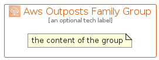

# AwsOutpostsFamily


```text
aws-q3-2022/Architecture/Compute/AwsOutpostsFamily
```

```text
include('aws-q3-2022/Architecture/Compute/AwsOutpostsFamily')
```


| Illustration | AwsOutpostsFamily | AwsOutpostsFamilyCard | AwsOutpostsFamilyGroup |
| :---: | :---: | :---: | :---: |
|  |  |  |  |


## AwsOutpostsFamily

### Load remotely
```plantuml
@startuml
' configures the library
!global $LIB_BASE_LOCATION="https://raw.githubusercontent.com/tmorin/plantuml-libs/master/distribution"

' loads the library's bootstrap
!include $LIB_BASE_LOCATION/bootstrap.puml

' loads the package bootstrap
include('aws-q3-2022/bootstrap')

' loads the Item which embeds the element AwsOutpostsFamily
include('aws-q3-2022/Architecture/Compute/AwsOutpostsFamily')

' renders the element
AwsOutpostsFamily('AwsOutpostsFamily', 'Aws Outposts Family', 'an optional tech label', 'an optional description')
@enduml
```

### Load locally
```plantuml
@startuml
' configures the library
!global $INCLUSION_MODE="local"
!global $LIB_BASE_LOCATION="../../.."

' loads the library's bootstrap
!include $LIB_BASE_LOCATION/bootstrap.puml

' loads the package bootstrap
include('aws-q3-2022/bootstrap')

' loads the Item which embeds the element AwsOutpostsFamily
include('aws-q3-2022/Architecture/Compute/AwsOutpostsFamily')

' renders the element
AwsOutpostsFamily('AwsOutpostsFamily', 'Aws Outposts Family', 'an optional tech label', 'an optional description')
@enduml
```

## AwsOutpostsFamilyCard

### Load remotely
```plantuml
@startuml
' configures the library
!global $LIB_BASE_LOCATION="https://raw.githubusercontent.com/tmorin/plantuml-libs/master/distribution"

' loads the library's bootstrap
!include $LIB_BASE_LOCATION/bootstrap.puml

' loads the package bootstrap
include('aws-q3-2022/bootstrap')

' loads the Item which embeds the element AwsOutpostsFamilyCard
include('aws-q3-2022/Architecture/Compute/AwsOutpostsFamily')

' renders the element
AwsOutpostsFamilyCard('AwsOutpostsFamilyCard', 'Aws Outposts Family Card', 'an optional description')
@enduml
```

### Load locally
```plantuml
@startuml
' configures the library
!global $INCLUSION_MODE="local"
!global $LIB_BASE_LOCATION="../../.."

' loads the library's bootstrap
!include $LIB_BASE_LOCATION/bootstrap.puml

' loads the package bootstrap
include('aws-q3-2022/bootstrap')

' loads the Item which embeds the element AwsOutpostsFamilyCard
include('aws-q3-2022/Architecture/Compute/AwsOutpostsFamily')

' renders the element
AwsOutpostsFamilyCard('AwsOutpostsFamilyCard', 'Aws Outposts Family Card', 'an optional description')
@enduml
```

## AwsOutpostsFamilyGroup

### Load remotely
```plantuml
@startuml
' configures the library
!global $LIB_BASE_LOCATION="https://raw.githubusercontent.com/tmorin/plantuml-libs/master/distribution"

' loads the library's bootstrap
!include $LIB_BASE_LOCATION/bootstrap.puml

' loads the package bootstrap
include('aws-q3-2022/bootstrap')

' loads the Item which embeds the element AwsOutpostsFamilyGroup
include('aws-q3-2022/Architecture/Compute/AwsOutpostsFamily')

' renders the element
AwsOutpostsFamilyGroup('AwsOutpostsFamilyGroup', 'Aws Outposts Family Group', 'an optional tech label') {
    note as note
        the content of the group
    end note
}
@enduml
```

### Load locally
```plantuml
@startuml
' configures the library
!global $INCLUSION_MODE="local"
!global $LIB_BASE_LOCATION="../../.."

' loads the library's bootstrap
!include $LIB_BASE_LOCATION/bootstrap.puml

' loads the package bootstrap
include('aws-q3-2022/bootstrap')

' loads the Item which embeds the element AwsOutpostsFamilyGroup
include('aws-q3-2022/Architecture/Compute/AwsOutpostsFamily')

' renders the element
AwsOutpostsFamilyGroup('AwsOutpostsFamilyGroup', 'Aws Outposts Family Group', 'an optional tech label') {
    note as note
        the content of the group
    end note
}
@enduml
```

